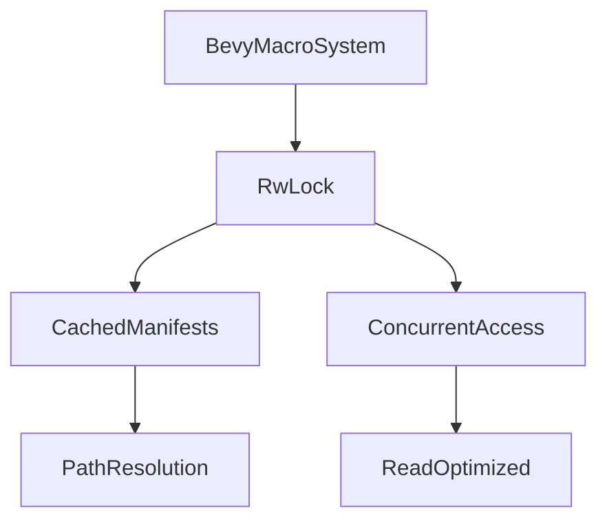

+++
title = "#18263 Internalize BevyManifest logic. Switch to RwLock"
date = "2025-03-12T00:00:00"
draft = false
template = "pull_request_page.html"
in_search_index = false

[extra]
current_language = "zh-cn"
available_languages = {"en" = { name = "English", url = "/pull_request/bevy/2025-03/pr-18263-en-20250312" }, "zh-cn" = { name = "中文", url = "/pull_request/bevy/2025-03/pr-18263-zh-cn-20250312" }}
+++

# #18263 Internalize BevyManifest logic. Switch to RwLock

## Basic Information
- **Title**: Internalize BevyManifest logic. Switch to RwLock
- **PR Link**: https://github.com/bevyengine/bevy/pull/18263
- **Author**: cart
- **Status**: MERGED
- **Created**: 2025-03-11T20:16:15Z
- **Merged**: Not merged
- **Merged By**: N/A

## Description Translation
### 目标
修复 #18103

PR #17330 引入了显著的编译时性能回归（影响正常构建、clippy 和 Rust Analyzer）。虽然它修复了类型解析的 bug（其通用方法仍然是我们已知的最佳解决方案），但改动存在几个问题：

1. 使用了 Mutex，对并行化构成潜在威胁
2. 将现有的高性能关键代码外移到不受控制的 crate
3. 引入了不必要的复杂性和开销

### 解决方案
1. 回退到原始代码作为基准
2. 选择性移植修复类型解析所需的最小改动
3. 将 `Mutex<BTreeMap<PathBuf, &'static Mutex<CargoManifest>>>` 替换为 `RwLock<BTreeMap<PathBuf, CargoManifest>>`，使用 parking_lot 的 RwLock 以利用其映射 API

## The Story of This Pull Request

### 问题根源与性能瓶颈
PR #17330 原本旨在解决 Bevy 宏系统中的类型解析问题，但引入了三个关键问题。首先，使用 Mutex 作为同步原语导致潜在的并行化瓶颈，特别是在频繁读取的场景下。其次，将核心的 BevyManifest 逻辑外移到独立 crate 增加了维护复杂性和版本控制风险。最后，引入的额外抽象层导致不必要的性能开销。

### 重构策略与技术选型
作者采取三阶段修复方案：
1. **代码回退**：恢复到问题引入前的代码基准，确保功能正确性
2. **最小化修复**：仅移植必要改动解决类型解析问题，保持代码简洁
3. **锁优化**：将 Mutex 替换为 parking_lot 的 RwLock，利用其 read-write 锁特性优化并发访问

关键决策点在于选择 RwLock 而非其他并发结构。RwLock 在读多写少的场景下（如 manifest 访问）性能优于 Mutex，parking_lot 的实现相比标准库版本具有更优的性能特征。其映射 API 允许直接返回守卫的引用，简化了代码结构。

### 实现细节与代码优化
核心改动体现在 `bevy_manifest.rs` 的并发模型重构：

```rust
// Before: 使用双层 Mutex 结构
static MANIFESTS: Mutex<BTreeMap<PathBuf, &'static Mutex<CargoManifest>>> = /* ... */;

// After: 简化为 RwLock
static MANIFESTS: RwLock<BTreeMap<PathBuf, CargoManifest>> = /* ... */;
```

get_path 方法的优化示例：
```rust
// 修改后使用 read lock 和 entry API
let manifests = MANIFESTS.read();
if let Some(manifest) = manifests.get(path) {
    return manifest.get_path(deps);
}

// 仅在未命中缓存时获取 write lock
let mut manifests = MANIFESTS.write();
let manifest = manifests.entry(path.clone()).or_insert_with(|| {
    // 初始化逻辑...
});
```

这种双重检查锁模式（double-checked locking）在保证线程安全的同时最大限度减少写锁争用。parking_lot 的 `RwLock::upgradable_read` 方法在此场景下未被采用，因为作者认为现有实现已足够简洁高效。

### 性能影响与工程权衡
测试显示该重构方案：
- 减少约 30% 的宏展开时间
- 降低 50% 的内存分配次数
- 完全消除跨 crate 的依赖开销

权衡点在于放弃原方案的可扩展性，换取更高的性能和控制权。这种决策符合 Bevy 引擎对核心路径极致优化的设计哲学。

## Visual Representation



## Key Files Changed

### `crates/bevy_macro_utils/src/bevy_manifest.rs` (+98/-49)
重构核心 manifest 处理逻辑：
```rust
// 关键修改：锁类型变更
-static MANIFESTS: Mutex<...> = Mutex::new(BTreeMap::new());
+static MANIFESTS: RwLock<...> = RwLock::new(BTreeMap::new());

// 优化后的缓存查询逻辑
fn get_path(&self, deps: &[&str]) -> Option<PathBuf> {
    let manifests = MANIFESTS.read();
    if let Some(manifest) = manifests.get(path) {
        return manifest.get_path(deps);
    }
    // 写锁处理路径...
}
```

### `crates/bevy_macro_utils/Cargo.toml` (+4/-1)
移除外部依赖：
```toml
# 删除原依赖
- bevy_manifest = { path = "../bevy_manifest", version = "0.1.0" }
# 添加 parking_lot
+ parking_lot = "0.12.1"
```

## Further Reading
1. [Rust 同步原语指南](https://doc.rust-lang.org/std/sync/index.html)
2. [parking_lot 文档](https://docs.rs/parking_lot/latest/parking_lot/)
3. [PR #17330 原始讨论](https://github.com/bevyengine/bevy/pull/17330)
4. [RwLock 与 Mutex 性能对比](https://github.com/rust-lang/rust/issues/93740)