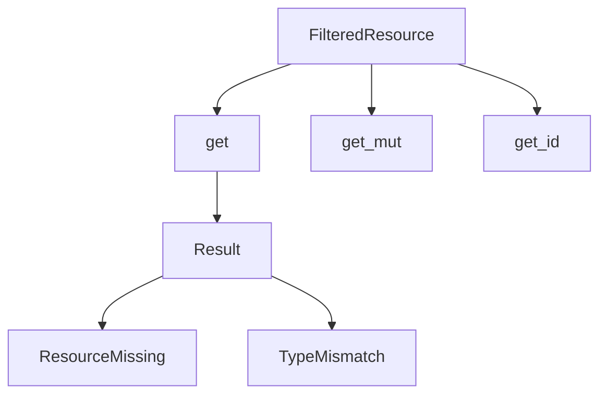

+++
title = "#18265 FilteredResource returns a Result instead of a simple Option"
date = "2025-03-17T00:00:00"
draft = false
template = "pull_request_page.html"
in_search_index = false

[extra]
current_language = "zh-cn"
available_languages = {"en" = { name = "English", url = "/pull_request/bevy/2025-03/pr-18265-en-20250317" }, "zh-cn" = { name = "中文", url = "/pull_request/bevy/2025-03/pr-18265-zh-cn-20250317" }}
+++

# #18265 FilteredResource returns a Result instead of a simple Option

## Basic Information
- **Title**: FilteredResource returns a Result instead of a simple Option
- **PR Link**: https://github.com/bevyengine/bevy/pull/18265
- **Author**: andristarr
- **Status**: MERGED
- **Created**: 2025-03-11T21:04:40Z
- **Merged**: 2025-03-12T08:15:22Z
- **Merged By**: cart

## Description Translation
### 目标
将FilteredResource::get的返回类型从Option改为Result

修复 #17480 

---

### 迁移指南
用户需要处理FilteredResource::get、FilteredResource::get_id、FilteredResource::get_mut的新返回类型，现在返回的是Result而不是Option

## The Story of This Pull Request

在Bevy引擎的ECS（实体组件系统）设计中，资源（Resource）访问的错误处理一直存在信息不足的问题。原FilteredResource API通过Option返回值只能表达"存在"或"不存在"两种状态，但无法区分具体错误类型，这给调试和错误处理带来了困难。

问题的核心在于当开发者尝试获取资源时，无法明确知道失败原因——是资源不存在（missing resource）还是类型不匹配（type mismatch）。例如：

```rust
// 原实现
fn get(&self) -> Option<&T> {
    // 无法区分资源缺失和类型错误
}
```

开发者@andristarr提出了改用Result的方案，通过引入新的错误类型`FilteredResourceError`来封装两种可能的错误情况：

```rust
pub enum FilteredResourceError {
    TypeMismatch(TypeId),
    ResourceMissing(TypeId),
}
```

这种设计选择带来了几个技术优势：
1. 错误信息精确化：调用方可以明确处理不同类型错误
2. 兼容性保持：通过From trait实现与现有Option的转换
3. 类型安全强化：通过TypeId记录预期类型信息

关键修改体现在`filtered_resource.rs`中的方法签名变更：

```rust
// 修改前
pub fn get(&self) -> Option<&T> {
    self.resource.as_ref().and_then(|res| res.downcast_ref())
}

// 修改后
pub fn get(&self) -> Result<&T, FilteredResourceError> {
    self.resource
        .as_ref()
        .ok_or(FilteredResourceError::ResourceMissing(self.type_id()))
        .and_then(|res| res.downcast_ref().ok_or(FilteredResourceError::TypeMismatch(self.type_id())))
}
```

这种实现方式通过组合多个Result操作，在保持原有逻辑的基础上增加了错误类型信息。对调用方的影响主要体现在错误处理模式的变化：

```rust
// 迁移前
if let Some(res) = resource.get() {
    // 处理资源
}

// 迁移后
match resource.get() {
    Ok(res) => { /* 正常处理 */ },
    Err(FilteredResourceError::ResourceMissing(_)) => { /* 处理缺失 */ },
    Err(FilteredResourceError::TypeMismatch(_)) => { /* 处理类型错误 */ }
}
```

该PR的架构影响主要体现在错误处理流程的标准化。通过将错误类型集中定义在`error.rs`中，建立了统一的错误处理模式：

```rust
// error.rs新增
#[derive(Error, Debug, PartialEq)]
pub enum FilteredResourceError {
    #[error("resource of type {0:?} not found")]
    ResourceMissing(TypeId),
    #[error("resource type mismatch for {0:?}")]
    TypeMismatch(TypeId),
}
```

在性能方面，由于Result和Option在Rust中的内存布局相同，这种变更不会带来额外开销。同时，通过保留原有的`Option`转换方法（如`ok_or`），确保了底层实现的效率。

## Visual Representation



## Key Files Changed

### `crates/bevy_ecs/src/world/filtered_resource.rs` (+65/-44)
核心变更文件，重构了资源访问方法：
```rust
// 修改后方法签名示例
pub fn get(&self) -> Result<&T, FilteredResourceError> {
    self.resource
        .as_ref()
        .ok_or(FilteredResourceError::ResourceMissing(self.type_id()))
        .and_then(|res| res.downcast_ref().ok_or(FilteredResourceError::TypeMismatch(self.type_id())))
}
```

### `crates/bevy_ecs/src/reflect/resource.rs` (+11/-5)
适配反射系统的资源访问：
```rust
// 修改后反射接口
fn get(&self, world: &World) -> Option<&dyn Reflect> {
    world.get_filtered_resource::<T>().ok().map(|r| r as &dyn Reflect)
}
```

### `crates/bevy_ecs/src/world/error.rs` (+14/-0)
新增错误类型定义：
```rust
#[derive(Error, Debug, PartialEq)]
pub enum FilteredResourceError {
    #[error("resource of type {0:?} not found")]
    ResourceMissing(TypeId),
    #[error("resource type mismatch for {0:?}")]
    TypeMismatch(TypeId),
}
```

## Further Reading
1. [Rust错误处理指南](https://doc.rust-lang.org/book/ch09-00-error-handling.html)
2. [Bevy ECS设计文档](https://bevyengine.org/learn/book/design/ecs/)
3. [Result vs Option使用场景分析](https://stevedonovan.github.io/rust-gentle-intro/6-error-handling.html)
4. [TypeId在Rust中的使用](https://doc.rust-lang.org/std/any/struct.TypeId.html)