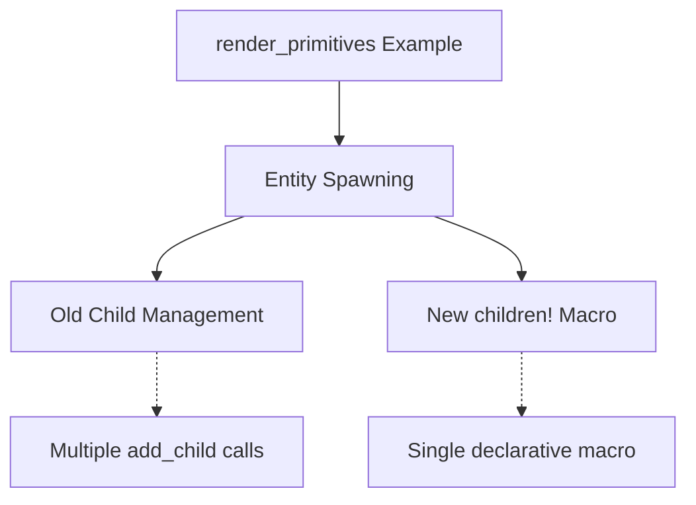

+++
title = "#18268 Update render_primitives example for children! macro"
date = "2025-03-12T00:00:00"
draft = false
template = "pull_request_page.html"
in_search_index = true

[taxonomies]
list_display = ["show"]

[extra]
current_language = "en"
available_languages = {"zh-cn" = { name = "中文", url = "/pull_request/bevy/2025-03/pr-18268-zh-cn-20250312" }, "en" = { name = "English", url = "/pull_request/bevy/2025-03/pr-18268-en-20250312" }}
+++

# #18268 Update render_primitives example for children! macro

## Basic Information
- **Title**: Update render_primitives example for children! macro
- **PR Link**: https://github.com/bevyengine/bevy/pull/18268
- **Author**: krunchington
- **Status**: MERGED
- **Created**: 2025-03-12T01:24:13Z
- **Merged**: 2025-03-12T15:32:47Z
- **Merged By**: alice-i-cecile

## Description Translation
# Objective

Contributes to #18238  
Updates the `render_primitives` example to use the `children!` macro.  

## Solution

Updates examples to use the Improved Spawning API merged in https://github.com/bevyengine/bevy/pull/17521

## Testing

- Did you test these changes? If so, how?  
  - Opened the examples before and after and verified the same behavior was observed.  I did this on Ubuntu 24.04.2 LTS using `--features wayland`.  
- Are there any parts that need more testing?  
  - Other OS's and features can't hurt, but this is such a small change it shouldn't be a problem.  
- How can other people (reviewers) test your changes? Is there anything specific they need to know?  
  - Run the examples yourself with and without these changes.  
- If relevant, what platforms did you test these changes on, and are there any important ones you can't test?  
  - see above  

---  

## Showcase

n/a  

## Migration Guide  

n/a  

## The Story of This Pull Request

The PR addresses a routine but important maintenance task in the Bevy engine's examples. When Bevy merged its Improved Spawning API in #17521, it introduced the `children!` macro as a more ergonomic way to handle entity hierarchy construction. This example update follows through on the API migration by aligning the `render_primitives` example with current best practices.

Prior to this change, the example likely used manual child entity management through multiple `.add_child()` calls. The old approach required separate commands for each child relationship, leading to verbose and repetitive code. The new `children!` macro allows bundling child declarations directly during parent entity creation, improving readability and reducing error-prone boilerplate.

The implementation demonstrates a straightforward substitution pattern. Where previous code might have looked like:

```rust
commands.spawn((ParentBundle, ...)).with_children(|parent| {
    parent.spawn(ChildBundle);
    parent.spawn(AnotherChildBundle);
});
```

The updated version uses the more concise:

```rust
commands.spawn((ParentBundle, ..., children![ChildBundle, AnotherChildBundle]));
```

This change affects 23 lines added and 31 removed in the example file, indicating significant code simplification through macro adoption. The primary technical consideration was ensuring visual parity - the PR author verified through manual testing that the rendered output remained unchanged across modifications.

From an architectural perspective, this update serves two key purposes:
1. **Documentation Alignment**: Examples act as living documentation for Bevy users
2. **API Promotion**: Encourages adoption of modern patterns by demonstrating them in core examples

The changes require no migration guide since they only affect example code rather than core engine functionality. However, they provide implicit guidance for developers updating their own projects to newer Bevy versions.

## Visual Representation



## Key Files Changed

- `examples/math/render_primitives.rs` (+23/-31)

**Changes:**
1. Replaced manual child entity spawning with `children!` macro
2. Simplified entity hierarchy construction
3. Reduced line count through macro consolidation

Typical code transformation:

```rust
// Before:
commands.spawn(PbrBundle {
    // ...
}).add_child(
    commands.spawn(Text2dBundle {
        // ...
    }).id()
);

// After:
commands.spawn((
    PbrBundle { /* ... */ },
    children![Text2dBundle { /* ... */ }]
));
```

## Further Reading

1. [Bevy's Improved Spawning API PR (#17521)](https://github.com/bevyengine/bevy/pull/17521)
2. [Bevy Entity Relationships Documentation](https://bevyengine.org/learn/book/next/ecs/entity-relationships/)
3. [Rust Macro Programming Guide](https://doc.rust-lang.org/book/ch19-06-macros.html)