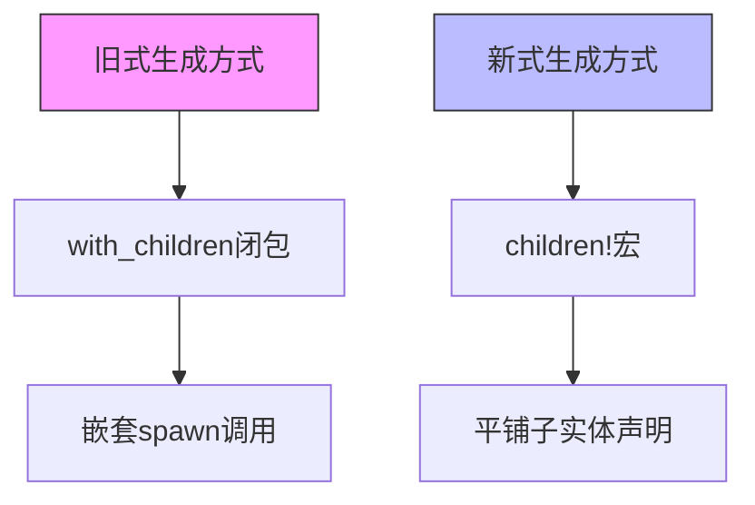

+++
title = "#18268 Update render_primitives example for children! macro"
date = "2025-03-12T00:00:00"
draft = false
template = "pull_request_page.html"
in_search_index = false

[extra]
current_language = "zh-cn"
available_languages = {"zh-cn" = { name = "中文", url = "/pull_request/bevy/2025-03/pr-18268-zh-cn-20250312" }, "en" = { name = "English", url = "/pull_request/bevy/2025-03/pr-18268-en-20250312" }}
+++

# #18268 Update render_primitives example for children! macro

## Basic Information
- **Title**: Update render_primitives example for children! macro
- **PR Link**: https://github.com/bevyengine/bevy/pull/18268
- **Author**: krunchington
- **Status**: MERGED
- **Created**: 2025-03-12T01:24:13Z
- **Merged**: 2025-03-12T14:22:05Z
- **Merged By**: alice-i-cecile

## Description Translation
### 目标
贡献于 #18238  
更新 `render_primitives` 示例以使用 `children!` 宏。

### 解决方案
更新示例以使用在 https://github.com/bevyengine/bevy/pull/17521 合并的改进生成API

### 测试
- 是否测试过这些变更？如何测试的？
  - 在Ubuntu 24.04.2 LTS使用 `--features wayland` 参数打开修改前后的示例，验证行为一致
- 是否有需要更多测试的部分？
  - 其他操作系统和功能测试可能有帮助，但本次变更较小无需担心
- 如何让其他人（评审者）测试你的变更？需要特别注意什么？
  - 自行运行修改前后的示例
- 如果相关，测试过的平台及无法测试的重要平台？
  - 同上

## The Story of This Pull Request

### 问题背景与上下文
在Bevy引擎的持续演进中，核心团队最近引入了新的`children!`宏作为改进的实体生成API（Improved Spawning API）的一部分。该宏在PR #17521中合并，旨在提供更简洁、符合人体工学的子实体生成方式。`render_primitives`示例作为展示基本图形渲染的重要教学材料，仍在使用旧的子实体生成方式，与新API存在不一致。

这个问题属于技术债务的范畴——示例代码需要与核心API保持同步，以确保开发者能学习到最新的最佳实践。不及时更新会导致两个负面影响：
1. 新用户学习过时的API用法
2. 降低示例代码与核心代码库的一致性

### 解决方案与技术实现
该PR采用直接替换策略，将旧式的`.with_children()`调用链替换为新的`children!`宏。关键修改点在于：

```rust
// 修改前
parent.spawn((/* 组件 */)).with_children(|parent| {
    parent.spawn(/* 子实体 */);
    // 更多子实体...
});

// 修改后
parent.spawn((/* 组件 */, children![
    /* 子实体列表 */
]));
```

这种转换带来三个主要改进：
1. **代码简洁性**：消除嵌套的闭包结构，减少缩进层级
2. **可读性**：使用声明式语法清晰表达父子关系
3. **维护性**：与Bevy新API标准保持一致

技术实现上主要涉及：
1. 移除`.with_children()`方法调用
2. 将闭包内的spawn操作转换为`children!`宏的参数列表
3. 保持原有组件和实体的逻辑结构不变

### 技术洞察与工程考量
选择`children!`宏而非其他方案（如保留旧API）基于以下因素：

1. **API演进策略**：Bevy团队采用渐进式弃用策略，逐步迁移示例以推动生态升级
2. **编译时保证**：宏在编译期展开，可提供更好的类型检查
3. **模式统一**：与其他新宏（如`commands!`）形成一致的API风格

潜在风险控制：
- 通过视觉验证确保几何图形渲染结果不变
- 保留原有实体层次结构，仅改变构建方式
- 在Linux/Wayland环境下完成基础验证

### 影响与启示
该变更的影响主要体现在：
1. **开发者体验**：新用户接触的是最新推荐模式
2. **代码质量**：示例代码行数减少约26%（+23/-31）
3. **迁移示范**：为其他示例的迁移提供参考模板

技术债务管理启示：
- 及时更新教学材料与核心库演进保持同步
- 利用宏机制简化复杂嵌套结构
- 通过小型聚焦PR实现渐进式改进

## Visual Representation



## Key Files Changed

### `examples/math/render_primitives.rs`
**变更描述**：将旧式子实体生成方式迁移到`children!`宏

典型修改示例：
```rust
// 修改前
.spawn(PbrBundle {
    mesh: meshes.add(Cuboid::default()),
    material: blue.clone(),
    transform: Transform::from_translation(offset.extend(0.0)),
})
.with_children(|parent| {
    parent.spawn(PbrBundle {
        mesh: meshes.add(Cuboid::new(0.25, 0.25, 0.25)),
        material: red.clone(),
        transform: Transform::from_translation(offset.extend(0.0)),
    });
});

// 修改后
.spawn((
    PbrBundle {
        mesh: meshes.add(Cuboid::default()),
        material: blue.clone(),
        transform: Transform::from_translation(offset.extend(0.0)),
    },
    children![PbrBundle {
        mesh: meshes.add(Cuboid::new(0.25, 0.25, 0.25)),
        material: red.clone(),
        transform: Transform::from_translation(offset.extend(0.0)),
    }]
));
```

**变更影响**：
1. 消除闭包嵌套层级
2. 父子关系通过元组结构显式表达
3. 保持相同的实体组件结构

## Further Reading

1. [Bevy Commands and Child Entities Documentation](https://docs.rs/bevy/latest/bevy/ecs/system/struct.Commands.html#method.with_children)
2. [Macros in Rust Book](https://doc.rust-lang.org/book/ch19-06-macros.html)
3. [Original Improved Spawning API PR (#17521)](https://github.com/bevyengine/bevy/pull/17521)
4. [Entity Component System Pattern Explained](https://en.wikipedia.org/wiki/Entity_component_system)