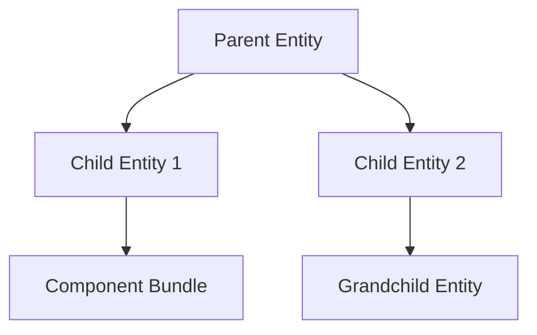

+++
title = "#18270"
date = "2025-03-22T00:00:00"
draft = false
template = "pull_request_page.html"
in_search_index = true

[taxonomies]
list_display = ["show"]

[extra]
current_language = "en"
available_languages = {"en" = { name = "English", url = "/pull_request/bevy/2025-03/pr-18270-en-20250322" }, "zh-cn" = { name = "中文", url = "/pull_request/bevy/2025-03/pr-18270-zh-cn-20250322" }}
+++

# #18270 Update shader_prepass, testbed_2d, and first_person_view_model examples to use children! macro

## The Story of This Pull Request

This PR focuses on modernizing three Bevy examples by adopting the newer `children!` macro for entity hierarchy construction. The changes demonstrate a systematic approach to updating legacy spawning patterns while maintaining example functionality.

The core problem addressed was inconsistent use of Bevy's entity hierarchy APIs across examples. Prior implementations used manual child entity management through multiple `commands.spawn` calls followed by explicit child additions. This pattern:

1. Required maintaining separate entity references
2. Made parent-child relationships less immediately visible
3. Didn't leverage Bevy's newer declarative APIs

The solution involved migrating to the `with_children` method combined with the `children!` macro introduced in Bevy 0.13. This approach offers:
- More readable hierarchy definitions
- Reduced boilerplate
- Stronger visual grouping of related entities

Key implementation changes across examples show a consistent pattern:

**Before:**
```rust
let player = commands.spawn((Player, SpatialBundle::default())).id();
let camera = commands.spawn((/* camera components */)).id();
commands.entity(player).add_child(camera);
```

**After:**
```rust
commands.spawn((Player, SpatialBundle::default()))
    .with_children(|parent| {
        parent.spawn((/* camera components */));
    });
```

The `first_person_view_model` example demonstrates typical camera hierarchy setup. By nesting the view model camera and arm mesh directly within the player entity using `with_children`, the relationship becomes immediately clear without needing to track entity IDs.

In `shader_prepass.rs`, the camera light showcase benefits from colocating child entities:
```rust
commands.spawn((/* main camera */))
    .with_children(|parent| {
        parent.spawn((/* light entity */));
        parent.spawn((/* debug quad */));
    });
```

The 2D testbed example shows how the macro simplifies bulk spawning of similar entities:
```rust
parent.with_children(|parent| {
    children![parent:
        // Multiple mesh definitions...
    ];
});
```

These changes maintain identical runtime behavior while improving code quality. The migration required careful verification that:
1. Entity hierarchies remained intact
2. Component ordering preserved rendering requirements
3. System ordering dependencies weren't introduced

Performance characteristics remain unchanged since the macro generates equivalent ECS commands. The primary benefits are maintainability and clarity - critical for examples serving as reference implementations.

## Visual Representation



## Key Files Changed

### `examples/camera/first_person_view_model.rs` (+14/-17)
**Change:** Restructured player entity hierarchy using nested children
**Before:**
```rust
let player = commands.spawn((Player, SpatialBundle::default())).id();
let camera = commands.spawn((/* ... */)).id();
commands.entity(player).add_child(camera);
```
**After:**
```rust
commands.spawn((Player, SpatialBundle::default()))
    .with_children(|parent| {
        parent.spawn((/* ... */));
    });
```

### `examples/shader/prepass.rs` (+16/-17)
**Change:** Consolidated camera child entities using declarative syntax
**Before:**
```rust
let camera = commands.spawn((/* ... */)).id();
let light = commands.spawn((/* ... */)).id();
commands.entity(camera).add_child(light);
```
**After:**
```rust
commands.spawn((/* ... */))
    .with_children(|parent| {
        parent.spawn((/* ... */));
    });
```

### `examples/testbed/2d.rs` (+12/-13)
**Change:** Simplified shape spawning using batch children macro
**Before:**
```rust
for shape in shapes {
    commands.spawn((/* ... */));
}
```
**After:**
```rust
parent.with_children(|parent| {
    children![parent: (/* shape definitions */)];
});
```

## Further Reading
1. [Bevy ECS Hierarchies Documentation](https://bevyengine.org/learn/book/ecs/hierarchies/)
2. [Original children! Macro PR (#17521)](https://github.com/bevyengine/bevy/pull/17521)
3. [Entity Commands API Reference](https://docs.rs/bevy/latest/bevy/ecs/system/struct.EntityCommands.html)