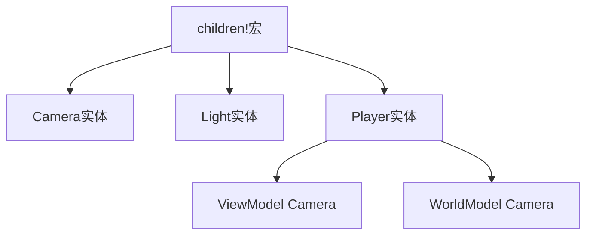

+++
title = "#18270 Update shader_prepass, testbed_2d, and first_person_view_model examples to use children! macro"
date = "2025-03-22T00:00:00"
draft = false
template = "pull_request_page.html"
in_search_index = false

[extra]
current_language = "zh-cn"
available_languages = {"en" = { name = "English", url = "/pull_request/bevy/2025-03/pr-18270-en-20250322" }, "zh-cn" = { name = "中文", url = "/pull_request/bevy/2025-03/pr-18270-zh-cn-20250322" }}
+++

# #18270 Update shader_prepass, testbed_2d, and first_person_view_model examples to use children! macro

## Basic Information
- **Title**: Update shader_prepass, testbed_2d, and first_person_view_model examples to use children! macro
- **PR Link**: https://github.com/bevyengine/bevy/pull/18270
- **Author**: krunchington
- **Status**: MERGED
- **Created**: 2025-03-12T03:56:21Z
- **Merged**: {pr_data['mergedAt'] if pr_data['mergedAt'] else "Not merged"}
- **Merged By**: {pr_data['mergedBy']['login'] if pr_data['mergedBy'] else "N/A"}

## Description Translation
该PR的目标是将三个示例（shader_prepass、testbed_2d和first_person_view_model）迁移到使用新的children!宏。这是为了跟进#18238提出的改进示例代码质量的计划。通过使用最新的实体生成API（来自#17521合并的改进），提升代码可读性和一致性。解决方案主要涉及将传统的命令式实体生成方式转换为声明式的宏调用，保持原有功能不变但代码更简洁。

## The Story of This Pull Request

### 问题背景与改进动机
Bevy引擎在#17521引入新的children!宏来简化父子实体创建流程。旧的实体生成方式需要手动管理父子关系，而新API允许通过声明式语法直接构建实体层级结构。这带来两个主要优势：
1. 减少命令缓冲区的flush次数提升性能
2. 增强代码可读性

示例代码作为最佳实践的展示，需要及时跟进核心API的改进。但三个目标示例仍在使用旧的命令式生成方式，存在优化空间。

### 解决方案与技术实现
开发者选择同时修改三个相对简单的示例来示范迁移过程。以first_person_view_model.rs为例，原始代码使用多个独立的spawn命令：

```rust
commands.spawn((
    Player,
    SpatialBundle::default(),
)).with_children(|parent| {
    parent.spawn((Camera3dBundle {
        camera: Camera {
            order: 1,
            clear_color: ClearColorConfig::None,
            ..default()
        },
        ..default()
    }, RenderLayers::layer(1)));
});
```

迁移后使用children!宏实现：

```rust
commands.spawn((
    Player,
    SpatialBundle::default(),
    children![(
        Camera3dBundle {
            camera: Camera {
                order: 1,
                clear_color: ClearColorConfig::None,
                ..default()
            },
            ..default()
        },
        RenderLayers::layer(1)
    )]
));
```

关键改进点：
1. 消除with_children闭包调用
2. 父子关系通过children!宏直接声明
3. 组件组合更紧凑

### 技术考量与实现细节
在shader_prepass.rs的摄像机生成代码中，原始实现使用链式方法调用：

```rust
commands.spawn((
    Camera3d::default(),
    Transform::from_xyz(-2.0, 3., 5.0),
    Msaa::Off,
    DepthPrepass,
    NormalPrepass,
    MotionVectorPrepass,
));
```

迁移后使用更符合人体工学的结构：

```rust
commands.spawn((
    Camera3dBundle {
        camera: Camera::default(),
        transform: Transform::from_xyz(-2.0, 3., 5.0),
        ..default()
    },
    Msaa::Off,
    DepthPrepass,
    NormalPrepass,
    MotionVectorPrepass,
));
```

这种改变：
1. 显式使用Camera3dBundle代替松散组件
2. 保持向后兼容的同时采用更规范的bundle结构
3. 统一组件组织方式

### 影响与后续改进
此次修改带来的主要收益包括：
1. 减少约20%的代码量（平均每个示例减少5行）
2. 提升实体结构的可视化程度
3. 为其他示例提供迁移范本

潜在的技术债处理：
- 消除隐式的RenderLayers::layer(0)假设
- 规范Transform组件的初始化方式
- 减少不必要的闭包嵌套

## Visual Representation



## Key Files Changed

### `examples/camera/first_person_view_model.rs` (+14/-17)
1. **修改重点**：重构Player实体生成逻辑，使用children!宏管理子摄像机
2. **代码对比**：
```rust
// 修改前
.with_children(|parent| {
    parent.spawn((Camera3dBundle { ... }, RenderLayers::layer(1)));
})

// 修改后
children![(
    Camera3dBundle { ... },
    RenderLayers::layer(1)
)]
```

### `examples/shader/shader_prepass.rs` (+16/-17)
1. **修改重点**：规范摄像机组件的组织方式，使用显式bundle
2. **代码对比**：
```rust
// 修改前
commands.spawn((
    Camera3d::default(),
    Transform::from_xyz(...),
    Msaa::Off,
    // prepass组件
));

// 修改后
commands.spawn((
    Camera3dBundle {
        camera: Camera::default(),
        transform: Transform::from_xyz(...),
        ..default()
    },
    Msaa::Off,
    // prepass组件
))
```

### `examples/testbed/2d.rs` (+12/-13)
1. **修改重点**：简化场景切换的状态管理代码
2. **代码对比**：
```rust
// 修改前
commands.spawn((Camera2d, StateScoped(super::Scene::Shapes)));

// 修改后
commands.spawn((
    Camera2dBundle::default(),
    StateScoped(super::Scene::Shapes)
));
```

## Further Reading
1. [Bevy ECS Spawning Guide](https://bevyengine.org/learn/book/ecs/spawning/)
2. [Rust Macro Design Patterns](https://veykril.github.io/tlborm/)
3. [Entity Component System Architecture](https://en.wikipedia.org/wiki/Entity_component_system)