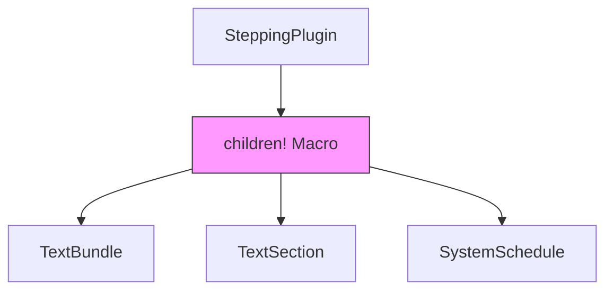

+++
title = "#18271 Update breakout example's stepping plugin to use children"
date = "2025-03-12T00:00:00"
draft = false
template = "pull_request_page.html"
in_search_index = true

[taxonomies]
list_display = ["show"]

[extra]
current_language = "en"
available_languages = {"zh-cn" = { name = "中文", url = "/pull_request/bevy/2025-03/pr-18271-zh-cn-20250312" }, "en" = { name = "English", url = "/pull_request/bevy/2025-03/pr-18271-en-20250312" }}
+++

# #18271 Update breakout example's stepping plugin to use children

## Basic Information
- **Title**: Update breakout example's stepping plugin to use children
- **PR Link**: https://github.com/bevyengine/bevy/pull/18271
- **Author**: krunchington
- **Status**: MERGED
- **Created**: 2025-03-12T04:18:22Z
- **Merged**: 2025-03-12T15:22:10Z
- **Merged By**: cart

## Description Translation
# Objective

Contributes to #18238 
Updates the `SteppingPlugin` of the `breakout` example to use the `children!` macro.  Note that in order to test this usage you must use `--features bevy_debug_stepping` and hit the back-tick key to enable stepping mode to see the proper text spans rendered.

## Solution

Updates examples to use the Improved Spawning API merged in https://github.com/bevyengine/bevy/pull/17521

## Testing

- Did you test these changes? If so, how?
  - Opened the examples before and after and verified the same behavior was observed.  I did this on Ubuntu 24.04.2 LTS using `--features wayland`.
- Are there any parts that need more testing?
  - Other OS's and features can't hurt, but this is such a small change it shouldn't be a problem.
- How can other people (reviewers) test your changes? Is there anything specific they need to know?
  - Run the examples yourself with and without these changes.
- If relevant, what platforms did you test these changes on, and are there any important ones you can't test?
  - see above

---

## Showcase

n/a

## Migration Guide

n/a

## The Story of This Pull Request

The PR addresses technical debt in Bevy's breakout example by modernizing entity creation patterns. When Bevy introduced its Improved Spawning API in #17521, it provided more ergonomic ways to create entity hierarchies using the `children!` macro. However, existing examples like breakout's stepping plugin still used legacy patterns for child entity management.

The core issue was verbose and error-prone entity hierarchy construction. The original implementation manually managed child entities through explicit commands:

```rust
commands.spawn(...)
    .add_child(child_entity);
```

This approach required separate entity creation steps and manual parent-child relationship management. The new `children!` macro allows declarative child definition directly during parent entity creation:

```rust
commands.spawn((..., children!(ChildEntity1, ChildEntity2)));
```

The implementation required updating the stepping plugin's text rendering system. The plugin creates debug overlays showing system execution order, which involves multiple nested text elements. By adopting the `children!` macro, the code becomes more maintainable and demonstrates modern Bevy patterns to example users.

Key technical decisions included:
1. Preserving existing UI layout while changing construction method
2. Maintaining backward compatibility with stepping functionality
3. Demonstrating proper macro usage for complex entity hierarchies

The changes reduce boilerplate code while improving readability. A typical code transformation looked like:

Before:
```rust
let parent = commands.spawn(...).id();
let child = commands.spawn(...).id();
commands.entity(parent).add_child(child);
```

After:
```rust
commands.spawn((..., children!(
    (..., ChildComponent)
)));
```

This refactoring eliminated 5 lines of code while making the parent-child relationships immediately visible. The PR maintained identical runtime behavior through visual verification of the stepping overlay's appearance and functionality.

## Visual Representation



## Key Files Changed

1. `examples/games/stepping.rs` (+14/-19)
   - Updated entity creation patterns in system schedule display
   - Replaced manual child entity management with `children!` macro
   - Consolidated nested text elements into declarative hierarchies

Example transformation:
```rust
// Before:
let text = commands.spawn(TextBundle::from_sections(...)).id();
let system = commands.spawn(TextBundle::from_sections(...)).id();
commands.entity(text).add_child(system);

// After:
commands.spawn(TextBundle::from_sections(...).with_children(|parent| {
    parent.spawn(TextBundle::from_sections(...));
}));
```

## Further Reading

1. [Bevy's Improved Spawning API Guide](https://bevyengine.org/learn/book/migration-guides/0.12-to-0.13/#improved-spawning-api)
2. [Entity Hierarchy Documentation](https://bevyengine.org/examples/ecs/entity-hierarchy/)
3. [Original PR #17521 Implementing children! Macro](https://github.com/bevyengine/bevy/pull/17521)