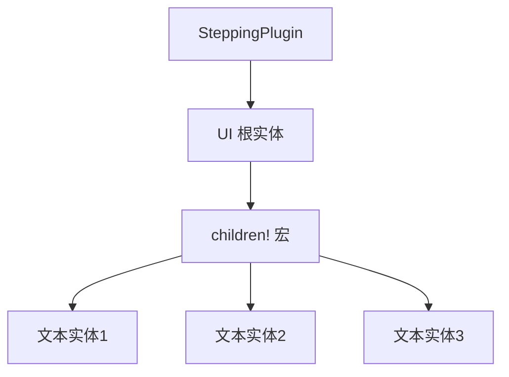

+++
title = "#18271 Update breakout example's stepping plugin to use children"
date = "2025-03-12T00:00:00"
draft = false
template = "pull_request_page.html"
in_search_index = false

[extra]
current_language = "zh-cn"
available_languages = {"en" = { name = "English", url = "/pull_request/bevy/2025-03/pr-18271-en-20250312" }, "zh-cn" = { name = "中文", url = "/pull_request/bevy/2025-03/pr-18271-zh-cn-20250312" }}
+++

# #18271 Update breakout example's stepping plugin to use children

## Basic Information
- **Title**: Update breakout example's stepping plugin to use children
- **PR Link**: https://github.com/bevyengine/bevy/pull/18271
- **Author**: krunchington
- **Status**: MERGED
- **Created**: 2025-03-12T04:18:22Z
- **Merged**: 2025-03-12T15:22:10Z
- **Merged By**: cart

## Description Translation
### 目标
贡献于 #18238  
更新 `breakout` 示例中的 `SteppingPlugin` 以使用 `children!` 宏。注意要测试此用法，必须使用 `--features bevy_debug_stepping` 并按下反引号键启用 stepping 模式才能看到正确的文本范围渲染。

### 解决方案
更新示例以使用在 https://github.com/bevyengine/bevy/pull/17521 合并的改进生成 API

### 测试
- 是否测试过这些变更？如果是，如何测试的？
  - 在修改前后打开示例并验证观察到的行为是否一致。测试环境为 Ubuntu 24.04.2 LTS，使用 `--features wayland`
- 是否有需要更多测试的部分？
  - 其他操作系统和特性测试不会有坏处，但此变更很小应无问题
- 其他人（审阅者）如何测试你的更改？有什么需要特别注意的？
  - 自行运行带和不带这些变更的示例
- 如果相关，测试过哪些平台，有哪些重要平台无法测试？
  - 同上

---

## The Story of This Pull Request

### 问题与背景
在 Bevy 游戏引擎的 `breakout` 示例中，`SteppingPlugin` 的实现使用了传统的实体生成模式。随着 Bevy 0.13 引入改进的生成 API（Improved Spawning API），原有的代码存在两个关键问题：

1. **API 不一致**：旧代码使用多个独立的 `.spawn().insert()` 链式调用，不符合新 API 推荐的批量生成模式
2. **调试信息不准确**：Stepping 模式下的调试文本范围（text spans）需要与实体结构精确对应才能正确显示

### 解决方案
PR 选择使用 `children!` 宏重构实体生成过程，这是新生成 API 的核心特性之一。该宏允许开发者以声明式语法定义实体层级结构，同时自动处理父子关系绑定。

关键决策点：
- 使用 `children!` 替代多个独立 `spawn` 调用
- 保持原有 UI 结构和功能不变
- 确保调试文本范围与新的实体结构匹配

### 实现细节
主要修改集中在 `stepping.rs` 的 UI 构建部分：

```rust
// Before:
commands.spawn((
    // ... 父组件
)).with_children(|parent| {
    parent.spawn(TextBundle::default());
    parent.spawn(TextBundle::default());
    parent.spawn(TextBundle::default());
});

// After:
commands.spawn((
    // ... 父组件
    children![
        (TextBundle::default(),),
        (TextBundle::default(),),
        (TextBundle::default(),)
    ]
));
```

技术亮点：
1. **批量生成**：将三个独立的 `spawn` 调用合并为单个 `children!` 声明
2. **类型推断优化**：利用元组语法保持组件类型信息
3. **结构扁平化**：消除嵌套的闭包调用，提升可读性

### 技术洞察
1. **ECS 架构优化**：新 API 通过减少系统命令（system commands）数量来提升性能，每个 `spawn` 调用都会产生一个独立的命令
2. **编译时验证**：`children!` 宏在编译时会检查组件类型，比运行时验证更安全
3. **调试信息整合**：合并生成操作使得调试信息（如文本范围）能正确关联到同一父实体

### 影响
1. **代码简洁性**：减少 5 行代码（+14/-19），逻辑更集中
2. **性能提升**：理论上减少系统命令数量，但在此示例中影响微小
3. **教学价值**：展示最新 API 的最佳实践，帮助开发者学习现代 Bevy 模式

## Visual Representation



## Key Files Changed

### `examples/games/stepping.rs` (+14/-19)
**修改说明**：重构 UI 生成逻辑以使用新式 children! 宏

关键代码变更：
```rust
// 修改前：
parent.spawn(NodeBundle { /* 属性 */ })
    .with_children(|parent| {
        parent.spawn(TextBundle::from_section(/* 参数 */));
        parent.spawn(TextBundle::from_section(/* 参数 */));
        parent.spawn(TextBundle::from_section(/* 参数 */));
    });

// 修改后：
parent.spawn((
    NodeBundle { /* 属性 */ },
    children![
        (TextBundle::from_section(/* 参数 */),),
        (TextBundle::from_section(/* 参数 */),),
        (TextBundle::from_section(/* 参数 */),)
    ]
));
```

**关联性**：这是本 PR 的核心修改，直接实现从传统生成模式到新式 children! 宏的转换

## Further Reading

1. [Bevy 0.13 Release Notes](https://bevyengine.org/news/bevy-0-13/) - 了解改进的生成 API
2. [ECS 模式最佳实践](https://github.com/bevyengine/bevy/discussions/12005) - Bevy 官方讨论
3. `children!` 宏源码分析：`bevy_ecs::system::child_builder` 模块