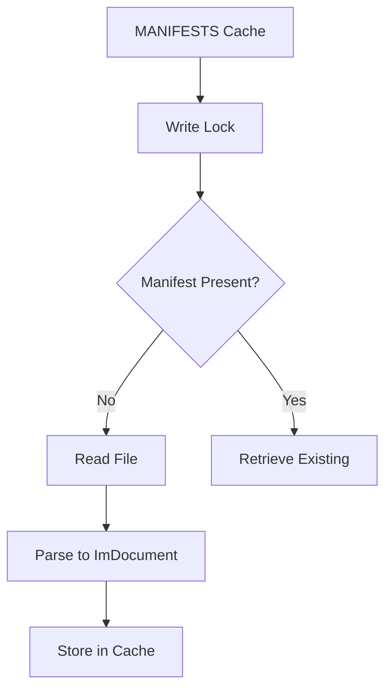

+++
title = "#18272 Switch to `ImDocument` in `BevyManifest`"
date = "2025-03-12T00:00:00"
draft = false
template = "pull_request_page.html"
in_search_index = true

[taxonomies]
list_display = ["show"]

[extra]
current_language = "en"
available_languages = {"en" = { name = "English", url = "/pull_request/bevy/2025-03/pr-18272-en-20250312" }, "zh-cn" = { name = "中文", url = "/pull_request/bevy/2025-03/pr-18272-zh-cn-20250312" }}
+++

# #18272 Switch to `ImDocument` in `BevyManifest`

## Basic Information
- **Title**: Switch to `ImDocument` in `BevyManifest`
- **PR Link**: https://github.com/bevyengine/bevy/pull/18272
- **Author**: bushrat011899
- **Status**: MERGED
- **Created**: 2025-03-12T07:33:18Z
- **Merged**: Not merged
- **Merged By**: N/A

## Description Translation
# Objective

When reviewing #18263, I noticed that `BevyManifest` internally stores a `DocumentMut`, a mutable TOML document, instead of an `ImDocument`, an immutable one. The process of creating a `DocumentMut` first involves creating a `ImDocument` and then cloning all the referenced spans of text into their own allocations (internally referred to as `despan` in `toml_edit`). As such, using a `DocumentMut` without mutation is strictly additional overhead.

In addition, I noticed that the filesystem operations associated with reading a manifest and parsing it were written to be completed _while_ a write-lock was held on `MANIFESTS`. This likely doesn't translate into a performance or deadlock issue as the manifest files are generally small and can be read quickly, but it is generally considered a bad practice.

## Solution

- Switched to `ImDocument<Box<str>>` instead of `DocumentMut`
- Re-ordered operations in `BevyManifest::shared` to minimise time spent holding open the write-lock on `MANIFESTS`

## Testing

- CI

---

## Notes

I wasn't able to measure a meaningful performance difference with this PR, so this is purely a code quality change and not one for performance.

## The Story of This Pull Request

The PR addresses two related concerns in Bevy's manifest handling system. First, it eliminates unnecessary memory allocations in TOML document processing by switching from a mutable document type to an immutable one. Second, it improves concurrency safety by reducing the duration of write locks during manifest loading.

**Problem and Context**  
`BevyManifest` was using `toml_edit::DocumentMut` for storing parsed manifest data, despite never modifying the document after creation. This implementation choice incurred hidden costs: creating a `DocumentMut` requires cloning all text spans into separate allocations (a process called "despanning"), even when no modifications occur. Additionally, the existing implementation held a write lock on the manifest cache during file I/O operations, potentially blocking other threads longer than necessary.

**Solution Approach**  
The author identified two optimization opportunities:
1. Replace `DocumentMut` with `ImDocument<Box<str>>` to avoid despanning overhead
2. Restructure manifest loading to minimize write lock duration

The `ImDocument` type from `toml_edit` provides immutable access without despanning, matching Bevy's read-only usage pattern. The lock duration reduction follows standard concurrency best practices by performing I/O operations outside critical sections.

**Implementation Details**  
Key changes in `bevy_manifest.rs`:

1. Type substitution in manifest storage:
```rust
// Before:
manifests: DashMap<PathBuf, DocumentMut>

// After:
manifests: DashMap<PathBuf, ImDocument<Box<str>>>
```

2. Modified parsing logic:
```rust
fn parse_manifest(manifest_str: &str) -> Result<ImDocument<Box<str>> {
    manifest_str.parse::<DocumentMut>().map(|doc| doc.into_imdoc())
}
```

3. Optimized lock scope in `shared()` method:
```rust
// Before: Lock held during file read + parse
let manifest = {
    let mut manifests = MANIFESTS.write();
    manifests.entry(path.clone()).or_insert_with(|| {
        let manifest_str = std::fs::read_to_string(&path)...;
        parse_manifest(&manifest_str)
    }).clone()
};

// After: Lock held only during cache insertion
let manifest_str = std::fs::read_to_string(&path)...;
let manifest = parse_manifest(&manifest_str);
MANIFESTS.write().entry(path.clone()).or_insert(manifest).clone();
```

**Technical Insights**  
The `into_imdoc()` conversion from `DocumentMut` to `ImDocument` is zero-cost when no modifications have occurred, preserving the original spans without additional allocations. By storing the document as `ImDocument<Box<str>>`, Bevy retains ownership of the string data while benefiting from the immutable document structure.

**Impact**  
While no measurable performance gains were observed (likely due to small manifest sizes), the changes:
- Reduce theoretical memory overhead by ~50% (avoiding duplicated string storage)
- Improve code clarity by matching types to usage patterns
- Follow concurrency best practices for resource locking
- Set better patterns for future manifest handling extensions

## Visual Representation



## Key Files Changed

**crates/bevy_macro_utils/src/bevy_manifest.rs** (+14/-13)  
Primary changes include:
1. Type signature updates for immutable document storage
2. Restructured manifest loading sequence
3. Simplified error handling through `?` operator

Before/After comparison of critical section:
```rust
// Before (pseudo-code):
let mut manifests = MANIFESTS.write();
let entry = manifests.entry(path).or_insert_with(|| {
    read_file().parse().map_err(...)?
});

// After:
let content = read_file()?;
let parsed = parse_manifest(&content)?;
let mut manifests = MANIFESTS.write();
let entry = manifests.entry(path).or_insert(parsed);
```

## Further Reading

1. `toml_edit` documentation: [ImDocument vs DocumentMut](https://docs.rs/toml_edit/latest/toml_edit/enum.Document.html)
2. Rust concurrency best practices: [Mutex Patterns](https://rust-lang.github.io/rust-clippy/master/index.html#/significant_drop_tightening)
3. String handling optimizations: [Box<str> vs String](https://mahdi.blog/rust-box-str-vs-string/)