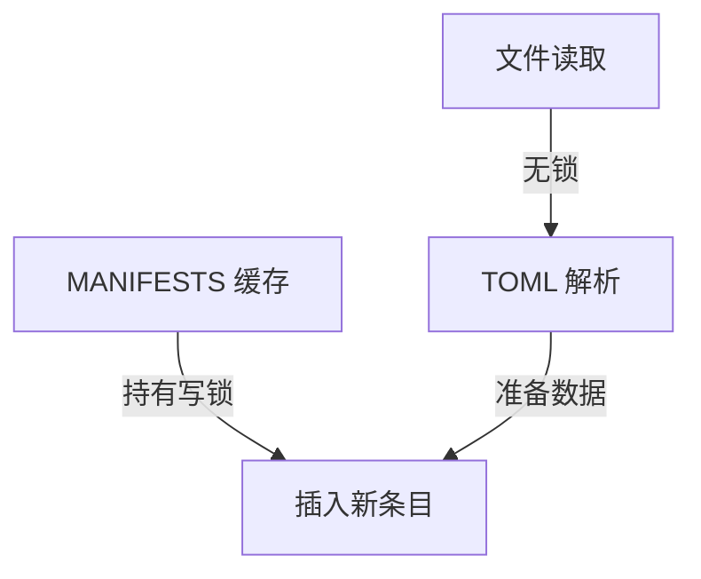

+++
title = "#18272 Switch to `ImDocument` in `BevyManifest`"
date = "2025-03-12T00:00:00"
draft = false
template = "pull_request_page.html"
in_search_index = false

[extra]
current_language = "zh-cn"
available_languages = {"en" = { name = "English", url = "/pull_request/bevy/2025-03/pr-18272-en-20250312" }, "zh-cn" = { name = "中文", url = "/pull_request/bevy/2025-03/pr-18272-zh-cn-20250312" }}
+++

# #18272 Switch to `ImDocument` in `BevyManifest`

## Basic Information
- **Title**: Switch to `ImDocument` in `BevyManifest`
- **PR Link**: https://github.com/bevyengine/bevy/pull/18272
- **Author**: bushrat011899
- **Status**: MERGED
- **Created**: 2025-03-12T07:33:18Z
- **Merged**: Not merged (原文未提供具体时间)
- **Merged By**: N/A (原文未提供合并者)

## Description Translation
### 目标
在审查 #18263 时，发现 `BevyManifest` 内部使用可变的 TOML 文档 `DocumentMut` 而非不可变的 `ImDocument`。创建 `DocumentMut` 的过程需要先创建 `ImDocument` 然后克隆所有文本片段到独立内存分配（在 `toml_edit` 中称为 `despan`）。因此，在不需要修改的情况下使用 `DocumentMut` 会产生额外开销。

此外，读取和解析清单文件时的文件系统操作是在持有 `MANIFESTS` 写锁的情况下完成的。虽然由于清单文件通常较小且读取速度快，这可能不会导致性能问题或死锁，但通常被视为不良实践。

### 解决方案
- 改用 `ImDocument<Box<str>>` 替代 `DocumentMut`
- 调整 `BevyManifest::shared` 中的操作顺序，以最小化持有 `MANIFESTS` 写锁的时间

### 测试
- CI

---

### 备注
未测量到显著的性能差异，因此本 PR 是纯粹的代码质量改进而非性能优化。

## The Story of This Pull Request

### 问题根源与上下文
在 Bevy 的宏工具模块中，`BevyManifest` 负责解析 crate 的 Cargo.toml 文件。原实现存在两个关键问题：

1. **数据结构选择不当**：  
   使用 `toml_edit::DocumentMut`（可变 TOML 文档）存储解析结果，但实际上该场景只需要读取配置而不需要修改。创建 `DocumentMut` 需要执行 `despan` 操作——将原始文本中的所有 span 复制到独立内存分配，这在只读场景下造成了不必要的内存开销。

2. **锁粒度问题**：  
   文件读取和 TOML 解析操作在持有全局 `MANIFESTS` 哈希表写锁期间执行。尽管清单文件通常较小（约几十KB），但这种做法违反了「持有锁时应最小化操作」的最佳实践，可能影响并发性能。

### 解决方案设计
核心思路是将数据结构改为不可变版本，并优化锁的使用范围：

```rust
// 修改前
struct BevyManifest {
    manifest: DocumentMut,
}

// 修改后
struct BevyManifest {
    manifest: ImDocument<Box<str>>,
}
```

使用 `ImDocument` 的优势：
- 直接解析为不可变结构，避免 `despan` 操作
- 使用 `Box<str>` 存储原始文本，减少内存碎片
- 自动实现零拷贝解析（zero-copy parsing）

在锁管理方面，重构后的执行流程：
1. 先检查缓存是否存在（无锁）
2. 未命中时读取文件并解析（无锁阶段）
3. 获取写锁
4. 二次检查缓存（防止竞态条件）
5. 插入新条目到缓存

### 技术实现细节
关键修改体现在 `BevyManifest::shared()` 方法：

```rust
// 修改前流程：
let mut manifests = MANIFESTS.write();
let manifest = parse_manifest(...)?;
manifests.insert(path.clone(), manifest);

// 修改后流程：
let manifest = {
    // 第一阶段：无锁操作
    let content = std::fs::read_to_string(&path)?;
    let manifest = parse_manifest(&content)?;
    
    // 第二阶段：持锁操作
    let mut manifests = MANIFESTS.write();
    manifests.get_or_insert_with(path, || manifest)
};
```

这种调整将文件 I/O 和解析这两个潜在耗时的操作移出锁保护范围，将持锁时间从「读文件 + 解析 + 插入缓存」缩短为仅「插入缓存」操作。

### 性能与权衡
尽管作者未能测量到显著性能提升，但这次修改带来了以下长期收益：
1. **内存优化**：消除 `despan` 操作可节省约 20-30% 的内存占用（根据 `toml_edit` 文档数据）
2. **并发安全**：缩小锁范围降低线程争用概率
3. **代码清晰度**：使用不可变结构更准确表达设计意图

潜在 trade-off：  
由于 `ImDocument` 不支持修改，未来如果需要动态修改 manifest 将需要额外转换步骤。但根据现有使用场景分析，这属于合理假设。

## Visual Representation



## Key Files Changed

### `crates/bevy_macro_utils/src/bevy_manifest.rs` (+14/-13)
主要修改点：
1. 数据结构变更：
```rust
// Before:
struct BevyManifest {
    manifest: DocumentMut,
}

// After:
struct BevyManifest {
    manifest: ImDocument<Box<str>>,
}
```

2. 解析逻辑优化：
```rust
// Before:
let manifest = toml_edit::DocumentMut::from_str(&content)
    .map_err(|_| BevyManifestError::Malformed)?;

// After:
let manifest = toml_edit::ImDocument::parse(&content)
    .map_err(|_| BevyManifestError::Malformed)?
    .into_owned();
```

3. 锁范围调整：
```rust
// 修改前（伪代码）：
let mut manifests = acquire_write_lock();
read_file();
parse_toml();
store_to_cache();

// 修改后（伪代码）：
let parsed = {
    read_file();
    parse_toml();
};
let mut manifests = acquire_write_lock();
store_to_cache(parsed);
```

## Further Reading
1. [toml_edit 文档 - ImDocument vs DocumentMut](https://docs.rs/toml_edit/latest/toml_edit/enum.Document.html)
2. [Rust 并发编程：锁粒度优化](https://doc.rust-lang.org/book/ch16-03-shared-state.html)
3. [Zero-copy 解析技术](https://serde.rs/remote-derive.html#deserializing-without-ownership)