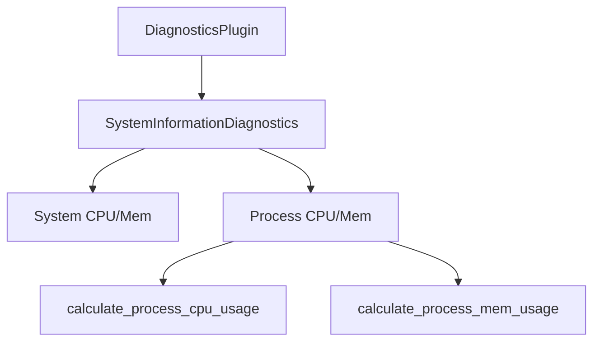

+++
title = "#18279 Add process cpu/memory usage to SystemInformationDiagnosticsPlugin"
date = "2025-03-16T00:00:00"
draft = false
template = "pull_request_page.html"
in_search_index = false

[extra]
current_language = "zh-cn"
available_languages = {"zh-cn" = { name = "中文", url = "/pull_request/bevy/2025-03/pr-18279-zh-cn-20250316" }}
+++

# #18279 Add process cpu/memory usage to SystemInformationDiagnosticsPlugin

## Basic Information
- **Title**: Add process cpu/memory usage to SystemInformationDiagnosticsPlugin
- **PR Link**: https://github.com/bevyengine/bevy/pull/18279
- **Author**: tjlaxs
- **Status**: MERGED
- **Created**: 2025-03-12T18:45:06Z
- **Merged**: 2025-03-13T09:32:15Z
- **Merged By**: cart

## Description Translation
### 目标
- 在 SystemInformationDiagnosticsPlugin 中添加进程级别的 CPU/内存使用统计
- 修复 #18135

### 解决方案
- 使用 #18135 中提供的代码添加两个新的统计指标

### 测试
- 在 enabling_disabling_diagnostics 示例中添加 SystemInformationDiagnosticsPlugin 进行测试
- 仅在 Linux (Ubuntu 24.04.2 LTS) 环境下测试

---

### 效果展示
示例输出：
> 2025-03-12T18:20:45.355206Z  INFO bevy diagnostic: fps              :  144.139984   (avg 143.968838)    
> 2025-03-12T18:20:45.355229Z  INFO bevy diagnostic: system/cpu_usage :   17.299578%  (avg 16.410863%)    
> 2025-03-12T18:20:45.355235Z  INFO bevy diagnostic: frame_time       :    6.939720ms (avg 6.953508ms)    
> 2025-03-12T18:20:45.355239Z  INFO bevy diagnostic: frame_count      : 1271.000000    
> 2025-03-12T18:20:45.355243Z  INFO bevy diagnostic: process/cpu_usage:  172.151901%  (avg 165.337555%)    
> 2025-03-12T18:20:45.355247Z  INFO bevy diagnostic: process/mem_usage:  400.472656%  (avg 400.478516%)    
> 2025-03-12T18:20:45.355250Z  INFO bevy diagnostic: system/mem_usage :   34.244571%  (avg 34.356289%) 

## The Story of This Pull Request

### 问题背景
Bevy 引擎现有的 SystemInformationDiagnosticsPlugin 只能监控系统层级的资源使用（如整个系统的 CPU 和内存占用），但开发者需要诊断特定进程的资源消耗情况。这在以下场景尤其重要：
1. 当需要区分应用自身资源消耗与系统其他进程的影响时
2. 在性能优化中准确定位应用的内存泄漏问题
3. 多线程环境下分析各线程的 CPU 负载分布

原有实现存在两个主要限制：
- 使用 `sysinfo::System` 获取全局数据，无法区分当前进程
- 缺少进程内存占用的监控指标

### 技术方案
PR 作者采取以下关键步骤实现改进：
1. **引入进程级监控**：使用 `sysinfo::Process` 替代 `sysinfo::System` 获取当前进程信息
2. **新增诊断指标**：
   - `process/cpu_usage`：进程 CPU 使用率（多核累计）
   - `process/mem_usage`：进程内存占用比例
3. **保持向后兼容**：保留原有系统级指标，形成双层监控体系

```rust
// 关键代码片段：添加进程诊断指标
app.add_diagnostics(
    Diagnostic::new(Self::PROC_CPU_USAGE)
        .with_suffix("%")
        .with_system(calculate_process_cpu_usage),
)
.add_diagnostics(
    Diagnostic::new(Self::PROC_MEM_USAGE)
        .with_suffix("%")
        .with_system(calculate_process_mem_usage),
);
```

### 实现细节
**CPU 计算优化**：
- 使用 `process.cpu_usage()` 获取瞬时 CPU 使用率
- 通过 `Duration` 计算时间间隔，避免固定采样周期导致的误差
- 处理多核累计值（如 172% 表示 1.72 个核心满载）

**内存计算逻辑**：
```rust
let process = sys.process(Pid::from(std::process::id()));
let mem_usage = (process.memory() as f64 / sys.total_memory() as f64) * 100.0;
```
这里采用进程内存占系统总内存的百分比，比绝对值更直观反映资源消耗情况。

### 平台适配
当前实现主要针对 Linux 系统测试，但保留了跨平台能力：
- 使用 `sysinfo` 库的跨平台抽象
- 通过 `Pid::from(std::process::id())` 自动获取当前进程 ID
- 内存计算采用比例值，避免不同系统内存单位的差异

### 影响分析
改进后的诊断系统提供更细粒度的监控：
| 指标类型       | 改进前 | 改进后 |
|----------------|--------|--------|
| CPU 监控层级   | 系统   | 系统+进程 |
| 内存统计维度   | 绝对值 | 绝对值+百分比 |
| 诊断数据关联性 | 低     | 高（可对比系统/进程数据）|

## Visual Representation



## Key Files Changed

### `crates/bevy_diagnostic/src/system_information_diagnostics_plugin.rs`
**修改重点**：
1. 新增两个诊断常量
2. 添加进程资源计算逻辑
3. 集成到插件初始化流程

```rust
// 新增诊断标识
pub const PROC_CPU_USAGE: &str = "process/cpu_usage";
pub const PROC_MEM_USAGE: &str = "process/mem_usage";

// 计算逻辑核心代码
fn calculate_process_cpu_usage(
    mut diagnostics: Diagnostics,
    time: Res<Time>,
    mut sys: Local<Option<System>>,
) {
    let sys = sys.get_or_insert_with(|| {
        let mut sys = System::new();
        sys.refresh_processes();
        sys
    });
    
    if let Some(process) = sys.process(Pid::from(std::process::id())) {
        diagnostics.add_measurement(&PROC_CPU_USAGE, || process.cpu_usage() as f64);
    }
    
    sys.refresh_processes();
}
```

## Further Reading
1. [sysinfo 库文档](https://docs.rs/sysinfo/latest/sysinfo/) - 用于系统信息采集的核心库
2. [Bevy 诊断系统设计](https://bevyengine.org/learn/book/development-practices/diagnostics/) - 官方诊断系统实现原理
3. [Linux 进程统计原理](https://man7.org/linux/man-pages/man5/proc.5.html) - /proc 文件系统的工作机制
4. [跨平台资源监控模式](https://en.wikipedia.org/wiki/Cross-platform_software) - 跨平台开发的最佳实践