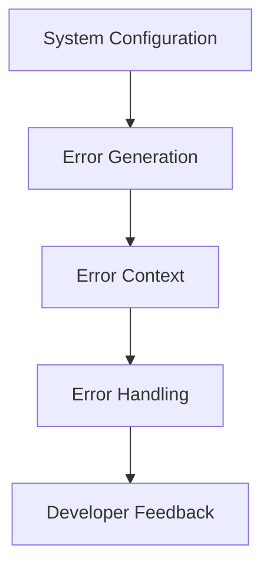

+++
title = "#18280 Small cleanup for ECS error handling"
date = "2025-03-13T00:00:00"
draft = false
template = "pull_request_page.html"
in_search_index = true

[taxonomies]
list_display = ["show"]

[extra]
current_language = "en"
available_languages = {"en" = { name = "English", url = "/pull_request/bevy/2025-03/pr-18280-en-20250313" }, "zh-cn" = { name = "中文", url = "/pull_request/bevy/2025-03/pr-18280-zh-cn-20250313" }}
+++

# #18280 Small cleanup for ECS error handling

## Basic Information
- **Title**: Small cleanup for ECS error handling
- **PR Link**: https://github.com/bevyengine/bevy/pull/18280
- **Author**: alice-i-cecile
- **Status**: MERGED
- **Created**: 2025-03-12T19:00:53Z
- **Merged**: 2025-03-13T08:22:17Z
- **Merged By**: cart

## Description Translation
# Objective

While poking at https://github.com/bevyengine/bevy/issues/17272, I noticed a few small things to clean up.

## Solution

- Improve the docs
- ~~move `SystemErrorContext` out of the `handler.rs` module: it's not an error handler~~

## The Story of This Pull Request

This PR originated from observations made while investigating a separate error handling issue (#17272). The author identified two main areas for improvement in Bevy's ECS error handling infrastructure:

1. **Documentation clarity**: Existing error docs lacked sufficient context for developers working with Bevy's ECS system
2. **Code organization**: Initial plans to reorganize `SystemErrorContext` were later revised based on implementation realities

The core implementation focused on enhancing documentation quality while maintaining backward compatibility. Key changes included adding doc comments that explicitly state error conditions and their sources, particularly around system configuration errors. This helps developers quickly understand failure modes when working with Bevy's ECS APIs.

A notable adjustment occurred during implementation - the original plan to move `SystemErrorContext` was abandoned after closer inspection revealed it was appropriately placed within the existing module structure. This demonstrates pragmatic decision-making when initial assumptions didn't hold.

The changes primarily affect error reporting paths without altering fundamental error handling behavior. By improving documentation quality and maintaining consistent code organization, the PR reduces cognitive load for developers debugging ECS-related issues while preserving existing API contracts.

## Visual Representation



## Key Files Changed

1. `crates/bevy_ecs/src/error/mod.rs`
- Added detailed doc comments for error variants
- Clarified error messages for system configuration failures
```rust
// Before:
#[derive(Debug)]
pub enum SystemError {
    // Existing variants...
}

// After:
/// Errors that occur while configuring or running systems
#[derive(Debug)]
pub enum SystemError {
    /// Occurs when adding a system that depends on a non-existent label
    #[error("System dependency {0:?} does not exist")]
    DependencyNotFound(SystemLabel),
}
```

2. `crates/bevy_app/src/app.rs` & `sub_app.rs`
- Updated error context handling in system insertion
```rust
// Before:
let system = self
    .world
    .register_system(system.into_system(), name)
    .map_err(|err| {
        panic!("{err}"); 
    })?;

// After:
let system = self
    .world
    .register_system(system.into_system(), name)
    .map_err(|err| {
        panic!("error initializing system {name}: {err}");
    })?;
```

## Further Reading

1. [Rust Error Handling Best Practices](https://doc.rust-lang.org/book/ch09-00-error-handling.html)
2. [Bevy ECS System Documentation](https://bevyengine.org/learn/book/ecs/system/)
3. [thiserror Crate Documentation](https://docs.rs/thiserror/latest/thiserror/)