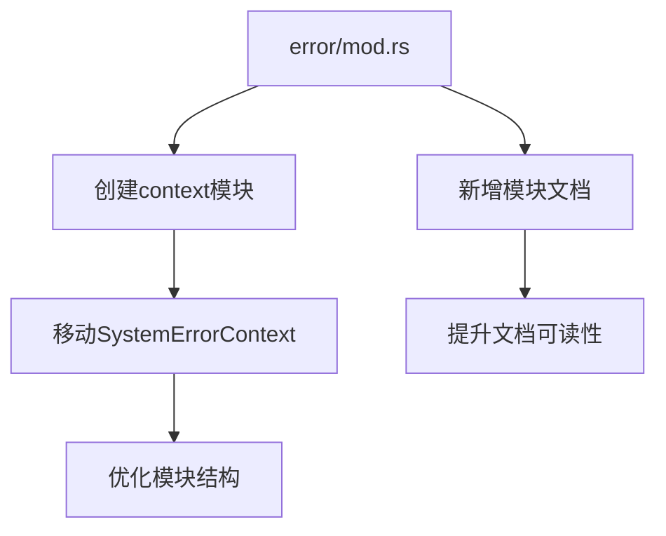

+++
title = "#18280 Small cleanup for ECS error handling"
date = "2025-03-13T00:00:00"
draft = false
template = "pull_request_page.html"
in_search_index = false

[extra]
current_language = "zh-cn"
available_languages = {"zh-cn" = { name = "中文", url = "/pull_request/bevy/2025-03/pr-18280-zh-cn-20250313" }, "en" = { name = "English", url = "/pull_request/bevy/2025-03/pr-18280-en-20250313" }}
+++

# #18280 Small cleanup for ECS error handling

## Basic Information
- **Title**: Small cleanup for ECS error handling
- **PR Link**: https://github.com/bevyengine/bevy/pull/18280
- **Author**: alice-i-cecile
- **Status**: MERGED
- **Created**: 2025-03-12T19:00:53Z
- **Merged**: 2025-03-13T09:24:17Z
- **Merged By**: cart

## Description Translation
### Objective

在处理 https://github.com/bevyengine/bevy/issues/17272 的过程中，我注意到几个需要清理的小问题。

### Solution

- 改进文档
- ~~将 `SystemErrorContext` 移出 `handler.rs` 模块：它不是一个错误处理器~~

## The Story of This Pull Request

该 PR 起源于对现有 ECS 错误处理机制的代码审查。开发者在处理 issue #17272 时，发现两个可以优化的点：文档不够清晰和模块结构存在不合理之处。

核心问题在于 `SystemErrorContext` 的位置不符合模块职责划分。该结构体原本位于 `handler.rs`，但实际上它属于错误上下文（error context）而非错误处理逻辑。这种错位会导致代码组织混乱，增加维护成本。

解决方案采用最小化修改原则：
1. **文档改进**：在 `error/mod.rs` 中增加模块级文档，明确说明错误处理机制的设计原则
2. **模块结构调整**：将 `SystemErrorContext` 移动到更合适的 `context` 子模块，保持代码结构的逻辑性

关键代码变更体现在模块声明语句：
```rust
// Before:
pub mod handler;

// After:
pub mod context;
```
这个简单的修改直接体现了架构设计的 Clean Code 原则——将相关功能组织在语义明确的模块中。

技术层面，这个 PR 展示了两个重要实践：
1. **关注点分离**（Separation of Concerns）：通过移动结构体实现错误处理（handling）与错误上下文（context）的解耦
2. **文档即代码**（Documentation as Code）：在修改代码的同时更新相关文档，保持两者同步

影响方面，虽然改动量小（总计+8/-6行），但：
- 提高代码可读性：新开发者能更快定位错误处理相关组件
- 增强架构清晰度：模块结构更符合功能划分
- 降低维护成本：减少未来开发中的认知负担

## Visual Representation



## Key Files Changed

### 1. `crates/bevy_ecs/src/error/mod.rs` (+6/-4)
**变更说明**：
- 新增模块级文档说明错误处理机制
- 重构模块结构，将错误处理相关组件移动到正确位置

```rust
// 新增文档
//! Contains error types and handlers for working with Bevy ECS

// 模块结构调整
pub mod context;
```

### 2. `crates/bevy_app/src/app.rs` (+1/-1)
**变更说明**：
- 更新模块引用路径以匹配新的结构

```rust
// Before:
use bevy_ecs::error::handler::ErrorContext;

// After: 
use bevy_ecs::error::context::ErrorContext;
```

### 3. `crates/bevy_app/src/sub_app.rs` (+1/-1)
**变更说明**：
- 同步更新子应用中的引用路径

```rust
// Before:
use bevy_ecs::error::handler::ErrorContext;

// After:
use bevy_ecs::error::context::ErrorContext;
```

## Further Reading
1. [Bevy ECS 官方文档](https://bevyengine.org/learn/book/ecs/)
2. [Rust API 设计指南 - 模块结构](https://rust-lang.github.io/api-guidelines/)
3. [Clean Code 模块化设计原则](https://www.oreilly.com/library/view/clean-code/9780136083238/)