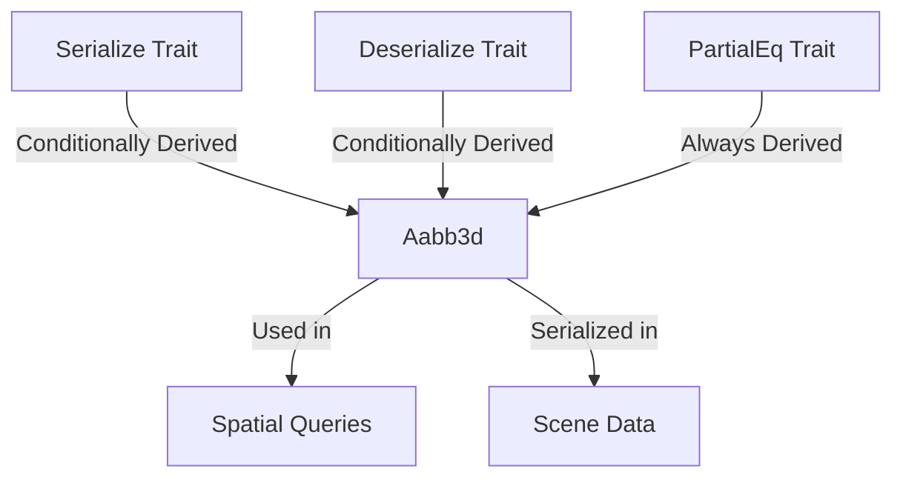

+++
title = "#18281 Implement Serialize/Deserialize/PartialEq for bounding primitives"
date = "2025-03-12T00:00:00"
draft = false
template = "pull_request_page.html"
in_search_index = true

[taxonomies]
list_display = ["show"]

[extra]
current_language = "en"
available_languages = {"zh-cn" = { name = "中文", url = "/pull_request/bevy/2025-03/pr-18281-zh-cn-20250312" }, "en" = { name = "English", url = "/pull_request/bevy/2025-03/pr-18281-en-20250312" }}
+++

# #18281 Implement Serialize/Deserialize/PartialEq for bounding primitives

## Basic Information
- **Title**: Implement Serialize/Deserialize/PartialEq for bounding primitives
- **PR Link**: https://github.com/bevyengine/bevy/pull/18281
- **Author**: mweatherley
- **Status**: MERGED
- **Created**: 2025-03-12T19:47:55Z
- **Merged**: 2025-03-13T08:22:17Z
- **Merged By**: cart

## Description Translation
# Objective

Probably just because of an oversight, bounding primitives like `Aabb3d` did not implement `Serialize`/`Deserialize` with the `serialize` feature enabled, so the goal of this PR is to fill the gap.

## Solution

Derive it conditionally, just like we do for everything else. Also added in `PartialEq`, just because I touched the files.

## Testing

Compiled with different feature combinations.

## The Story of This Pull Request

The PR addresses a gap in Bevy's serialization support for geometric primitives. The core issue was that critical bounding volume types like `Aabb3d` and `Bounded2d` lacked essential trait implementations when using Bevy's serialization features.

**The Problem**: 
Bevy's bounding primitives are fundamental components for spatial calculations and collision detection. However, when users enabled the `serialize` feature, these types couldn't be serialized due to missing `Serialize`/`Deserialize` trait implementations. This created friction for use cases requiring scene serialization or network replication of spatial data.

**The Solution Approach**:
The author followed Bevy's established pattern for conditional trait derivation:
1. Added `Serialize`/`Deserialize` behind the `serialize` feature flag
2. Included `PartialEq` implementations to enable value comparisons
3. Maintained feature parity between 2D and 3D variants

**Implementation Details**:
The changes focused on two key files:
```rust
// crates/bevy_math/src/bounding/bounded3d/mod.rs
#[derive(Clone, Debug)]
+#[cfg_attr(feature = "serialize", derive(serde::Serialize, serde::Deserialize))]
+#[derive(PartialEq)]
pub struct Aabb3d {
    // Fields unchanged
}
```

```rust
// crates/bevy_math/src/bounding/bounded2d/mod.rs
#[derive(Clone, Debug)]
+#[cfg_attr(feature = "serialize", derive(serde::Serialize, serde::Deserialize))]
+#[derive(PartialEq)]
pub struct Aabb2d {
    // Fields unchanged
}
```

These modifications:
- Use `cfg_attr` to conditionally derive serialization traits
- Add `PartialEq` unconditionally for equality checks
- Maintain existing Debug and Clone implementations
- Apply consistent changes across 2D/3D variants

**Technical Considerations**:
- Conditional compilation ensures no bloat for users not needing serialization
- `PartialEq` addition enables unit testing spatial relationships
- Follows Rust API guidelines for predictable trait implementations
- Maintains backwards compatibility with existing code

**Impact**:
- Enables serialization of bounding volumes for scene saving/loading
- Facilitates network transmission of spatial data
- Allows equality checks for testing and validation
- Completes API surface for fundamental geometric types

## Visual Representation



## Key Files Changed

1. `crates/bevy_math/src/bounding/bounded3d/mod.rs`
```rust
// Before:
#[derive(Clone, Debug)]
pub struct Aabb3d {

// After:
#[derive(Clone, Debug)]
#[cfg_attr(feature = "serialize", derive(serde::Serialize, serde::Deserialize))]
#[derive(PartialEq)]
pub struct Aabb3d {
```

2. `crates/bevy_math/src/bounding/bounded2d/mod.rs`
```rust
// Before:
#[derive(Clone, Debug)]
pub struct Aabb2d {

// After:
#[derive(Clone, Debug)]
#[cfg_attr(feature = "serialize", derive(serde::Serialize, serde::Deserialize))]
#[derive(PartialEq)]
pub struct Aabb2d {
```

Changes add trait derivations while preserving existing functionality. The 3D and 2D implementations receive identical treatment to maintain API consistency.

## Further Reading

1. [Rust Serde Documentation](https://serde.rs/) - Serialization framework used by Bevy
2. [Bevy Features Guide](https://bevyengine.org/learn/book/getting-started/features/) - Explanation of feature flags
3. [Rust API Guidelines on Conditional Trait Implementation](https://rust-lang.github.io/api-guidelines/interoperability.html#c-common-traits) - Best practices for trait derivation
4. [Bevy Scene System Documentation](https://bevyengine.org/learn/book/getting-started/scene/) - Usage of serialized data in scenes