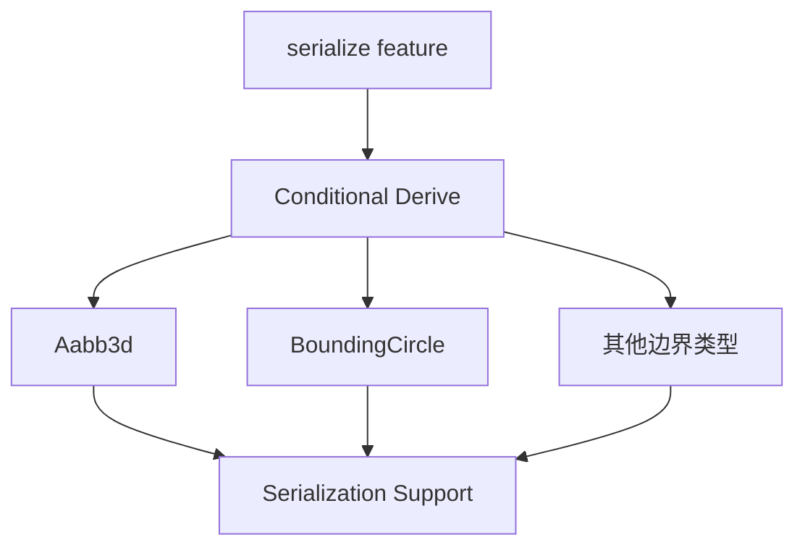

+++
title = "#18281 Implement Serialize/Deserialize/PartialEq for bounding primitives"
date = "2025-03-12T00:00:00"
draft = false
template = "pull_request_page.html"
in_search_index = false

[extra]
current_language = "zh-cn"
available_languages = {"en" = { name = "English", url = "/pull_request/bevy/2025-03/pr-18281-en-20250312" }, "zh-cn" = { name = "中文", url = "/pull_request/bevy/2025-03/pr-18281-zh-cn-20250312" }}
+++

# #18281 Implement Serialize/Deserialize/PartialEq for bounding primitives

## Basic Information
- **Title**: Implement Serialize/Deserialize/PartialEq for bounding primitives  
- **PR Link**: https://github.com/bevyengine/bevy/pull/18281  
- **Author**: mweatherley  
- **Status**: MERGED  
- **Created**: 2025-03-12T19:47:55Z  
- **Merged By**: cart  

## Description Translation
### 目标  
由于疏忽，当启用`serialize`功能时，`Aabb3d`等边界体基元（bounding primitives）没有实现`Serialize`/`Deserialize` trait，本PR的目标是填补这个缺口。

### 解决方案  
条件式派生（conditionally derive）这些trait，与代码库其他部分保持一致。同时添加了`PartialEq`实现——因修改相关文件而顺带完成。

### 测试  
通过不同功能组合进行编译测试。

## The Story of This Pull Request

### 问题背景与发现
在Bevy引擎的数学模块中，边界体（bounding volumes）如`Aabb3d`（3D轴对齐包围盒）和`Bounded2d`/`Bounded3d` trait承担着空间计算和序列化的重要职责。开发团队发现当启用`serialize`功能时，这些基础类型缺乏必要的序列化支持，这会导致：
1. 无法将包含这些类型的场景数据序列化为文件
2. 网络传输时无法正确编解码空间数据
3. 与其他序列化系统集成时出现兼容性问题

问题的根源在于这些结构体缺少`Serialize`和`Deserialize` trait派生，而引擎中其他可序列化类型通常通过条件编译自动实现这些特性。

### 解决方案的选择与实现
采用Bevy项目已有的条件派生模式，主要修改集中在两个文件：
```rust
// crates/bevy_math/src/bounding/bounded3d/mod.rs
#[derive(Clone, Debug, PartialEq)]
#[cfg_attr(feature = "serialize", derive(serde::Serialize, serde::Deserialize))]
pub struct Aabb3d {
    // 原有字段保持不变
}

// 对BoundingCircle等类型进行类似修改
```

实现策略的关键点：
1. **条件编译**：使用`#[cfg_attr(feature = "serialize", ...)]`确保只在启用serialize功能时引入序列化依赖
2. **最小化改动**：利用Rust的derive宏以声明式添加功能，避免手动实现可能引入的错误
3. **连带改进**：在修改文件时补充`PartialEq`实现，提升类型的可用性

### 技术细节与工程考量
1. **Feature Gates管理**：保持与现有代码风格一致，所有序列化相关功能都通过feature flag控制
2. **测试策略**：采用编译时验证而非运行时测试，因为核心改动是trait实现而非算法逻辑
3. **向下兼容**：未改变现有数据结构的内存布局，确保零成本添加新功能

### 影响与后续工作
该修改使得：
1. 序列化系统可以正确处理空间边界数据
2. 提升了类型系统的完整性（添加PartialEq支持）
3. 为未来可能需要序列化边界体的功能（如场景保存、网络同步）奠定基础

潜在的技术债务在于需要保持这些派生实现与其他特性的兼容性，特别是在添加新trait时需要注意派生顺序。

## Visual Representation



## Key Files Changed

### crates/bevy_math/src/bounding/bounded3d/mod.rs (+17/-2)
```rust
// 修改前
#[derive(Clone, Debug)]
pub struct Aabb3d { /*...*/ }

// 修改后
#[derive(Clone, Debug, PartialEq)]
#[cfg_attr(feature = "serialize", derive(serde::Serialize, serde::Deserialize))]
pub struct Aabb3d { /*...*/ }
```
- 添加`PartialEq`和条件式序列化派生
- 影响所有使用Aabb3d进行相等比较或序列化的场景

### crates/bevy_math/src/bounding/bounded2d/mod.rs (+16/-2)
```rust
// 对BoundingCircle等2D类型的类似修改
#[derive(Clone, Debug, PartialEq)]
#[cfg_attr(feature = "serialize", derive(serde::Serialize, serde::Deserialize))]
pub struct BoundingCircle { /*...*/ }
```
- 保持2D/3D边界类型实现的一致性
- 确保接口统一性

## Further Reading
1. [Serde官方文档 - 派生宏](https://serde.rs/derive.html)
2. [Rust条件编译指南](https://doc.rust-lang.org/reference/conditional-compilation.html)
3. [Bevy引擎的ECS序列化设计](https://bevyengine.org/learn/book/getting-started/resources/#serialization)
4. [Rust的trait派生机制](https://doc.rust-lang.org/rust-by-example/trait/derive.html)