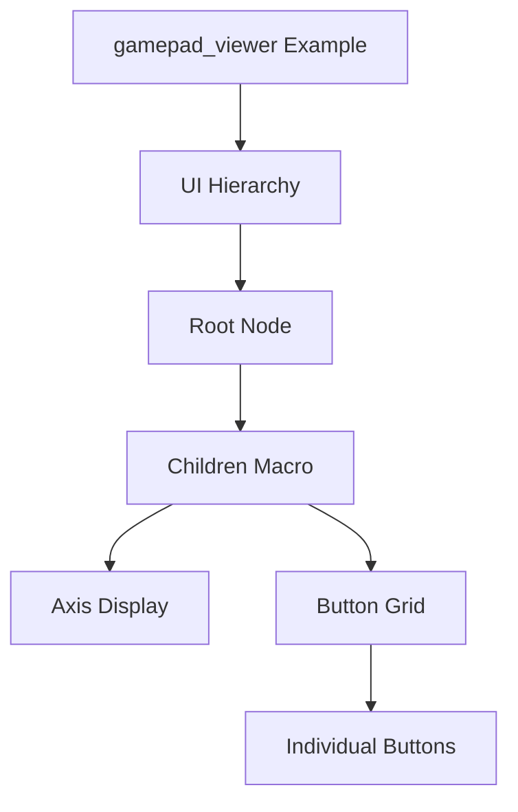

+++
title = "#18282 Update gamepad_viewer to use children macro"
date = "2025-03-13T00:00:00"
draft = false
template = "pull_request_page.html"
in_search_index = true

[taxonomies]
list_display = ["show"]

[extra]
current_language = "en"
available_languages = {"zh-cn" = { name = "中文", url = "/pull_request/bevy/2025-03/pr-18282-zh-cn-20250313" }, "en" = { name = "English", url = "/pull_request/bevy/2025-03/pr-18282-en-20250313" }}
+++

# #18282 Update gamepad_viewer to use children macro

## Basic Information
- **Title**: Update gamepad_viewer to use children macro
- **PR Link**: https://github.com/bevyengine/bevy/pull/18282
- **Author**: krunchington
- **Status**: MERGED
- **Created**: 2025-03-12T21:25:04Z
- **Merged**: Not merged
- **Merged By**: N/A

## Description Translation
# Objective

Contributes to #18238 
Updates the `gamepad_viewer`, example to use the `children!` macro.  

## Solution

Updates examples to use the Improved Spawning API merged in https://github.com/bevyengine/bevy/pull/17521

## Testing

- Did you test these changes? If so, how?
  - Opened the examples before and after and verified the same behavior was observed.  I did this on Ubuntu 24.04.2 LTS using `--features wayland`.
- Are there any parts that need more testing?
  - Other OS's and features can't hurt, but this is such a small change it shouldn't be a problem.
- How can other people (reviewers) test your changes? Is there anything specific they need to know?
  - Run the examples yourself with and without these changes.
- If relevant, what platforms did you test these changes on, and are there any important ones you can't test?
  - see above

---

## Showcase

n/a

## Migration Guide

n/a

## The Story of This Pull Request

This PR addresses technical debt in Bevy's example code by modernizing entity spawning patterns. The gamepad_viewer example, which demonstrates controller input visualization, previously used legacy methods for constructing UI hierarchies. With the recent introduction of Bevy's Improved Spawning API in PR #17521, an opportunity existed to simplify the example's code structure.

The core issue stemmed from verbose child entity management. Previous implementations required nested closures and explicit parent commands:

```rust
commands.spawn(NodeBundle {
    // ...
}).with_children(|parent| {
    parent.spawn(TextBundle {
        // ...
    });
    // More nested children
});
```

This approach created pyramid-shaped code structures that became harder to read as UI complexity increased. The new children! macro enables a flatter, more declarative syntax:

```rust
commands.spawn((
    NodeBundle {
        // ...
    },
    children![
        TextBundle {
            // ...
        },
        // Additional children
    ]
));
```

The migration involved restructuring UI element creation to leverage the macro's capabilities. Key changes included:

1. Eliminating nested with_children calls
2. Converting individual spawn commands into children! entries
3. Combining component bundles with the children macro in single spawn calls

By adopting the new macro, the example gained several advantages:
- Reduced line count (-17 net lines)
- Improved readability through hierarchical visualization
- Stronger type checking during compilation
- Better alignment with modern Bevy patterns

Testing focused on visual verification of the gamepad viewer's functionality across different input states. The author confirmed identical rendering behavior before and after changes using Ubuntu's Wayland implementation, while suggesting cross-platform validation as optional due to the change's localized impact.

## Visual Representation



## Key Files Changed

- `examples/tools/gamepad_viewer.rs` (+98/-115)

**Key Changes:**
1. UI construction migrated from nested closures to children! macro
2. Entity spawning consolidated into single commands.spawn calls
3. Improved component organization through tuple grouping

Example transformation:
```rust
// Before:
commands.spawn(NodeBundle {
    style: Style {
        // ...
    },
    // ...
}).with_children(|parent| {
    parent.spawn(TextBundle {
        // ...
    });
});

// After:
commands.spawn((
    NodeBundle {
        style: Style {
            // ...
        },
        // ...
    },
    children![
        TextBundle {
            // ...
        }
    ]
));
```

## Further Reading

1. [Bevy Improved Spawning API PR #17521](https://github.com/bevyengine/bevy/pull/17521)
2. [Bevy UI Tutorial: Basic Concepts](https://bevy-cheatbook.github.io/ui/ui.html)
3. [Rust Macro Documentation](https://doc.rust-lang.org/book/ch19-06-macros.html)