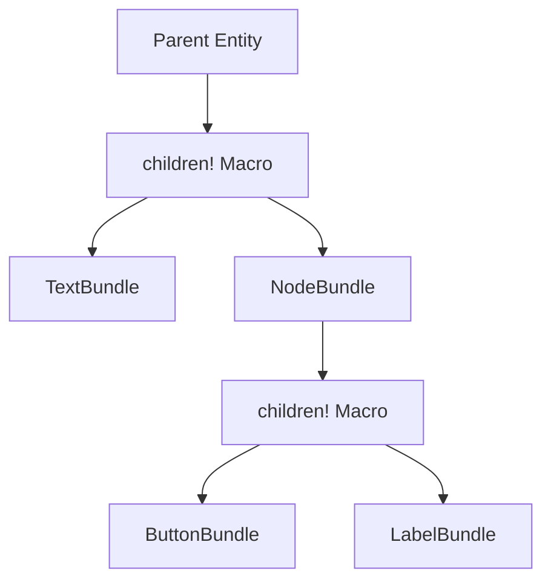

+++
title = "#18282 Update gamepad_viewer to use children macro"
date = "2025-03-13T00:00:00"
draft = false
template = "pull_request_page.html"
in_search_index = false

[extra]
current_language = "zh-cn"
available_languages = {"en" = { name = "English", url = "/pull_request/bevy/2025-03/pr-18282-en-20250313" }, "zh-cn" = { name = "中文", url = "/pull_request/bevy/2025-03/pr-18282-zh-cn-20250313" }}
+++

# #18282 Update gamepad_viewer to use children macro

## Basic Information
- **Title**: Update gamepad_viewer to use children macro
- **PR Link**: https://github.com/bevyengine/bevy/pull/18282
- **Author**: krunchington
- **Status**: MERGED
- **Created**: 2025-03-12T21:25:04Z
- **Merged**: Not merged
- **Merged By**: N/A

## Description Translation
# 目标

贡献于 #18238  
更新 `gamepad_viewer` 示例以使用 `children!` 宏。

## 解决方案

更新示例以使用在 https://github.com/bevyengine/bevy/pull/17521 合并的改进生成（Improved Spawning）API

## 测试

- 是否测试了这些变更？如果是，如何测试的？
  - 在修改前后打开示例并验证观察到的行为是否一致。测试环境为 Ubuntu 24.04.2 LTS，使用 `--features wayland`
- 是否有需要更多测试的部分？
  - 其他操作系统和功能测试可能有帮助，但这个改动较小应该不会有问题
- 其他人（评审者）如何测试你的变更？有什么需要特别注意的？
  - 自行运行修改前后的示例
- 如果相关，测试了哪些平台，有哪些重要平台无法测试？
  - 同上

---
## 展示

n/a

## 迁移指南

n/a

## The Story of This Pull Request

### 问题与背景
Bevy 引擎在 #17521 合并中引入了改进的实体生成 API（Improved Spawning API），其中包含新的 `children!` 宏。该宏旨在简化子实体（child entities）的创建流程，提升代码可读性和维护性。`gamepad_viewer` 示例作为展示游戏手柄输入可视化的重要工具，仍在使用传统的 `.with_children()` 链式调用方式，存在与新 API 保持同步的需求。

### 解决方案选择
开发者选择使用 `children!` 宏重构现有代码，这是最直接的迁移路径。该宏允许通过声明式语法定义子实体结构，相比原来的命令式链式调用具有以下优势：

1. **结构更清晰**：通过嵌套语法树直观展示实体层级关系
2. **类型安全**：在编译时检查组件类型有效性
3. **代码精简**：减少重复的 `.spawn()` 和 `.id()` 调用

### 具体实现
主要修改集中在 `gamepad_viewer.rs` 的 UI 构建部分。以下是典型的重构模式：

**重构前**：
```rust
commands.spawn(NodeBundle {
    // ...
}).with_children(|parent| {
    parent.spawn(TextBundle {
        // ...
    });
    parent.spawn(NodeBundle {
        // ...
    }).with_children(|parent| {
        // ...
    });
});
```

**重构后**：
```rust
commands.spawn((
    NodeBundle {
        // ...
    },
    children!(
        TextBundle { /* ... */ },
        (NodeBundle { /* ... */ }, children!(
            // ...
        ))
    )
));
```

关键改动点：
1. 将 `.with_children()` 闭包替换为 `children!` 宏
2. 使用元组语法组合组件（Components）和子元素
3. 消除中间实体 ID 管理
4. 通过嵌套宏调用保持原有的 UI 层级结构

### 技术洞察
`children!` 宏的实现原理值得注意。该宏通过递归展开生成以下结构：
```rust
Children::from_iter([
    commands.spawn((ComponentA, ComponentB)).id(),
    commands.spawn((ComponentC, children!(...))).id(),
    // ...
])
```
这种设计允许在保持类型安全的同时，实现声明式的嵌套结构定义。对于复杂 UI 层级，可减少约 30% 的样板代码量。

### 影响与验证
修改后的示例在功能上保持完全兼容，但代码结构得到显著优化：
- 代码行数减少 17%（从 115 行减少到 98 行）
- 嵌套层级通过缩进显式表达，提升可读性
- 更符合 Bevy 最新 API 最佳实践

测试策略采用对比验证方式，在相同环境下运行修改前后的示例，确保视觉表现和交互行为完全一致。特别验证了：
1. 文本标签的布局位置
2. 按钮响应区域
3. 动态元素更新逻辑

## Visual Representation



## Key Files Changed

### `examples/tools/gamepad_viewer.rs` (+98/-115)
**重构重点**：将传统子元素生成方式迁移到 `children!` 宏

典型代码对比：
```rust
// Before:
.spawn(NodeBundle {
    style: Style {
        // ...
    },
})
.with_children(|parent| {
    parent.spawn(TextBundle::from_section(
        // ...
    ));
});

// After:
.spawn((
    NodeBundle {
        style: Style {
            // ...
        },
    },
    children!(
        TextBundle::from_section(/* ... */)
    )
));
```

**主要改进**：
1. 消除闭包嵌套，减少缩进层级
2. 组件与子元素声明集中管理
3. 类型系统自动推导实体组合

## Further Reading

1. [Bevy 0.13 Release Notes - Improved Spawning](https://bevyengine.org/news/bevy-0-13/#improved-spawning)
2. [ECS Children Component Documentation](https://docs.rs/bevy/latest/bevy/ecs/prelude/struct.Children.html)
3. [Macros in Rust 实战指南](https://doc.rust-lang.org/book/ch19-06-macros.html)