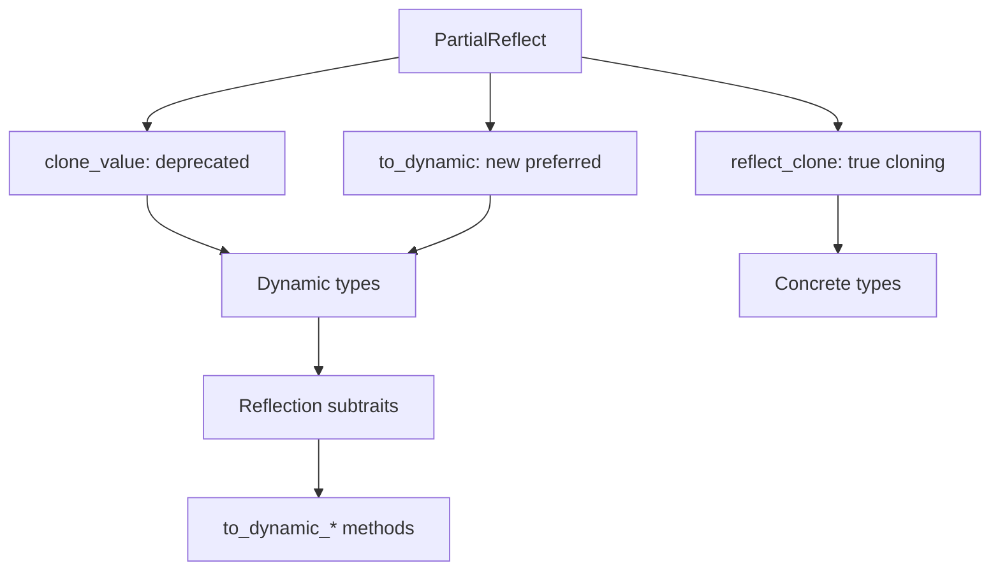

+++
title = "#18284 bevy_reflect: Deprecate `PartialReflect::clone_value`"
date = "2025-03-14T00:00:00"
draft = false
template = "pull_request_page.html"
in_search_index = true

[taxonomies]
list_display = ["show"]

[extra]
current_language = "en"
available_languages = {"en" = { name = "English", url = "/pull_request/bevy/2025-03/pr-18284-en-20250314" }}
+++

# #18284 bevy_reflect: Deprecate `PartialReflect::clone_value`

## Basic Information
- **Title**: bevy_reflect: Deprecate `PartialReflect::clone_value`
- **PR Link**: https://github.com/bevyengine/bevy/pull/18284
- **Author**: MrGVSV
- **Status**: MERGED
- **Created**: 2025-03-12T22:13:26Z
- **Merged**: Not merged
- **Merged By**: N/A

## Description Translation
# Objective

#13432 added proper reflection-based cloning. This is a better method than cloning via `clone_value` for reasons detailed in the description of that PR. However, it may not be immediately apparent to users why one should be used over the other, and what the gotchas of `clone_value` are.

## Solution

This PR marks `PartialReflect::clone_value` as deprecated, with the deprecation notice pointing users to `PartialReflect::reflect_clone`. However, it also suggests using a new method introduced in this PR: `PartialReflect::to_dynamic`.

`PartialReflect::to_dynamic` is essentially a renaming of `PartialReflect::clone_value`. By naming it `to_dynamic`, we make it very obvious that what's returned is a dynamic type. The one caveat to this is that opaque types still use `reflect_clone` as they have no corresponding dynamic type.

Along with changing the name, the method is now optional, and comes with a default implementation that calls out to the respective reflection subtrait method. This was done because there was really no reason to require manual implementors provide a method that almost always calls out to a known set of methods.

Lastly, to make this default implementation work, this PR also did a similar thing with the `clone_dynamic ` methods on the reflection subtraits. For example, `Struct::clone_dynamic` has been marked deprecated and is superseded by `Struct::to_dynamic_struct`. This was necessary to avoid the "multiple names in scope" issue.

### Open Questions

This PR maintains the original signature of `clone_value` on `to_dynamic`. That is, it takes `&self` and returns `Box<dyn PartialReflect>`.

However, in order for this to work, it introduces a panic if the value is opaque and doesn't override the default `reflect_clone` implementation.

One thing we could do to avoid the panic would be to make the conversion fallible, either returning `Option<Box<dyn PartialReflect>>` or `Result<Box<dyn PartialReflect>, ReflectCloneError>`.

This makes using the method a little more involved (i.e. users have to either unwrap or handle the rare possibility of an error), but it would set us up for a world where opaque types don't strictly need to be `Clone`. Right now this bound is sort of implied by the fact that `clone_value` is a required trait method, and the default behavior of the macro is to use `Clone` for opaque types.

Alternatively, we could keep the signature but make the method required. This maintains that implied bound where manual implementors must provide some way of cloning the value (or YOLO it and just panic), but also makes the API simpler to use.

Finally, we could just leave it with the panic. It's unlikely this would occur in practice since our macro still requires `Clone` for opaque types, and thus this would only ever be an issue if someone were to manually implement `PartialReflect` without a valid `to_dynamic` or `reflect_clone` method.

## Testing

You can test locally using the following command:

```
cargo test --package bevy_reflect --all-features
```

---

## Migration Guide

`PartialReflect::clone_value` is being deprecated. Instead, use `PartialReflect::to_dynamic` if wanting to create a new dynamic instance of the reflected value. Alternatively, use `PartialReflect::reflect_clone` to attempt to create a true clone of the underlying value.

Similarly, the following methods have been deprecated and should be replaced with these alternatives:
- `Array::clone_dynamic` → `Array::to_dynamic_array`
- `Enum::clone_dynamic` → `Enum::to_dynamic_enum`
- `List::clone_dynamic` → `List::to_dynamic_list`
- `Map::clone_dynamic` → `Map::to_dynamic_map`
- `Set::clone_dynamic` → `Set::to_dynamic_set`
- `Struct::clone_dynamic` → `Struct::to_dynamic_struct`
- `Tuple::clone_dynamic` → `Tuple::to_dynamic_tuple`
- `TupleStruct::clone_dynamic` → `TupleStruct::to_dynamic_tuple_struct`

## The Story of This Pull Request

The reflection system in Bevy needed clearer cloning semantics after PR #13432 introduced `reflect_clone`. While the new method provided proper reflection-aware cloning, the existing `clone_value` method remained ambiguous in purpose and potentially misleading in its name. This PR addresses that confusion through strategic deprecation and renaming.

The core issue stemmed from `clone_value` returning a dynamic type (`Box<dyn PartialReflect>`) while its name suggested simple value cloning. This could lead developers to misuse it as a general cloning mechanism rather than understanding its specific role in dynamic type creation. The solution required three key changes:

1. **Semantic Renaming**: `clone_value` became `to_dynamic` to explicitly communicate its purpose of creating dynamic type instances. This aligns with Rust's naming conventions where `to_*` methods typically imply conversions:
   
   ```rust
   #[deprecated = "use `to_dynamic` instead"]
   fn clone_value(&self) -> Box<dyn PartialReflect> {
       self.to_dynamic()
   }
   ```

2. **Optional Trait Methods**: The PR made `to_dynamic` optional in the `PartialReflect` trait with a default implementation calling `reflect_clone`. This reduced boilerplate for implementors while maintaining backward compatibility:
   
   ```rust
   fn to_dynamic(&self) -> Box<dyn PartialReflect> {
       self.reflect_clone()
   }
   ```

3. **Subtrait Method Alignment**: Related methods like `Struct::clone_dynamic` were renamed to `to_dynamic_struct` to maintain naming consistency across the reflection hierarchy. This prevented method name collisions and improved API discoverability.

The implementation carefully balanced API stability with clarity. By keeping the original method signatures but marking them deprecated, the changes allow gradual migration while immediately improving documentation and method names. The panic introduced for opaque types without `reflect_clone` implementations was deemed acceptable given Bevy's macro system enforces `Clone` for such types through derive macros.

## Visual Representation



## Key Files Changed

1. **`crates/bevy_reflect/src/reflect.rs`**
   - Added `to_dynamic` trait method with default implementation
   - Deprecated `clone_value` with automatic forwarding
   - Updated documentation to emphasize dynamic type creation

2. **`crates/bevy_reflect/src/impls/std.rs`**
   - Removed redundant `clone_value` implementations
   - Updated collection types to use new `to_dynamic_*` methods
   
   Before:
   ```rust
   impl<T: PartialReflect> PartialReflect for Vec<T> {
       fn clone_value(&self) -> Box<dyn PartialReflect> {
           Box::new(self.clone_dynamic())
       }
   }
   ```
   
   After:
   ```rust
   impl<T: PartialReflect> PartialReflect for Vec<T> {
       fn to_dynamic(&self) -> Box<dyn PartialReflect> {
           Box::new(self.to_dynamic_list())
       }
   }
   ```

3. **`crates/bevy_ecs/src/entity/clone_entities.rs`**
   - Updated entity cloning to use `reflect_clone` instead of deprecated methods
   - Ensured proper deep cloning of reflected components

## Further Reading

1. [PR #13432](https://github.com/bevyengine/bevy/pull/13432) - Original reflection cloning implementation
2. [Rust API Guidelines: Naming](https://rust-lang.github.io/api-guidelines/naming.html) - Rationale for `to_*` method naming
3. [Bevy Reflection Documentation](https://docs.rs/bevy_reflect/latest/bevy_reflect/) - Core reflection concepts
4. [Rust Deprecation Attributes](https://doc.rust-lang.org/reference/attributes/diagnostics.html#the-deprecated-attribute) - Proper deprecation practices