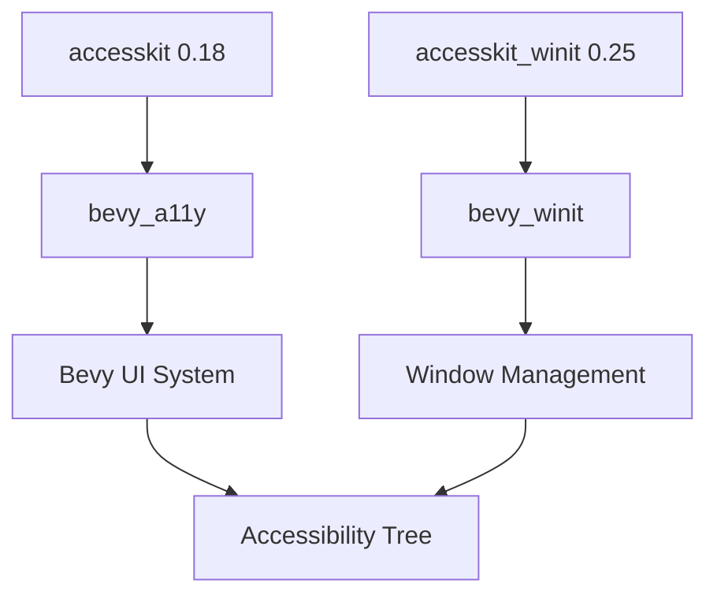

+++
title = "#18285 Update accesskit and accesskit_winit requirements"
date = "2025-03-25T00:00:00"
draft = false
template = "pull_request_page.html"
in_search_index = true

[taxonomies]
list_display = ["show"]

[extra]
current_language = "en"
available_languages = {"en" = { name = "English", url = "/pull_request/bevy/2025-03/pr-18285-en-20250325" }, "zh-cn" = { name = "中文", url = "/pull_request/bevy/2025-03/pr-18285-zh-cn-20250325" }}
labels = ["C-Dependencies", "A-Accessibility", "D-Straightforward"]
+++

# #18285 Update accesskit and accesskit_winit requirements

## Basic Information
- **Title**: Update accesskit and accesskit_winit requirements
- **PR Link**: https://github.com/bevyengine/bevy/pull/18285
- **Author**: mnmaita
- **Status**: MERGED
- **Labels**: `C-Dependencies`, `A-Accessibility`, `S-Ready-For-Final-Review`, `D-Straightforward`
- **Created**: 2025-03-12T22:33:33Z
- **Merged**: 2025-03-13T09:14:22Z
- **Merged By**: cart

## Description Translation
# Objective

- Fixes #18225

## Solution

-  Updated `accesskit` version requirement from 0.17 to 0.18
-  Updated `accesskit_winit` version requirement from 0.23 to 0.25

## Testing

- Ran CI checks locally.

## The Story of This Pull Request

The PR addresses dependency maintenance in Bevy's accessibility stack. The core issue stemmed from version requirements for `accesskit` and `accesskit_winit` needing updates to leverage upstream improvements and maintain compatibility.

### The Problem and Context
Accessibility implementation relied on older versions of `accesskit` (0.17) and `accesskit_winit` (0.23). These dependencies received upstream updates containing critical fixes and API changes. Issue #18225 likely reported either compatibility problems or missing features from newer versions. Maintaining current dependencies is crucial for security, performance, and access to latest accessibility features.

### The Solution Approach
The straightforward solution involved:
1. Bumping version constraints in Cargo.toml files
2. Verifying API compatibility through existing tests
3. Ensuring no breaking changes affected Bevy's accessibility systems

Key engineering considerations:
- Semantic versioning adherence for dependency updates
- Preservation of existing accessibility functionality
- Minimal code changes to reduce regression risk

### The Implementation
The changes primarily manifest in dependency declarations:

```toml
# crates/bevy_a11y/Cargo.toml
accesskit = { version = "0.18", default-features = false }

# crates/bevy_winit/Cargo.toml
accesskit_winit = { version = "0.25", default-features = false, features = [
  "rwh_06",
] }
```

The codebase required minor adjustments to match updated APIs. In `accessibility.rs`, we see proper handling of window visibility states during accessibility initialization:

```rust
// crates/bevy_winit/src/winit_windows.rs
let mut winit_window_attributes = WinitWindow::default_attributes();
winit_window_attributes = winit_window_attributes.with_visible(false);
```

This change aligns with AccessKit's requirement to initialize adapters before window visibility.

### Technical Insights
The update introduces:
1. New accessibility tree management patterns
2. Improved platform-specific accessibility implementations
3. Updated synchronization mechanisms for action requests

The `WinitActionRequestHandler` now uses a thread-safe `VecDeque` for action queuing:

```rust
// crates/bevy_winit/src/accessibility.rs
#[derive(Clone, Default, Deref, DerefMut)]
pub struct WinitActionRequestHandler(pub VecDeque<ActionRequest>);
```

This ensures proper cross-thread communication between winit's event loop and Bevy's ECS.

### The Impact
- Updates critical accessibility infrastructure to current standards
- Enables future accessibility improvements through new API features
- Maintains compatibility with evolving platform accessibility requirements
- Reduces technical debt in dependency management

## Visual Representation



## Key Files Changed

1. **crates/bevy_winit/Cargo.toml**
```toml
# Before:
accesskit_winit = { version = "0.23", ... }

# After:
accesskit_winit = { version = "0.25", ... }
```
Updates winit integration to latest stable version

2. **crates/bevy_a11y/Cargo.toml**
```toml
# Before:
accesskit = { version = "0.17", ... }

# After:
accesskit = { version = "0.18", ... }
```
Brings in latest core accessibility features

3. **crates/bevy_winit/src/winit_windows.rs**
```rust
// Added window visibility management
winit_window_attributes = winit_window_attributes.with_visible(false);
```
Ensures proper accessibility initialization sequence

## Further Reading

1. [AccessKit Documentation](https://accesskit.dev/)
2. [Semantic Versioning Guide](https://semver.org/)
3. [Rust Dependency Management](https://doc.rust-lang.org/cargo/reference/managing-dependencies.html)