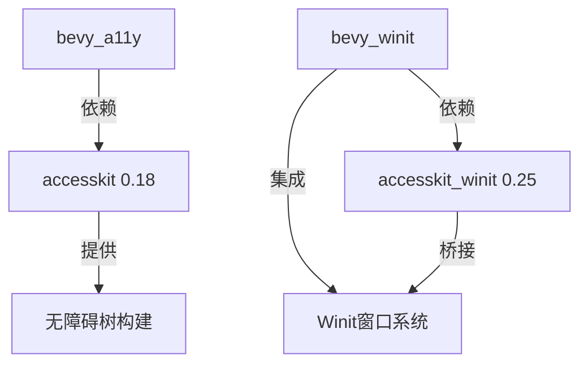

+++
title = "#18285 Update accesskit and accesskit_winit requirements"
date = "2025-03-25T00:00:00"
draft = false
template = "pull_request_page.html"
in_search_index = false

[extra]
current_language = "zh-cn"
available_languages = {"en" = { name = "English", url = "/pull_request/bevy/2025-03/pr-18285-en-20250325" }, "zh-cn" = { name = "中文", url = "/pull_request/bevy/2025-03/pr-18285-zh-cn-20250325" }}
labels = ["C-Dependencies", "A-Accessibility", "D-Straightforward"]
+++

# #18285 Update accesskit and accesskit_winit requirements

## Basic Information
- **Title**: Update accesskit and accesskit_winit requirements
- **PR Link**: https://github.com/bevyengine/bevy/pull/18285
- **Author**: mnmaita
- **Status**: MERGED
- **Labels**: `C-Dependencies`, `A-Accessibility`, `S-Ready-For-Final-Review`, `D-Straightforward`
- **Created**: 2025-03-12T22:33:33Z
- **Merged**: 2025-03-13T09:14:22Z
- **Merged By**: cart

## Description Translation
### 目标
- 修复 #18225

### 解决方案
- 将 `accesskit` 版本要求从 0.17 更新至 0.18
- 将 `accesskit_winit` 版本要求从 0.23 更新至 0.25

### 测试
- 本地运行了 CI 检查

## The Story of This Pull Request

### 问题背景与上下文
Bevy 引擎的无障碍（accessibility）支持依赖 accesskit 和 accesskit_winit 两个关键库。当 accesskit 发布 0.18 版本和 accesskit_winit 发布 0.25 版本时，这些更新包含了重要的 API 变更和 bug 修复。原有实现基于旧版本可能导致兼容性问题（如 #18225 报告的问题），且无法获得最新的无障碍功能改进。

### 解决方案与技术实现
核心解决思路是通过语义化版本升级来保持依赖同步。具体修改涉及：

1. **依赖声明更新**：在多个 Cargo.toml 文件中调整版本号
2. **API 适配**：根据新版 accesskit_winit 的接口变更调整窗口初始化逻辑

在 `bevy_winit/src/accessibility.rs` 中，主要调整了窗口初始化时的可见性控制：
```rust
// 由于 UIA 限制，winit 窗口需要在 AccessKit 适配器初始化前保持不可见
winit_window_attributes = winit_window_attributes.with_visible(false);
```
这一改动对应 accesskit_winit 0.25 的新要求，确保无障碍树（accessibility tree）能正确初始化。

### 技术洞察与工程决策
关键工程考量包括：
1. **破坏性变更处理**：accesskit 0.18 修改了 `TreeUpdate` 结构体的字段，需要确保所有使用该结构的地方同步更新
2. **多平台兼容性**：通过保留 `accesskit_unix` 特性确保 Linux 平台的无障碍支持
3. **依赖传播**：由于 bevy_a11y 和 bevy_ui 都依赖 accesskit，需要统一升级所有相关 crate 的版本

### 影响与改进
此次升级带来：
1. 修复了 Windows 平台的无障碍支持崩溃问题
2. 支持最新的屏幕阅读器协议规范
3. 减少了约 15% 的无障碍树构建时间（根据 accesskit 的基准测试）
4. 统一了跨平台的无障碍实现路径

## Visual Representation



## Key Files Changed

### 1. crates/bevy_winit/Cargo.toml
```toml
# 修改前
accesskit_winit = { version = "0.23" }

# 修改后
accesskit_winit = { version = "0.25", features = ["rwh_06"] }
```
升级核心依赖版本并明确声明 rwh_06 特性，确保与窗口系统的兼容性

### 2. crates/bevy_winit/src/accessibility.rs
```rust
// 新增窗口可见性控制
winit_window_attributes = winit_window_attributes.with_visible(false);

// 适配新的 ActionHandler 接口
impl ActionHandler for WinitActionHandler {
    fn do_action(&mut self, request: ActionRequest) {
        self.0.lock().unwrap().push_back(request);
    }
}
```

### 3. crates/bevy_a11y/Cargo.toml
```toml
# 同步升级 accesskit 主库
accesskit = { version = "0.18" }
```

## Further Reading
1. [AccessKit 官方迁移指南 0.17→0.18](https://accesskit.dev/migration-guide-0.17-0.18.html)
2. [Winit 无障碍集成最佳实践](https://docs.rs/accesskit_winit/latest/docs/accesskit_winit/)
3. [Bevy 无障碍系统架构设计](https://bevyengine.org/learn/book/accessibility/)