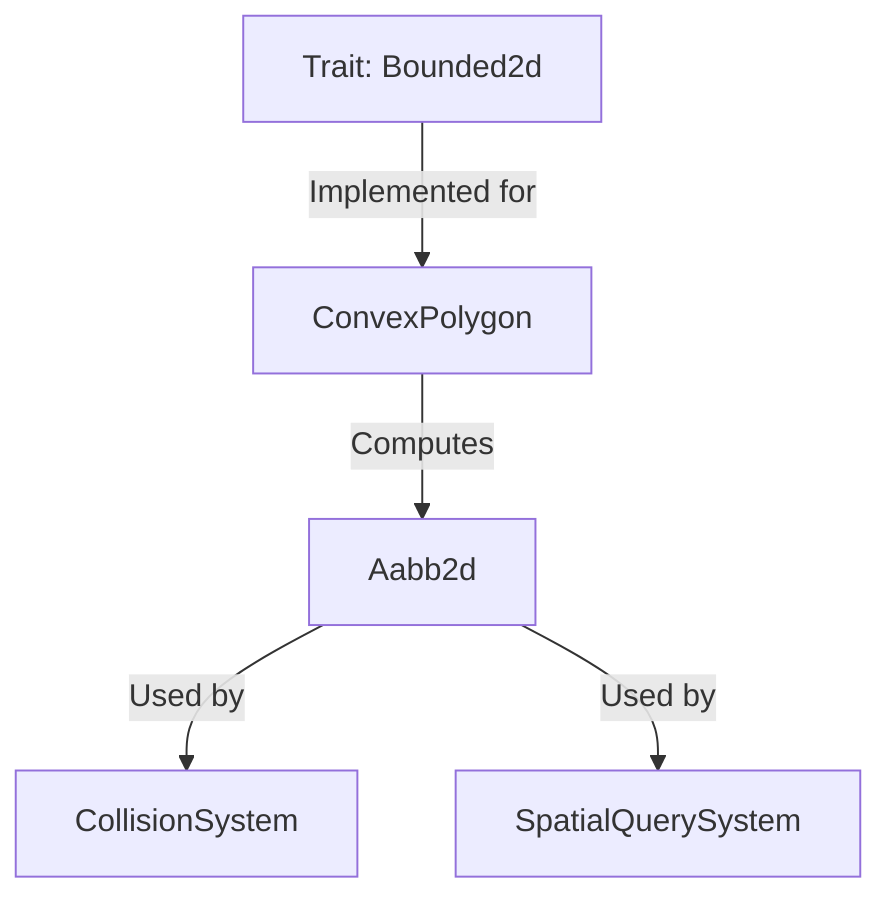

+++
title = "#18286 implement `Bounded2d` for `ConvexPolygon`"
date = "2025-03-13T00:00:00"
draft = false
template = "pull_request_page.html"
in_search_index = true

[taxonomies]
list_display = ["show"]

[extra]
current_language = "en"
available_languages = {"en" = { name = "English", url = "/pull_request/bevy/2025-03/pr-18286-en-20250313" }, "zh-cn" = { name = "中文", url = "/pull_request/bevy/2025-03/pr-18286-zh-cn-20250313" }}
+++

# #18286 implement `Bounded2d` for `ConvexPolygon`

## Basic Information
- **Title**: implement `Bounded2d` for `ConvexPolygon`
- **PR Link**: https://github.com/bevyengine/bevy/pull/18286
- **Author**: lynn-lumen
- **Status**: MERGED
- **Created**: 2025-03-13T00:01:06Z
- **Merged**: Not merged
- **Merged By**: N/A

## Description Translation
# Objective

- Implement `Bounded2d` for `ConvexPolygon`

## The Story of This Pull Request

The PR addresses a gap in Bevy's 2D bounding volume system by implementing axis-aligned bounding box (AABB) calculations for convex polygons. Prior to this change, the `ConvexPolygon` struct lacked a `Bounded2d` implementation, limiting its integration with Bevy's collision detection and spatial query systems that rely on standardized bounding volumes.

The core challenge was efficiently computing tight AABBs for convex polygons while maintaining consistency with existing bounded implementations for other shapes. The solution leverages the polygon's vertex data to determine minimum and maximum extents:

```rust
impl Bounded2d for ConvexPolygon {
    fn aabb_2d(&self, translation: Vec2, rotation: f32) -> Aabb2d {
        let rotation = Rotation2d::from_radians(rotation);
        let [min, max] = self.points.iter().map(|point| rotation * *point).fold(
            [Vec2::MAX, Vec2::MIN],
            |[mut min, mut max], point| {
                min = min.min(point);
                max = max.max(point);
                [min, max]
            },
        );

        Aabb2d::new(translation, (max - min) * 0.5)
    }
}
```

This implementation:
1. Applies rotation to each vertex using `Rotation2d`
2. Tracks minimum and maximum coordinates through a fold operation
3. Constructs the AABB from calculated extents
4. Centers the box at the provided translation

The approach maintains O(n) complexity proportional to vertex count, which is optimal for convex polygon bounding calculations. By reusing existing mathematical types like `Rotation2d` and `Vec2`, it integrates consistently with Bevy's math ecosystem.

This change enables convex polygons to participate fully in Bevy's physics systems, including:
- Collision detection against other bounded shapes
- Spatial partitioning optimizations
- Frustum culling operations
- Debug visualization of bounds

## Visual Representation



## Key Files Changed

**crates/bevy_math/src/bounding/bounded2d/primitive_impls.rs** (+13/-2)
```rust
// Before: No ConvexPolygon implementation
// After:
impl Bounded2d for ConvexPolygon {
    fn aabb_2d(&self, translation: Vec2, rotation: f32) -> Aabb2d {
        // Implementation as shown in The Story section
    }
}
```
This addition places `ConvexPolygon` alongside other primitive shape implementations in Bevy's bounding system, maintaining API consistency. The implementation directly follows the pattern established for other shapes while handling polygon-specific rotation considerations.

## Further Reading

1. Bevy Bounding Volume Documentation: https://bevyengine.org/learn/book/features/2d/bounding-volumes/
2. Separating Axis Theorem for Collision Detection: https://en.wikipedia.org/wiki/Hyperplane_separation_theorem
3. Rust Iterator Documentation: https://doc.rust-lang.org/std/iter/trait.Iterator.html