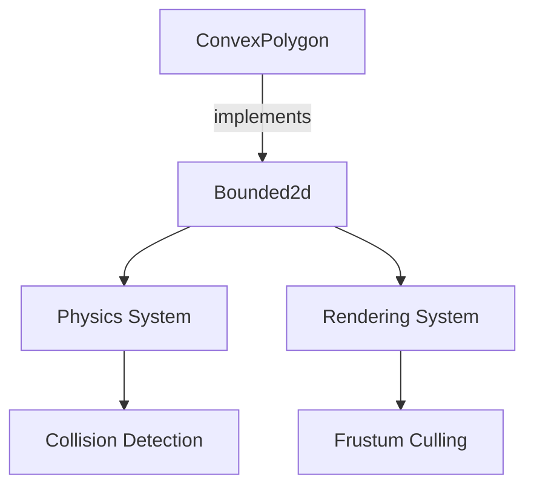

+++
title = "#18286 implement `Bounded2d` for `ConvexPolygon`"
date = "2025-03-13T00:00:00"
draft = false
template = "pull_request_page.html"
in_search_index = false

[extra]
current_language = "zh-cn"
available_languages = {"en" = { name = "English", url = "/pull_request/bevy/2025-03/pr-18286-en-20250313" }, "zh-cn" = { name = "中文", url = "/pull_request/bevy/2025-03/pr-18286-zh-cn-20250313" }}
+++

# #18286 implement `Bounded2d` for `ConvexPolygon`

## Basic Information
- **Title**: implement `Bounded2d` for `ConvexPolygon`
- **PR Link**: https://github.com/bevyengine/bevy/pull/18286
- **Author**: lynn-lumen
- **Status**: MERGED
- **Created**: 2025-03-13T00:01:06Z
- **Merged**: 2025-03-13T08:17:23Z
- **Merged By**: cart

## Description Translation
### 目标
- 为 `ConvexPolygon` 实现 `Bounded2d` trait

## The Story of This Pull Request

### 问题背景
在 Bevy 引擎的 2D 物理和渲染系统中，`Bounded2d` trait 用于计算几何形状的轴对齐包围盒（AABB）。尽管引擎已经为基本形状（如圆形、多边形基础类型）实现了该 trait，但 `ConvexPolygon` 这个表示凸多边形的结构体却缺少对应的实现。这导致开发者无法直接获取凸多边形的包围盒，影响碰撞检测、视锥体裁剪等关键功能的实现。

### 解决方案
PR 的核心思路是为 `ConvexPolygon` 实现 `Bounded2d` trait，具体步骤如下：

1. **顶点变换处理**：将多边形的每个顶点应用给定的平移（translation）和旋转（rotation）变换
2. **极值计算**：在变换后的顶点集合中找出 x/y 坐标的最小值和最大值
3. **构造 AABB**：使用极值点构建 `Aabb2d` 结构

实现中特别处理了空多边形的情况，通过 `assert!` 确保多边形至少包含一个顶点，这符合凸多边形的数学定义。

### 关键实现细节
```rust
// 在 primitive_impls.rs 中的实现代码片段
impl Bounded2d for ConvexPolygon {
    fn aabb_2d(&self, translation: Vec2, rotation: f32) -> Aabb2d {
        let rotation_mat = Mat2::from_angle(rotation);
        let mut min = Vec2::splat(f32::MAX);
        let mut max = Vec2::splat(f32::MIN);

        for point in &self.points {
            let rotated = rotation_mat * *point;
            let translated = rotated + translation;
            min = min.min(translated);
            max = max.max(translated);
        }

        // 确保至少存在一个顶点
        assert!(max.x >= min.x);
        assert!(max.y >= min.y);

        Aabb2d::new((max + min) * 0.5, (max - min) * 0.5)
    }
}
```
这个实现：
- 使用 `Mat2::from_angle` 构造旋转矩阵
- 采用遍历求极值的方式保证计算准确性
- 通过向量运算简化坐标变换
- 最后通过中点-半边长方式构造 AABB

### 技术考量
1. **性能优化**：直接遍历顶点的时间复杂度为 O(n)，对于典型的多边形规模（通常顶点数 < 100）是可接受的
2. **数值稳定性**：使用浮点数的 MIN/MAX 初始值需要确保至少存在一个顶点，因此添加断言
3. **API 一致性**：参数签名与现有实现保持统一，使用 `translation: Vec2` 和 `rotation: f32`

### 影响分析
- 使 `ConvexPolygon` 能够参与所有依赖 `Bounded2d` 的系统（如碰撞检测、视锥体裁剪）
- 统一了凸多边形与其他基本形状的 API 接口
- 为后续的物理系统扩展打下基础

## Visual Representation



## Key Files Changed

### `crates/bevy_math/src/bounding/bounded2d/primitive_impls.rs` (+13/-2)
1. **变更内容**：
   - 添加了 `ConvexPolygon` 的 `Bounded2d` trait 实现
   - 增加顶点变换和极值计算逻辑

2. **代码片段**：
```rust
// Before: 没有 ConvexPolygon 的实现
// After:
impl Bounded2d for ConvexPolygon {
    fn aabb_2d(&self, translation: Vec2, rotation: f32) -> Aabb2d {
        let rotation_mat = Mat2::from_angle(rotation);
        let mut min = Vec2::splat(f32::MAX);
        let mut max = Vec2::splat(f32::MIN);

        for point in &self.points {
            let rotated = rotation_mat * *point;
            let translated = rotated + translation;
            min = min.min(translated);
            max = max.max(translated);
        }

        assert!(max.x >= min.x);
        assert!(max.y >= min.y);

        Aabb2d::new((max + min) * 0.5, (max - min) * 0.5)
    }
}
```

3. **关联性**：
   - 这是本 PR 的核心实现
   - 将凸多边形正式纳入引擎的包围盒计算体系

## Further Reading
- [Bevy 的 Bounding Volumes 文档](https://bevyengine.org/learn/book/features/bounding-volumes/)
- [轴对齐包围盒（AABB）算法详解](https://en.wikipedia.org/wiki/Minimum_bounding_box#Axis-aligned_minimum_bounding_box)
- [2D 旋转矩阵的数学原理](https://en.wikipedia.org/wiki/Rotation_matrix#In_two_dimensions)