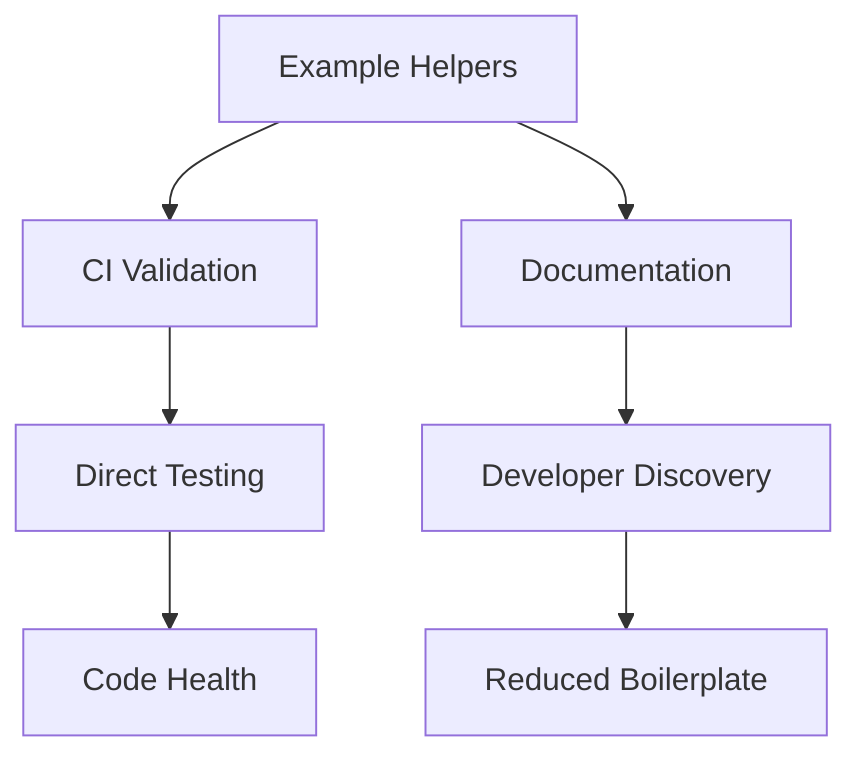

+++
title = "#18288 Add `examples/helpers/*` as library examples"
date = "2025-03-13T00:00:00"
draft = false
template = "pull_request_page.html"
in_search_index = true

[taxonomies]
list_display = ["show"]

[extra]
current_language = "en"
available_languages = {"en" = { name = "English", url = "/pull_request/bevy/2025-03/pr-18288-en-20250313" }, "zh-cn" = { name = "中文", url = "/pull_request/bevy/2025-03/pr-18288-zh-cn-20250313" }}
+++

# #18288 Add `examples/helpers/*` as library examples

## Basic Information
- **Title**: Add `examples/helpers/*` as library examples
- **PR Link**: https://github.com/bevyengine/bevy/pull/18288
- **Author**: bushrat011899
- **Status**: MERGED
- **Created**: 2025-03-13T00:48:17Z
- **Merged**: Not merged
- **Merged By**: N/A

## Description Translation
# Objective

Some of Bevy's examples contain boilerplate which is split out into the `helpers` folder. This allows examples to have access to common functionality without building into Bevy directly. However, these helpers are themselves quite high-quality code, and we do intend for users to read them and even use them. But, we don't list them in the examples document, and they aren't explicitly checked in CI, only transitively through examples which import them.

## Solution

- Added `camera_controller` and `widgets` as library examples.

## Testing

- CI

---

## Notes

- Library examples are identical to any other example, just with `crate-type = ["lib"]` in the `Cargo.toml`. Since they are marked as libraries, they don't require a `main` function but do require public items to be documented.
- Library examples opens the possibility of creating examples which don't need to be actual runnable applications. This may be more appropriate for certain ECS examples, and allows for adding helpers which (currently) don't have an example that needs them without them going stale.
- I learned about this as a concept during research for `no_std` examples, but believe it has value for Bevy outside that specific niche.

## The Story of This Pull Request

The PR addresses a visibility and maintenance gap in Bevy's example ecosystem. While Bevy's example system effectively demonstrates engine capabilities, helper modules in the `examples/helpers` directory served as hidden infrastructure. These utilities provided common functionality (like camera controls and UI widgets) to multiple examples but weren't themselves treated as first-class examples.

The core problem was two-fold: 
1. **Discoverability**: Developers exploring Bevy's examples wouldn't naturally find these helpers despite their utility
2. **Maintenance Safety**: CI only verified helpers indirectly through parent examples that imported them

The solution leverages Rust's crate type system by converting these helpers into library examples. By adding `crate-type = ["lib"]` to their Cargo.toml entries, these modules gain:
```toml
# In examples/helpers/camera_controller/Cargo.toml
[package]
name = "camera_controller"
crate-type = ["lib"]
```

This approach provides three key benefits:
1. Explicit inclusion in example documentation
2. Direct CI validation through `cargo test --examples`
3. Enforcement of documentation standards through Rust's lib crate requirements

The implementation required targeted changes:
1. **Structural Updates**: Each helper became a proper example subproject
2. **Documentation Integration**: Adding entries to examples/README.md
3. **CI Alignment**: Ensuring cargo commands would detect and verify these lib examples

An important technical consideration was maintaining helper functionality while converting them to libraries. Since library crates don't require main functions, the implementation needed to ensure all public items were properly documented:
```rust
/// System set containing all systems of the camera controller
#[derive(SystemSet, Debug, Hash, PartialEq, Eq, Clone)]
pub enum CameraControllerSet {
    // Variants omitted
}
```

This change establishes a pattern for future helper development. By treating reusable components as library examples, Bevy can:
- Reduce example boilerplate through verified shared modules
- Improve code health through direct CI validation
- Enhance discoverability of architectural patterns

The impact manifests in two primary areas:
1. **Developer Experience**: New users can now find camera/widget helpers through standard example listings
2. **Code Quality**: Changes to helpers will be validated even if no parent example breaks

## Visual Representation



## Key Files Changed

1. **examples/helpers/camera_controller/Cargo.toml**
```toml
[package]
name = "camera_controller"
version = "0.1.0"
edition = "2021"
crate-type = ["lib"]
```

- Establishes the helper as a library example
- Enables inclusion in example documentation and direct testing

2. **examples/README.md**
```markdown
- [`camera_controller`][camera_controller] - Shows how to implement a first-person camera controller
- [`widgets`][widgets] - Demonstrates custom UI widget creation
```

- Makes helpers discoverable in main examples documentation
- Provides explicit documentation links

3. **examples/helpers/widgets/Cargo.toml**
```toml
[package]
name = "widgets"
version = "0.1.0"
edition = "2021"
crate-type = ["lib"]
```

- Parallel structure to camera controller
- Creates consistent pattern for helper examples

## Further Reading

1. [Rust Cargo Documentation on crate-type](https://doc.rust-lang.org/cargo/reference/cargo-targets.html#the-crate-type-field)
2. [Bevy Examples Guide](https://bevyengine.org/learn/book/getting-started/examples/)
3. [Rust Library Development Patterns](https://doc.rust-lang.org/book/ch07-00-managing-growing-projects-with-packages-crates-and-modules.html)