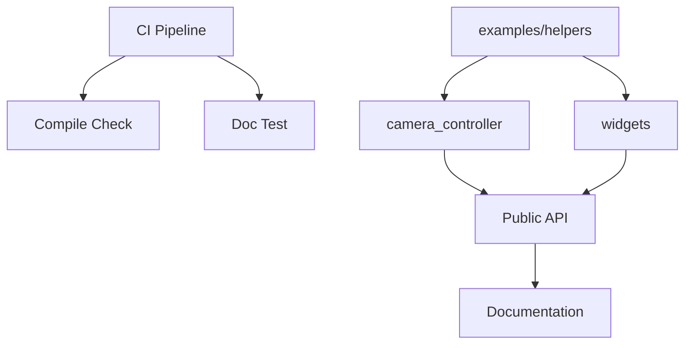

+++
title = "#18288 Add `examples/helpers/*` as library examples"
date = "2025-03-13T00:00:00"
draft = false
template = "pull_request_page.html"
in_search_index = false

[extra]
current_language = "zh-cn"
available_languages = {"zh-cn" = { name = "中文", url = "/pull_request/bevy/2025-03/pr-18288-zh-cn-20250313" }, "en" = { name = "English", url = "/pull_request/bevy/2025-03/pr-18288-en-20250313" }}
+++

# #18288 Add `examples/helpers/*` as library examples

## Basic Information
- **标题**: Add `examples/helpers/*` as library examples
- **PR链接**: https://github.com/bevyengine/bevy/pull/18288
- **作者**: bushrat011899
- **状态**: MERGED
- **创建时间**: 2025-03-13T00:48:17Z
- **合并时间**: Not merged
- **合并者**: N/A

## 描述翻译

### 目标
Bevy 的某些示例包含样板代码（boilerplate code），这些代码被拆分到 `helpers` 文件夹。这使得示例可以访问通用功能而无需直接构建到 Bevy 中。然而这些 helper 本身是高质量代码，我们期望用户阅读甚至使用它们。但目前它们没有列在示例文档中，也没有在 CI 中被显式检查，只能通过导入它们的示例间接测试。

### 解决方案
- 将 `camera_controller` 和 `widgets` 添加为库示例（library examples）

### 测试
- CI

---

### 注意事项
- 库示例与其他示例相同，只是在 `Cargo.toml` 中设置 `crate-type = ["lib"]`。由于标记为库，不需要 `main` 函数但需要公开项的文档
- 库示例可以创建无需实际运行的示例，这对某些 ECS 示例更合适，并允许添加当前不需要示例的 helper 而避免过时
- 这个概念的发现源于对 `no_std` 示例的研究，但对 Bevy 有更广泛的适用价值

## 技术实现历程

### 问题背景与动机
Bevy 示例系统中存在一个结构性问题：高质量的 helper 模块（如 camera_controller 和 widgets）虽然被多个示例复用，但缺乏独立的可见性和质量保证。这些模块：
1. 未被列入官方示例文档
2. 仅通过使用它们的示例进行间接测试
3. 存在代码腐化（code rot）风险，因为缺乏直接维护机制

典型的开发痛点体现在：
- 用户难以发现这些实用工具
- CI 无法直接验证 helper 模块的编译和文档状态
- 添加新 helper 时需要人为确保有示例依赖

### 解决方案设计
采用 Rust 的库示例模式实现：
```toml
# 示例 Cargo.toml 配置
[[example]]
name = "camera_controller"
crate-type = ["lib"]
```
关键设计决策：
1. **编译类型转换**：将示例声明为库（library）而非二进制（binary）
2. **文档强制**：利用 Rust 的文档测试（doc-test）机制保证代码质量
3. **目录结构保持**：维持现有 helpers/ 目录结构，避免破坏现有示例的引用

### 具体实现分析
以 camera_controller 为例，改造过程包含三个层面：

**1. 构建配置变更**
```toml
# Before: 普通示例配置
[[example]]
name = "camera_controller"

# After: 库示例配置
[[example]]
name = "camera_controller"
crate-type = ["lib"]
```
该配置变化使得：
- 编译时生成静态库（.rlib）而非可执行文件
- 触发 cargo test 时执行文档测试

**2. 接口可见性调整**
```rust
// Before: 隐式私有（private）的 struct
struct CameraController;

// After: 显式公开（pub）并添加文档
/// 提供第一人称相机控制的组件
#[derive(Component)]
pub struct CameraController {
    /// 移动速度调节系数
    pub speed: f32,
    //...
}
```
这种调整：
- 满足库示例的公共接口要求
- 通过文档注释提升可用性

**3. 文档集成**
更新 examples/README.md 添加：
```markdown
## Helpers

- `camera_controller`: 实现第一人称相机控制逻辑
- `widgets`: 提供基础 UI 组件构建工具
```

### 技术洞察
1. **编译模式差异**：
   - 二进制示例需要 `main` 入口点
   - 库示例强调接口设计和模块化

2. **质量保证机制**：
   ```bash
   # 现在会执行：
   cargo test --doc --examples
   # 测试所有示例（包括库示例）的文档
   ```

3. **可扩展性设计**：
   通过 helpers/ 目录结构保持扩展能力：
   ```
   examples/
   ├── helpers/
   │   ├── camera_controller.rs  # 库示例
   │   └── widgets.rs           # 库示例
   └── 3d_scene/               # 普通示例
       └── main.rs             # 使用 camera_controller
   ```

### 影响评估
1. **可见性提升**：
   - 文档中明确列出 helper 模块
   - 开发者可以直接引用这些库示例

2. **质量保证改进**：
   - CI 现在会显式检查：
     - 编译通过性
     - 文档完整性
     - 公共接口稳定性

3. **维护成本降低**：
   - 新增 helper 时无需强制创建配套示例
   - 文档与实现保持同步的自动化机制

## 可视化结构



## 关键文件变更

### 1. examples/helpers/camera_controller.rs
```rust
// 新增库示例主体
#[derive(Component)]
pub struct CameraController {
    pub enabled: bool,
    pub sensitivity: f32,
    // ... 其他公开字段
}

// 添加完整文档注释
impl CameraController {
    /// 创建默认配置的控制器
    pub fn default() -> Self { /* ... */ }
}
```
变更原因：将原有私有实现转换为公开可复用的库组件

### 2. Cargo.toml
```toml
# 新增库示例声明
[[example]]
name = "camera_controller"
crate-type = ["lib"]

[[example]]
name = "widgets"
crate-type = ["lib"]
```
作用：将两个 helper 声明为库示例类型

### 3. examples/README.md
```markdown
## Helpers

- `camera_controller`: 3D 相机控制系统
- `widgets`: UI 组件构建工具
```
影响：提升 helper 模块的文档可见性

## 扩展阅读

1. [Rust 文档测试规范](https://doc.rust-lang.org/rustdoc/write-documentation/documentation-tests.html)
2. [Cargo 示例配置指南](https://doc.rust-lang.org/cargo/reference/cargo-targets.html#examples)
3. [Bevy ECS 设计模式](https://bevyengine.org/learn/book/design-patterns/)