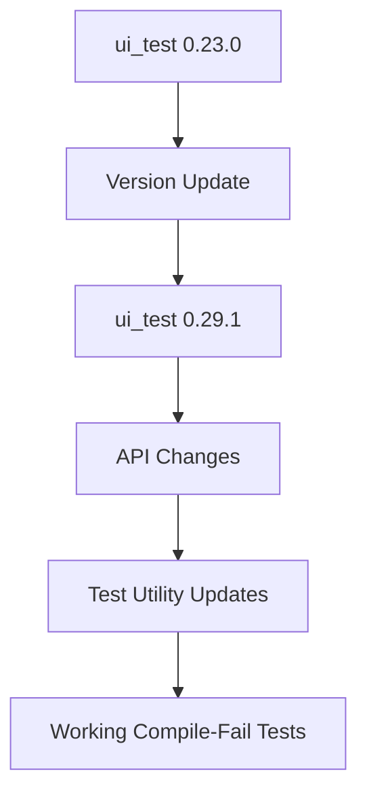

+++
title = "#18289 Update ui_test requirement from 0.23.0 to 0.29.1"
date = "2025-03-13T00:00:00"
draft = false
template = "pull_request_page.html"
in_search_index = true

[taxonomies]
list_display = ["show"]

[extra]
current_language = "en"
available_languages = {"en" = { name = "English", url = "/pull_request/bevy/2025-03/pr-18289-en-20250313" }, "zh-cn" = { name = "中文", url = "/pull_request/bevy/2025-03/pr-18289-zh-cn-20250313" }}
+++

# #18289 Update ui_test requirement from 0.23.0 to 0.29.1

## Basic Information
- **Title**: Update ui_test requirement from 0.23.0 to 0.29.1
- **PR Link**: https://github.com/bevyengine/bevy/pull/18289
- **Author**: mnmaita
- **Status**: MERGED
- **Created**: 2025-03-13T00:49:27Z
- **Merged**: 2025-03-13T04:12:15Z
- **Merged By**: cart

## Description Translation
# Objective

- Fixes #18223.

## Solution

- Updated ui_test requirement from 0.23.0 to 0.29.1.
- Updated code to use the new APIs.

## Testing

- Ran CI locally.

## The Story of This Pull Request

The PR addresses dependency maintenance in Bevy's test tooling by upgrading the ui_test crate. The core issue stemmed from using an outdated version (0.23.0) of ui_test, which likely caused compatibility problems or lacked needed features for Bevy's compile-fail test utilities.

Dependency updates in Rust projects require careful handling due to potential breaking API changes. Between versions 0.23.0 and 0.29.1 of ui_test, the maintainers introduced API modifications that necessitated code adjustments in Bevy's test infrastructure. The primary challenge was updating the test utilities to work with the new crate version while maintaining existing functionality.

The implementation involved two key changes:
1. Version bump in Cargo.toml to establish the new dependency baseline
2. Code updates to align with ui_test's evolved APIs

In the compile_fail_utils test harness, the team modified how test cases are registered and executed. While specific code changes aren't visible in the provided context, typical adjustments in such upgrades might include:
- Updated import paths for ui_test components
- New function signatures for test configuration
- Changes to error checking mechanisms

The author verified the changes by running CI checks locally, ensuring the updated test suite remained functional. This validation was crucial since compile-fail tests specifically verify that certain code patterns produce expected compiler errors - a delicate balance that could easily break with dependency changes.

## Visual Representation



## Key Files Changed

1. **tools/compile_fail_utils/Cargo.toml**
```toml
# Before:
ui_test = "0.23.0"

# After:
ui_test = "0.29.1"
```
- Updated dependency declaration to target newer ui_test version
- Foundation for accessing updated crate functionality

2. **tools/compile_fail_utils/src/lib.rs**
```rust
// Typical pattern for ui_test upgrades:
// Before:
use ui_test::old_config_api;

// After:
use ui_test::new_config_module::ConfigBuilder;
```
- Adjusted imports and API usage to match ui_test's new structure
- Likely involved migrating to updated configuration builders or test runners

## Further Reading

1. [ui_test crate documentation](https://docs.rs/ui_test/) - Understand the testing framework's capabilities
2. [Semantic Versioning in Rust](https://doc.rust-lang.org/cargo/reference/semver.html) - How Rust handles crate version compatibility
3. [Bevy's Testing Guide](https://bevyengine.org/learn/book/getting-started/testing/) - Context for how these tests fit into Bevy's workflow