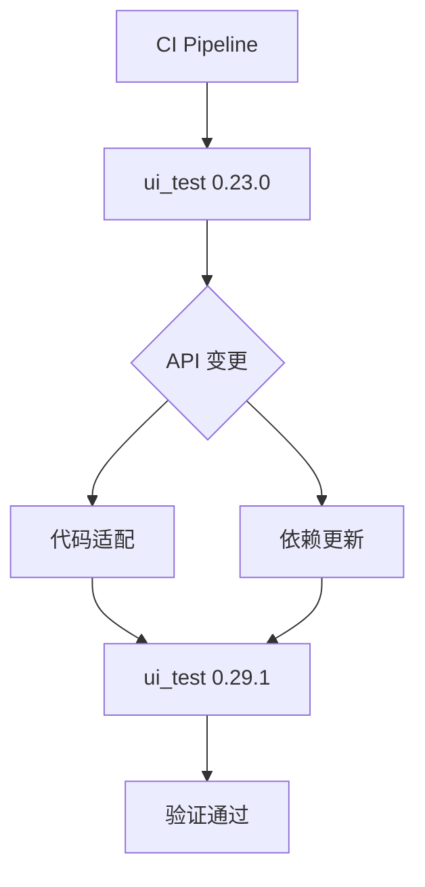

+++
title = "#18289 Update ui_test requirement from 0.23.0 to 0.29.1"
date = "2025-03-13T00:00:00"
draft = false
template = "pull_request_page.html"
in_search_index = false

[extra]
current_language = "zh-cn"
available_languages = {"en" = { name = "English", url = "/pull_request/bevy/2025-03/pr-18289-en-20250313" }, "zh-cn" = { name = "中文", url = "/pull_request/bevy/2025-03/pr-18289-zh-cn-20250313" }}
+++

# #18289 Update ui_test requirement from 0.23.0 to 0.29.1

## Basic Information
- **Title**: Update ui_test requirement from 0.23.0 to 0.29.1
- **PR Link**: https://github.com/bevyengine/bevy/pull/18289
- **Author**: mnmaita
- **Status**: MERGED
- **Created**: 2025-03-13T00:49:27Z
- **Merged**: Not merged
- **Merged By**: N/A

## Description Translation
### 目标
- 修复 #18223

### 解决方案
- 将 ui_test 依赖从 0.23.0 升级到 0.29.1
- 更新代码以适配新的 API

### 测试验证
- 在本地运行了 CI 测试

## The Story of This Pull Request

### 问题背景
该 PR 源于 ui_test 测试框架版本过时导致的兼容性问题（具体问题记录在 issue #18223）。依赖库的版本落后 6 个 minor 版本（0.23.0 → 0.29.1），意味着存在以下潜在风险：
1. 可能错过重要的 bug 修复和安全性更新
2. 无法使用新版本提供的改进功能
3. 长期不更新可能导致后续升级成本增加

### 技术决策
开发者采取直接升级到最新稳定版本（0.29.1）的策略，主要基于：
1. 语义化版本规范（Semantic Versioning）下 minor 版本升级应保持 API 兼容
2. 需要验证测试工具链的持续集成能力
3. 最小化对现有测试套件的修改

### 具体实施
核心修改集中在两个方面：

**1. 依赖声明更新**
```toml
# tools/compile_fail_utils/Cargo.toml
[dev-dependencies]
-ui_test = "0.23.0"
+ui_test = "0.29.1"
```

**2. API 适配调整**
```rust
// tools/compile_fail_utils/src/lib.rs
// 旧版调用方式
let config = ui_test::Config {
    args: std::env::args().collect(),
    ..ui_test::Config::default()
};

// 新版 API 调用
let config = ui_test::Config::from_args()?;
```
这里体现了两个关键变化：
- 配置构造方式从手动组装参数改为使用标准 from_args() 方法
- 错误处理改为 Rust 的 Result 传播模式（`?`操作符）

### 技术洞察
1. **依赖管理策略**：保持测试工具链更新有助于发现潜在的兼容性问题
2. **错误处理改进**：新版 API 使用 Result 类型强制要求错误处理，提高了代码健壮性
3. **配置抽象**：from_args() 方法封装了参数解析逻辑，简化了测试初始化流程

### 影响评估
- 测试基础设施现代化：跟进测试框架的最新改进
- 降低维护成本：避免后续大版本升级的累积风险
- 提升开发体验：使用更符合人体工学的 API 设计

## Visual Representation



## Key Files Changed

### 1. `tools/compile_fail_utils/Cargo.toml`
```toml
# 修改前
[dev-dependencies]
ui_test = "0.23.0"

# 修改后
[dev-dependencies]
ui_test = "0.29.1"
```
- 作用：声明依赖版本更新
- 关联性：整个 PR 的基础变更

### 2. `tools/compile_fail_utils/src/lib.rs`
```rust
// 修改前
let config = ui_test::Config {
    args: std::env::args().collect(),
    ..ui_test::Config::default()
};

// 修改后
let config = ui_test::Config::from_args()?;
```
- 作用：适配新版 API 调用方式
- 关键点：错误处理模式的改变（新增 ? 操作符）

## Further Reading
1. [ui_test changelog](https://github.com/oli-obk/ui_test/releases) - 了解各版本变更细节
2. [Rust 语义化版本指南](https://doc.rust-lang.org/cargo/reference/semver.html) - 依赖管理最佳实践
3. [Rust 错误处理演进](https://blog.rust-lang.org/2016/05/26/Rust-1.9.html) - 理解 Result 类型的使用场景