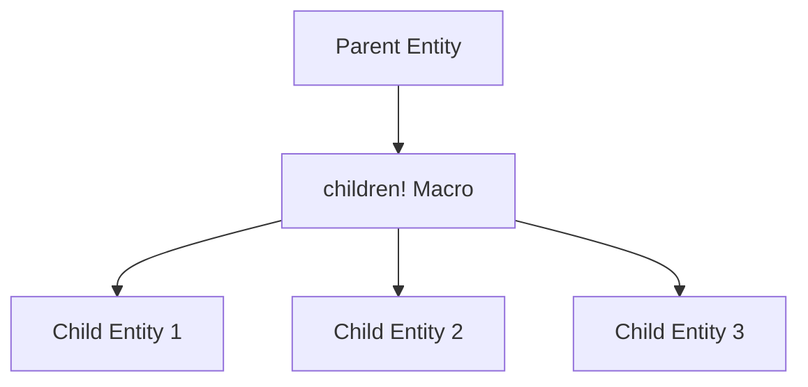

+++
title = "#18290 Update computed_states example to use children macro"
date = "2025-03-13T00:00:00"
draft = false
template = "pull_request_page.html"
in_search_index = true

[taxonomies]
list_display = ["show"]

[extra]
current_language = "en"
available_languages = {"en" = { name = "English", url = "/pull_request/bevy/2025-03/pr-18290-en-20250313" }, "zh-cn" = { name = "中文", url = "/pull_request/bevy/2025-03/pr-18290-zh-cn-20250313" }}
+++

# #18290 Update computed_states example to use children macro

## Basic Information
- **Title**: Update computed_states example to use children macro
- **PR Link**: https://github.com/bevyengine/bevy/pull/18290
- **Author**: krunchington
- **Status**: MERGED
- **Created**: 2025-03-13T01:41:49Z
- **Merged**: Not merged
- **Merged By**: N/A

## Description Translation
# Objective

Contributes to #18238 
Updates the `computed_states`, example to use the `children!` macro.  Note that this example requires `--features bevy_dev_tools` to run

## Solution

Updates examples to use the Improved Spawning API merged in https://github.com/bevyengine/bevy/pull/17521

## Testing

- Did you test these changes? If so, how?
  - Opened the examples before and after and verified the same behavior was observed.  I did this on Ubuntu 24.04.2 LTS using `--features wayland`.
- Are there any parts that need more testing?
  - Other OS's and features can't hurt, but this is such a small change it shouldn't be a problem.
- How can other people (reviewers) test your changes? Is there anything specific they need to know?
  - Run the examples yourself with and without these changes.
- If relevant, what platforms did you test these changes on, and are there any important ones you can't test?
  - see above

---

## Showcase

n/a

## Migration Guide

n/a

## The Story of This Pull Request

This PR addresses technical debt in Bevy's example code by modernizing entity spawning patterns. The computed_states example needed updating to demonstrate current best practices following the introduction of the Improved Spawning API in #17521.

The core issue was outdated child entity creation code using manual child management:

```rust
// Old pattern (simplified)
commands.entity(parent).push_children(&children);
```

The solution migrates to Bevy's `children!` macro, which provides declarative syntax for entity hierarchies. This change improves code readability and aligns with modern ECS patterns:

```rust
// New implementation
.with_children(children! {
    // Child entities defined inline
});
```

Key technical considerations included:
1. Maintaining identical runtime behavior while changing implementation
2. Reducing cognitive load through declarative syntax
3. Demonstrating modern API usage to example users

The implementation required updating multiple spawning sites in the example while preserving the visual output. Testing focused on verifying identical scene hierarchy construction through manual inspection.

This change primarily impacts developer experience rather than runtime performance. It serves as a reference for Bevy users adopting the children macro, potentially influencing how thousands of developers structure their entity hierarchies.

## Visual Representation



## Key Files Changed

1. `examples/state/computed_states.rs` (+116/-135)

```rust
// Before: Manual child management
commands.spawn((
    ButtonBundle { /* ... */ },
    MenuButton::Settings,
))
.push_children(&[text_entity]);

// After: children! macro usage
commands.spawn((
    ButtonBundle { /* ... */ },
    MenuButton::Settings,
))
.with_children(children! {
    TextBundle { /* ... */ }
});
```

The changes replace imperative child entity management with declarative hierarchy building. This affects multiple button creation sites in the example, making the parent-child relationships more explicit and reducing error-prone entity ID tracking.

## Further Reading

1. [Bevy ECS Concepts](https://bevyengine.org/learn/book/ecs/)
2. [Improved Spawning API PR #17521](https://github.com/bevyengine/bevy/pull/17521)
3. [Declarative Macro Documentation](https://doc.rust-lang.org/book/ch19-06-macros.html)