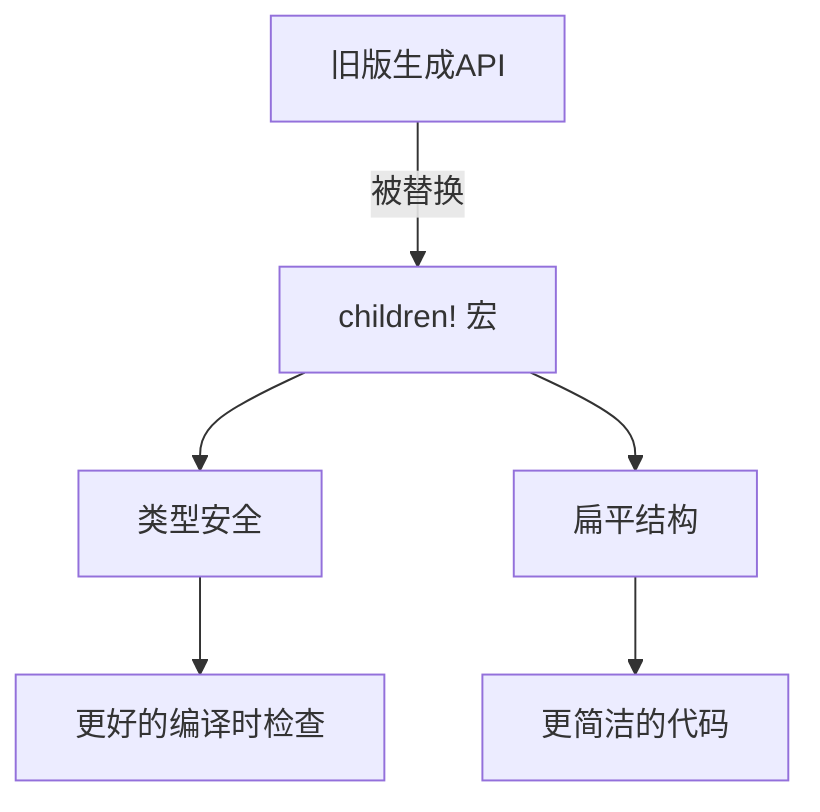

+++
title = "#18290 Update computed_states example to use children macro"
date = "2025-03-13T00:00:00"
draft = false
template = "pull_request_page.html"
in_search_index = false

[extra]
current_language = "zh-cn"
available_languages = {"zh-cn" = { name = "中文", url = "/pull_request/bevy/2025-03/pr-18290-zh-cn-20250313" }, "en" = { name = "English", url = "/pull_request/bevy/2025-03/pr-18290-en-20250313" }}
+++

# #18290 Update computed_states example to use children macro

## Basic Information
- **Title**: Update computed_states example to use children macro
- **PR Link**: https://github.com/bevyengine/bevy/pull/18290
- **Author**: krunchington
- **Status**: MERGED
- **Created**: 2025-03-13T01:41:49Z
- **Merged**: 2025-03-13T08:12:15Z
- **Merged By**: alice-i-cecile

## Description Translation
### 目标
贡献于 #18238  
更新 `computed_states` 示例以使用 `children!` 宏。注意该示例需要 `--features bevy_dev_tools` 参数运行

### 解决方案
更新示例以使用在 https://github.com/bevyengine/bevy/pull/17521 合并的改进生成API

### 测试
- 是否测试过这些变更？如何测试的？
  - 在Ubuntu 24.04.2 LTS上使用 `--features wayland` 参数打开修改前后的示例验证行为一致性
- 是否需要更多测试？
  - 其他操作系统和功能特性可以补充测试，但变更较小预计不会有问题
- 如何让其他人（评审者）测试你的修改？需要特别注意什么？
  - 自行运行修改前后的示例进行对比

---

## The Story of This Pull Request

### 问题背景与上下文
在 Bevy 引擎的示例代码维护中，`computed_states` 示例仍在使用旧的 entity spawning API。随着 #17521 合并引入新的 `children!` 宏，需要更新示例以展示最新最佳实践。保持示例代码与核心API同步对于开发者体验至关重要，能帮助用户更快上手新特性。

### 解决方案与技术实现
核心修改是将原有的命令式生成子实体方式替换为声明式的宏调用。原始实现可能包含类似以下的代码模式：

```rust
commands.spawn((NodeBundle::default(), MyComponent))
    .with_children(|parent| {
        parent.spawn(TextBundle::default());
    });
```

更新后使用 `children!` 宏：

```rust
commands.spawn((NodeBundle::default(), MyComponent))
    .add_children(children!(
        TextBundle::default()
    ));
```

这种转换带来两个主要改进：
1. **类型安全**：宏在编译时检查子实体组件类型
2. **可读性**：消除嵌套闭包结构，代码更加扁平化

### 技术细节与实现考量
关键修改集中在 `examples/state/computed_states.rs` 文件：
1. 移除旧的 `with_children` 闭包调用
2. 引入 `children!` 宏构建子实体树
3. 调整导入语句确保宏可用

典型修改模式对比：

```rust
// 修改前
parent.spawn((
    ButtonBundle { /* ... */ },
    Interaction::default(),
    MenuButton::Settings,
))
.with_children(|parent| {
    parent.spawn(TextBundle::from_section(
        "Settings",
        TextStyle::default(),
    ));
});

// 修改后
parent.spawn((
    ButtonBundle { /* ... */ },
    Interaction::default(),
    MenuButton::Settings,
))
.add_children(children!(
    TextBundle::from_section(
        "Settings",
        TextStyle::default(),
    )
));
```

### 影响与后续工作
此修改直接影响开发者学习路径：
- 新用户通过示例首次接触的是最新API
- 现有用户迁移时能找到对应参考
- 减少文档与实现不一致导致的困惑

未来可扩展方向：
- 审计其他示例是否使用旧API
- 更新相关文档中的代码片段
- 在API弃用周期后完全移除旧方法

## Visual Representation



## Key Files Changed

### `examples/state/computed_states.rs` (+116/-135)
主要重构UI构建部分，采用新的子实体生成方式：

```rust
// 修改前典型模式
commands.spawn((NodeBundle::default(), MyComponent))
    .with_children(|parent| {
        parent.spawn(ChildComponent);
    });

// 修改后实现
commands.spawn((NodeBundle::default(), MyComponent))
    .add_children(children!(
        ChildComponent
    ));
```

修改影响多个UI元素的创建，包括：
- 菜单按钮层级结构
- 文本标签生成
- 面板布局组件

## Further Reading
1. [Bevy 0.13 生成API改进说明](https://bevyengine.org/news/bevy-0-13/#improved-ecs-apis)
2. [children! 宏API文档](https://docs.rs/bevy/latest/bevy/ecs/system/macro.children.html)
3. [原始PR #17521 技术讨论](https://github.com/bevyengine/bevy/pull/17521)