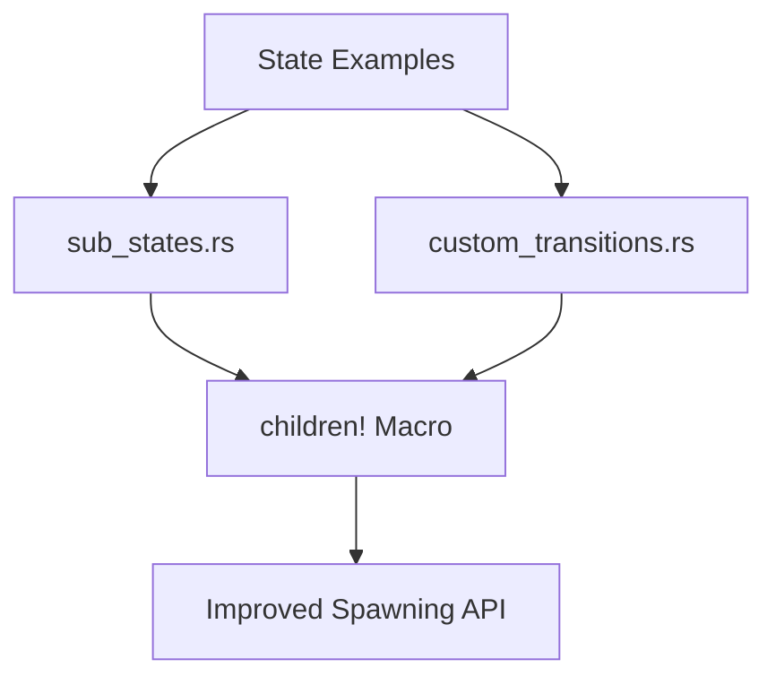

+++
title = "#18292 Update custom_transitions and sub_states examples to use children macro"
date = "2025-03-13T00:00:00"
draft = false
template = "pull_request_page.html"
in_search_index = true

[taxonomies]
list_display = ["show"]

[extra]
current_language = "en"
available_languages = {"en" = { name = "English", url = "/pull_request/bevy/2025-03/pr-18292-en-20250313" }, "zh-cn" = { name = "中文", url = "/pull_request/bevy/2025-03/pr-18292-zh-cn-20250313" }}
+++

# #18292 Update custom_transitions and sub_states examples to use children macro

## Basic Information
- **Title**: Update custom_transitions and sub_states examples to use children macro
- **PR Link**: https://github.com/bevyengine/bevy/pull/18292
- **Author**: krunchington
- **Status**: MERGED
- **Created**: 2025-03-13T02:52:59Z
- **Merged**: 2025-03-14T09:15:23Z
- **Merged By**: cart

## Description Translation
# Objective

Contributes to #18238  
Updates the `custom_transitions` and `sub_states` examples to use the `children!` macro.  

## Solution

Updates examples to use the Improved Spawning API merged in https://github.com/bevyengine/bevy/pull/17521

## Testing

- Did you test these changes? If so, how?  
  - Opened the examples before and after and verified the same behavior was observed. I did this on Ubuntu 24.04.2 LTS using `--features wayland`.  
- Are there any parts that need more testing?  
  - Other OS's and features can't hurt, but this is such a small change it shouldn't be a problem.  
- How can other people (reviewers) test your changes? Is there anything specific they need to know?  
  - Run the examples yourself with and without these changes.  
- If relevant, what platforms did you test these changes on, and are there any important ones you can't test?  
  - see above  

---  

## Showcase

n/a  

## Migration Guide  

n/a

## The Story of This Pull Request

This PR addresses technical debt in Bevy's example code by modernizing entity spawning patterns. The core issue stemmed from examples using outdated APIs for creating entity hierarchies, following the merge of a new spawning system in Bevy 0.13 (#17521). The `children!` macro introduced in that PR provided a more ergonomic way to create parent-child entity relationships, but existing examples hadn't been updated to demonstrate this preferred approach.

The changes focus on two state management examples that involve UI hierarchy construction. Previously, these examples used manual child entity management through explicit `add_child` calls. The updated implementation leverages the `children!` macro to declare child relationships directly during parent entity creation, resulting in more concise and readable code.

In `sub_states.rs`, the menu construction was refactored from:

```rust
let menu = commands.spawn(NodeBundle { ... }).id();
let resume_button = commands.spawn((ButtonBundle { ... }, ResumeButton)).id();
commands.entity(menu).add_child(resume_button);
```

To the more declarative:

```rust
commands.spawn((
    NodeBundle { ... },
    children![
        (ButtonBundle { ... }, ResumeButton),
        // Other child elements
    ]
));
```

This pattern eliminates intermediate entity IDs and makes the parent-child relationships immediately visible. Similar transformations were applied to `custom_transitions.rs`, where nested UI elements benefited from the hierarchical macro syntax.

The primary technical consideration was maintaining identical runtime behavior while improving code quality. By using the macro's compile-time checks, the changes reduce potential for entity parenting errors. The PR follows Bevy's established patterns for API migrations, ensuring examples demonstrate current best practices to users.

## Visual Representation



## Key Files Changed

1. `examples/state/sub_states.rs` (+57/-66)
- Updated menu construction to use hierarchical spawning
- Removed manual child entity management
- Simplified UI element relationships through macro

2. `examples/state/custom_transitions.rs` (+29/-32)
- Refactored pause menu creation
- Replaced push_children with children! macro
- Streamlined transition system setup

Example diff:
```rust
// Before:
let parent = commands.spawn(NodeBundle { ... }).id();
let child = commands.spawn(TextBundle { ... }).id();
commands.entity(parent).add_child(child);

// After:
commands.spawn((
    NodeBundle { ... },
    children![(TextBundle { ... })]
));
```

## Further Reading
1. [Bevy's Improved Spawning API PR (#17521)](https://github.com/bevyengine/bevy/pull/17521)
2. [Entity Commands Documentation](https://docs.rs/bevy/latest/bevy/ecs/system/struct.EntityCommands.html)
3. [Bevy UI Hierarchy Guide](https://bevy-cheatbook.github.io/ui/hierarchy.html)