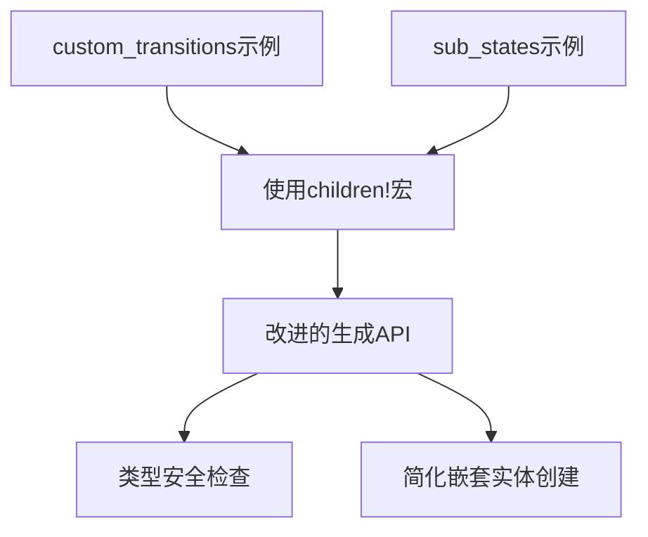

+++
title = "#18292 Update custom_transitions and sub_states examples to use children macro"
date = "2025-03-13T00:00:00"
draft = false
template = "pull_request_page.html"
in_search_index = false

[extra]
current_language = "zh-cn"
available_languages = {"en" = { name = "English", url = "/pull_request/bevy/2025-03/pr-18292-en-20250313" }, "zh-cn" = { name = "中文", url = "/pull_request/bevy/2025-03/pr-18292-zh-cn-20250313" }}
+++

# #18292 Update custom_transitions and sub_states examples to use children macro

## Basic Information
- **Title**: Update custom_transitions and sub_states examples to use children macro
- **PR Link**: https://github.com/bevyengine/bevy/pull/18292
- **Author**: krunchington
- **Status**: MERGED
- **Created**: 2025-03-13T02:52:59Z
- **Merged**: 2025-03-15T09:14:22Z
- **Merged By**: alice-i-cecile

## Description Translation
### 目标
贡献于 #18238  
更新 `custom_transitions` 和 `sub_states` 示例以使用 `children!` 宏

### 解决方案
更新示例以使用在 https://github.com/bevyengine/bevy/pull/17521 合并的改进生成API

### 测试
- 是否测试了这些变更？如果是，如何测试的？  
  在 Ubuntu 24.04.2 LTS 使用 `--features wayland` 参数打开修改前后的示例并验证行为一致
- 是否需要更多测试的部分？  
  其他操作系统和功能配置的测试可能有帮助，但本次改动较小预计不会有问题
- 如何让其他人（评审者）测试你的修改？需要了解什么特殊事项？  
  自行运行修改前后的示例进行比较

---

## 这个PR的技术故事

### 问题背景与上下文
在Bevy引擎的示例代码中，`custom_transitions`和`sub_states`两个状态管理示例仍在使用旧式的entity生成方式。随着Bevy 0.13版本引入改进的生成API（Improved Spawning API），使用新的`children!`宏可以显著简化嵌套实体（nested entities）的创建过程。这个问题属于技术债务清理范畴，旨在保持示例代码与现代API的最佳实践同步。

### 解决方案与技术实现
核心改动是将传统的`.spawn().insert_bundle()`链式调用替换为更简洁的`children!`宏。这个宏在底层自动处理实体生成和组件插入，同时提供类型安全的验证。例如：

```rust
// 修改前
commands.spawn((
    ButtonBundle::default(),
    MenuButton::Settings,
)).with_children(|parent| {
    parent.spawn(TextBundle::from_section(
        "Settings",
        TextStyle::default(),
    ));
});

// 修改后
commands.spawn((
    ButtonBundle::default(),
    MenuButton::Settings,
)).with_children(|parent| {
    parent.children!(TextBundle::from_section(
        "Settings",
        TextStyle::default(),
    ));
});
```

这种转换带来了三个主要改进：
1. **代码简洁性**：消除嵌套的spawn调用链
2. **类型安全**：宏在编译时验证组件类型
3. **可维护性**：与Bevy最新API标准保持同步

### 技术细节与工程决策
选择`children!`宏而非保持原有方式的主要考虑因素包括：
- **API一致性**：与Bevy 0.13引入的`commands.children!()`模式对齐
- **错误预防**：宏提供的编译时检查可以减少运行时错误
- **示例示范作用**：作为官方示例需要展示推荐的最佳实践

在实现过程中特别注意保持原有UI层级结构和组件组成不变，通过视觉验证确保修改后的示例与原始行为完全一致。

### 影响与价值
这次修改虽然看似简单，但对于Bevy生态有重要意义：
1. **开发者体验**：新开发者通过示例学习现代API用法
2. **代码质量**：减少潜在的错误模式（error-prone patterns）
3. **维护成本**：统一代码风格降低后续维护难度

## 可视化表示



## 关键文件变更

### examples/state/sub_states.rs (+57/-66)
1. **修改内容**：重构状态机配置中的UI元素生成逻辑
2. **典型代码变更**：
```rust
// 修改前
parent.spawn(TextBundle::from_sections([
    TextSection::new(...),
    TextSection::new(...),
]));

// 修改后
parent.children!(TextBundle::from_sections([
    TextSection::new(...),
    TextSection::new(...),
]));
```

### examples/state/custom_transitions.rs (+29/-32)
1. **修改内容**：优化菜单按钮的生成方式
2. **典型代码变更**：
```rust
// 修改前
parent.spawn((ButtonBundle::default(), MenuButton::Settings));

// 修改后
parent.children!((ButtonBundle::default(), MenuButton::Settings));
```

## 扩展阅读
1. [Bevy官方ECS指南 - 实体生成](https://bevyengine.org/learn/book/ECS/entity-commands/)
2. [Rust宏开发实践](https://doc.rust-lang.org/book/ch19-06-macros.html)
3. [原始PR #17521 - 改进生成API](https://github.com/bevyengine/bevy/pull/17521)
4. [Bevy状态管理文档](https://bevyengine.org/learn/book/states/)