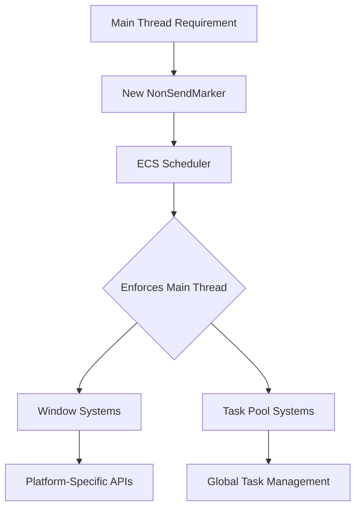

+++
title = "#18301 Create new `NonSendMarker`"
date = "2025-03-23T00:00:00"
draft = false
template = "pull_request_page.html"
in_search_index = true

[taxonomies]
list_display = ["show"]

[extra]
current_language = "en"
available_languages = {"en" = { name = "English", url = "/pull_request/bevy/2025-03/pr-18301-en-20250323" }, "zh-cn" = { name = "中文", url = "/pull_request/bevy/2025-03/pr-18301-zh-cn-20250323" }}
labels = ["C-Feature", "A-ECS", "X-Contentious", "D-Straightforward"]
+++

# #18301 Create new `NonSendMarker`

## Basic Information
- **Title**: Create new `NonSendMarker`
- **PR Link**: https://github.com/bevyengine/bevy/pull/18301
- **Author**: joshua-holmes
- **Status**: MERGED
- **Labels**: `C-Feature`, `A-ECS`, `S-Ready-For-Final-Review`, `X-Contentious`, `D-Straightforward`
- **Created**: 2025-03-13T23:57:31Z
- **Merged**: Not merged
- **Merged By**: N/A

## Description Translation
# Objective

Create new `NonSendMarker` that does not depend on `NonSend`.

Required, in order to accomplish #17682. In that issue, we are trying to replace `!Send` resources with `thread_local!` in order to unblock the resources-as-components effort. However, when we remove all the `!Send` resources from a system, that allows the system to run on a thread other than the main thread, which is against the design of the system. So this marker gives us the control to require a system to run on the main thread without depending on `!Send` resources.

## Solution

Create a new `NonSendMarker` to replace the existing one that does not depend on `NonSend`.

## Testing

Other than running tests, I ran a few examples:
- `window_resizing`
- `wireframe`
- `volumetric_fog` (looks so cool)
- `rotation`
- `button`

There is a Mac/iOS-specific change and I do not have a Mac or iOS device to test it. I am doubtful that it would cause any problems for 2 reasons:
1. The change is the same as the non-wasm change which I did test
2. The Pixel Eagle tests run Mac tests

But it wouldn't hurt if someone wanted to spin up an example that utilizes the `bevy_render` crate, which is where the Mac/iSO change was.

## Migration Guide

If `NonSendMarker` is being used from `bevy_app::prelude::*`, replace it with `bevy_ecs::system::NonSendMarker` or use it from `bevy_ecs::prelude::*`. In addition to that, `NonSendMarker` does not need to be wrapped like so:
```rust
fn my_system(_non_send_marker: Option<NonSend<NonSendMarker>>) {
    ...
}
```

Instead, it can be used without any wrappers:
```rust
fn my_system(_non_send_marker: NonSendMarker) {
    ...
}
```

## The Story of This Pull Request

The PR addresses a core architectural challenge in Bevy's ECS system related to thread-local execution requirements. The problem stemmed from efforts to migrate `!Send` resources to thread-local storage (TLS) as part of #17682. While removing `!Send` constraints enabled more flexible system scheduling, it inadvertently allowed systems designed for main-thread execution (like window management and rendering) to potentially run on worker threads, which could cause platform-specific issues.

The key insight was to create a dedicated marker type that enforces main-thread execution without relying on `!Send` resource wrappers. The new `NonSendMarker` serves as a zero-sized type (ZST) that systems can request as a parameter. Bevy's scheduler recognizes this marker and ensures affected systems only execute on the main thread.

Implementation involved:

1. **Decoupling from NonSend**: Previously, systems used `NonSend<NonSendMarker>` which combined thread enforcement with resource access. The new approach separates these concerns:

```rust
// Before: Required NonSend wrapper
fn system(_: Option<NonSend<NonSendMarker>>) {}

// After: Direct marker usage
fn system(_: NonSendMarker) {}
```

2. **Type System Enforcement**: The marker leverages Rust's type system and Bevy's scheduler logic:
```rust
pub struct NonSendMarker {
    _private: (),
}

// Implements marker traits for ECS recognition
unsafe impl Send for NonSendMarker {}
unsafe impl Sync for NonSendMarker {}
```

3. **Platform-Specific Handling**: Updated window management systems in `bevy_render` to use the new marker, ensuring platform requirements like macOS/iOS window handling stay on the main thread.

The changes maintain thread safety while reducing boilerplate. Systems needing main-thread access now declare this requirement explicitly through their parameters rather than implicit `!Send` resource dependencies.

## Visual Representation



## Key Files Changed

1. `crates/bevy_ecs/src/system/system_param.rs` (+27/-0)
- Added `NonSendMarker` definition and ECS parameter handling
```rust
pub struct NonSendMarker {
    _private: (),
}

// Implementation details for system parameter
```

2. `crates/bevy_app/src/task_pool_plugin.rs` (+4/-5)
- Updated task pool system to use new marker
```rust
// Before:
fn tick_global_task_pools(_: NonSend<NonSendMarker>)

// After:
fn tick_global_task_pools(_: NonSendMarker)
```

3. `crates/bevy_ecs/src/lib.rs` (+2/-2)
- Updated module exports and prelude inclusions

4. `crates/bevy_render/src/view/window/mod.rs` (+1/-3)
- Adjusted imports for platform-specific window handling

5. `crates/bevy_app/src/lib.rs` (+1/-1)
- Removed legacy marker export from app prelude

## Further Reading

1. [Bevy ECS System Parameters](https://bevyengine.org/learn/book/next/programming/ecs/system-parameters/)
2. [Rust Send and Sync Traits](https://doc.rust-lang.org/nomicon/send-and-sync.html)
3. [Thread-Local Storage Patterns](https://rust-lang.github.io/rfcs/2144-type-safe-thread-local-storage.html)