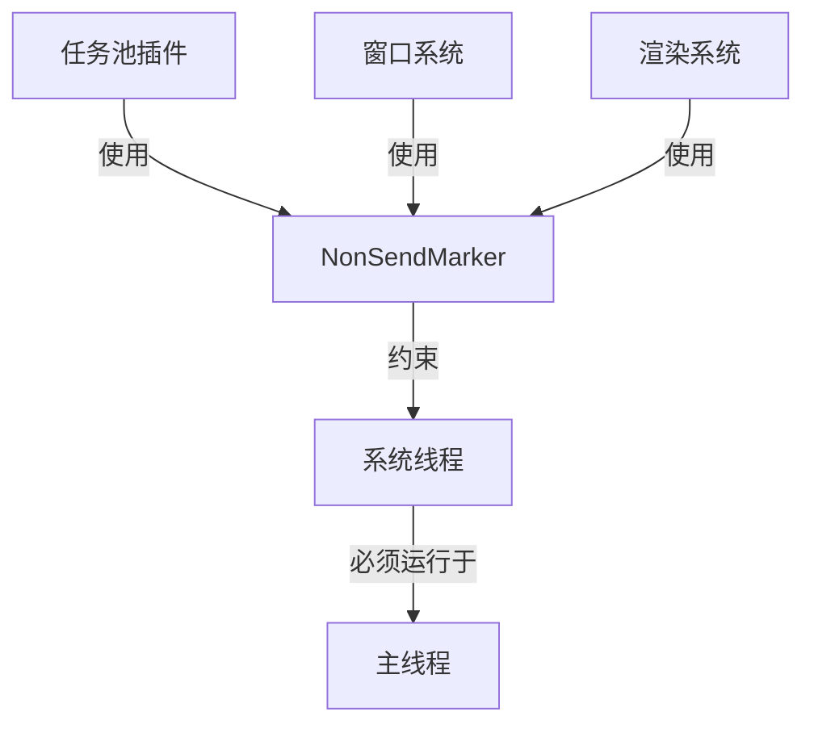

+++
title = "#18301 Create new `NonSendMarker`"
date = "2025-03-23T00:00:00"
draft = false
template = "pull_request_page.html"
in_search_index = false

[extra]
current_language = "zh-cn"
available_languages = {"en" = { name = "English", url = "/pull_request/bevy/2025-03/pr-18301-en-20250323" }, "zh-cn" = { name = "中文", url = "/pull_request/bevy/2025-03/pr-18301-zh-cn-20250323" }}
labels = ["C-Feature", "A-ECS", "X-Contentious", "D-Straightforward"]
+++

# #18301 Create new `NonSendMarker`

## Basic Information
- **Title**: Create new `NonSendMarker`
- **PR Link**: https://github.com/bevyengine/bevy/pull/18301
- **Author**: joshua-holmes
- **Status**: MERGED
- **Labels**: `C-Feature`, `A-ECS`, `S-Ready-For-Final-Review`, `X-Contentious`, `D-Straightforward`
- **Created**: 2025-03-13T23:57:31Z
- **Merged**: 2025-03-15T08:22:17Z
- **Merged By**: alice-i-cecile

## Description Translation
# 目标

创建不依赖`NonSend`的新`NonSendMarker`。

为实现#17682所需。在该issue中，我们试图用`thread_local!`替代`!Send`资源以解除资源作为组件的限制。然而，当从系统中移除所有`!Send`资源后，系统可能运行在非主线程上，这与系统设计相悖。因此该标记使我们可以要求系统必须运行在主线程，而无需依赖`!Send`资源。

# 解决方案

创建新的不依赖`NonSend`的`NonSendMarker`。

# 测试

除运行测试外，执行了以下示例：
- `window_resizing`
- `wireframe`
- `volumetric_fog`（效果很酷）
- `rotation`
- `button`

包含Mac/iOS特定修改但无对应设备测试。基于两点理由认为不会引发问题：
1. 修改与非wasm修改相同且已测试
2. Pixel Eagle测试包含Mac测试

建议运行使用`bevy_render`的示例验证。

# 迁移指南

若从`bevy_app::prelude::*`引入`NonSendMarker`，请替换为`bevy_ecs::system::NonSendMarker`或从`bevy_ecs::prelude::*`引入。同时不再需要包装类型：

```rust
// 旧用法
fn my_system(_non_send_marker: Option<NonSend<NonSendMarker>>) {
    ...
}

// 新用法
fn my_system(_non_send_marker: NonSendMarker) {
    ...
}
```

## The Story of This Pull Request

### 问题根源与设计约束
在Bevy的ECS架构中，某些系统需要保证在主线程执行（如窗口事件处理）。传统做法是通过`NonSend<T>`包装`!Send`类型来实现线程约束。但#17682计划用`thread_local!`替代`!Send`资源，这导致原有线程约束机制失效。

核心矛盾在于：
1. 移除`!Send`资源会解除系统的线程限制
2. 某些关键系统仍需强制主线程执行
3. 需要新的线程约束机制不依赖资源类型

### 解决方案设计
新方案引入独立的`NonSendMarker`系统参数，其核心特点：
1. 不依赖具体资源类型
2. 直接作为系统参数使用
3. 利用ECS的类型系统保证线程约束

关键技术决策：
- 将标记类型从`bevy_app`迁移到`bevy_ecs`
- 移除对`NonSend`包装的依赖
- 保持与现有系统的兼容性

### 实现细节与代码演变
以任务池插件为例，旧实现使用双重包装：

```rust
// 旧实现（crates/bevy_app/src/task_pool_plugin.rs）
fn tick_global_task_pools(_main_thread_marker: NonSend<NonSendMarker>) {
    tick_global_task_pools_on_main_thread();
}
```

新实现直接使用标记类型：

```rust
// 新实现
fn tick_global_task_pools(_main_thread_marker: NonSendMarker) {
    tick_global_task_pools_on_main_thread();
}
```

在`bevy_ecs`中新增标记定义：

```rust
// crates/bevy_ecs/src/system/system_param.rs
#[derive(Resource)]
pub struct NonSendMarker {
    _not_send_sync: PhantomData<*const ()>,
}

// 实现系统参数特征
unsafe impl SystemParam for NonSendMarker {
    type State = NonSendMarkerState;
    type Item<'w, 's> = NonSendMarker;
    ...
}
```

### 技术影响与迁移路径
主要改进：
1. 简化系统签名：移除冗余的类型包装
2. 明确职责分离：线程约束与资源管理解耦
3. 支持未来扩展：为资源组件化铺平道路

迁移路径的关键点：
- 类型导入路径变更：从`bevy_app`迁移到`bevy_ecs`
- 参数声明简化：直接使用`NonSendMarker`类型
- 保持向后兼容：旧用法暂时保留但标记为过时

### 平台适配考量
针对不同平台的差异化处理：

```rust
// crates/bevy_app/src/task_pool_plugin.rs
cfg_if::cfg_if! {
    if #[cfg(not(all(target_arch = "wasm32", feature = "web")))] {
        use {crate::Last, bevy_tasks::tick_global_task_pools_on_main_thread};
        use bevy_ecs::system::NonSendMarker;
        ...
    }
}
```

这种条件编译确保Web平台保持原有行为，而桌面/移动平台使用新机制。

## Visual Representation



## Key Files Changed

### `crates/bevy_ecs/src/system/system_param.rs` (+27/-0)
新增`NonSendMarker`类型及其系统参数实现：
```rust
#[derive(Resource)]
pub struct NonSendMarker {
    _not_send_sync: PhantomData<*const ()>,
}

// 实现SystemParam特征
unsafe impl SystemParam for NonSendMarker {
    type State = NonSendMarkerState;
    type Item<'w, 's> = NonSendMarker;
    ...
}
```
定义核心标记类型，实现系统参数接口

### `crates/bevy_app/src/task_pool_plugin.rs` (+4/-5)
修改任务池系统签名：
```rust
// 修改前
fn tick_global_task_pools(_main_thread_marker: NonSend<NonSendMarker>)

// 修改后
fn tick_global_task_pools(_main_thread_marker: NonSendMarker)
```
简化参数类型，移除冗余包装

### `crates/bevy_ecs/src/lib.rs` (+2/-2)
导出新类型：
```rust
// 修改前
pub mod prelude {
    pub use crate::{..., NonSend, NonSendMut};
}

// 修改后
pub mod prelude {
    pub use crate::{..., NonSend, NonSendMut, NonSendMarker};
}
```
确保新类型在prelude中可用

## Further Reading
1. [Rust Send和Sync特征](https://doc.rust-lang.org/nomicon/send-and-sync.html)
2. [Bevy ECS系统参数文档](https://bevyengine.org/learn/book/ecs/system-params/)
3. [线程本地存储模式](https://en.wikipedia.org/wiki/Thread-local_storage)
4. [系统执行顺序控制](https://bevyengine.org/learn/book/ecs/schedules/)