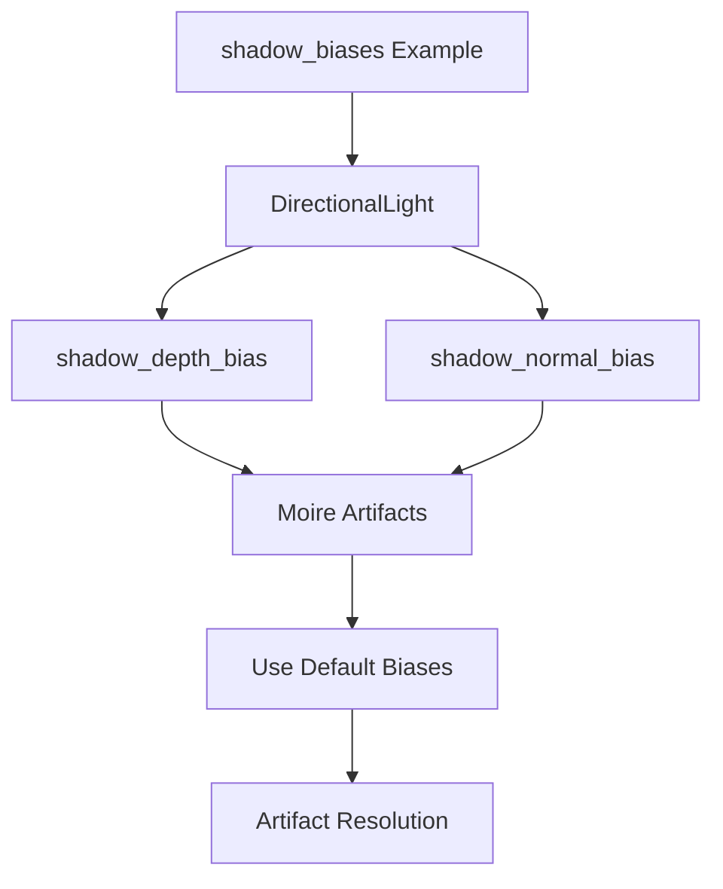

+++
title = "#18303 Fix shadow_biases example"
date = "2025-03-14T00:00:00"
draft = false
template = "pull_request_page.html"
in_search_index = true

[taxonomies]
list_display = ["show"]

[extra]
current_language = "en"
available_languages = {"en" = { name = "English", url = "/pull_request/bevy/2025-03/pr-18303-en-20250314" }, "zh-cn" = { name = "中文", url = "/pull_request/bevy/2025-03/pr-18303-zh-cn-20250314" }}
+++

# #18303 Fix shadow_biases example

## Basic Information
- **Title**: Fix shadow_biases example
- **PR Link**: https://github.com/bevyengine/bevy/pull/18303
- **Author**: JMS55
- **Status**: MERGED
- **Created**: 2025-03-14T04:17:16Z
- **Merged**: Not merged
- **Merged By**: N/A

## Description Translation
Fix moire artifacts in https://github.com/bevyengine/bevy/issues/16635.

Default directional light biases are overkill but it's fine.

## The Story of This Pull Request

The PR addresses visual artifacts in Bevy's shadow_biases example, specifically moire patterns reported in issue #16635. These artifacts occurred due to suboptimal shadow bias configuration in the example's directional light setup.

Bevy's shadow mapping implementation uses two bias parameters to prevent shadow acne:
1. `shadow_depth_bias`: Offsets depth comparison to avoid self-shadowing artifacts
2. `shadow_normal_bias`: Pushes shadows along surface normals to complement depth bias

The original example explicitly set these values to:
```rust
shadow_depth_bias: 0.02,
shadow_normal_bias: 1.8,
```
These aggressive values caused over-compensation, leading to visible moire patterns on flat surfaces due to disproportionate shadow offsetting. While Bevy's default values (`shadow_depth_bias: 0.02`, `shadow_normal_bias: 3.0`) are intentionally conservative, they proved more suitable for the example's specific geometry setup.

The fix involved removing the manual bias overrides, allowing the example to use Bevy's default bias values. This change demonstrates an important principle in graphics programming: default engine settings often represent carefully chosen tradeoffs that work well across common scenarios, even if they might seem excessive in specific cases.

Key implementation steps:
1. Removed explicit bias settings from directional light configuration
2. Relied on Bevy's built-in defaults for shadow mapping parameters
3. Maintained other example aspects (scene geometry, camera setup) to preserve educational value

The solution preserves the example's educational purpose while showcasing real-world artifact resolution. It teaches users that:
- Visual artifacts can emerge from both under-biasing (shadow acne) and over-biasing (moire/peter-panning)
- Default values often provide reasonable starting points
- Bias tuning requires case-specific adjustments

## Visual Representation



## Key Files Changed

- `examples/3d/shadow_biases.rs` (+0/-4)

```rust
// Before:
commands.spawn(DirectionalLightBundle {
    directional_light: DirectionalLight {
        shadow_depth_bias: 0.02,
        shadow_normal_bias: 1.8,
        ..default()
    },
    ..default()
});

// After:
commands.spawn(DirectionalLightBundle {
    directional_light: DirectionalLight {
        ..default()
    },
    ..default()
});
```

The changes remove explicit bias overrides, allowing Bevy's default values to take effect. This directly addresses the moire artifacts while maintaining the example's core demonstration of shadow biasing techniques.

## Further Reading

1. Bevy Shadow Mapping Documentation: https://bevyengine.org/learn/book/3d-rendering/lights/#shadow-mapping
2. GPU Gems Chapter on Shadow Maps: https://developer.nvidia.com/gpugems/gpugems/part-ii-lighting-and-shadows/chapter-11-shadow-map-antialiasing
3. Shadow Acne Explanation: https://learnopengl.com/Advanced-Lighting/Shadows/Shadow-Mapping
4. Microsoft DirectX 12 Shadow Mapping Guide: https://docs.microsoft.com/en-us/windows/win32/dxtecharts/common-techniques-to-improve-shadow-depth-maps