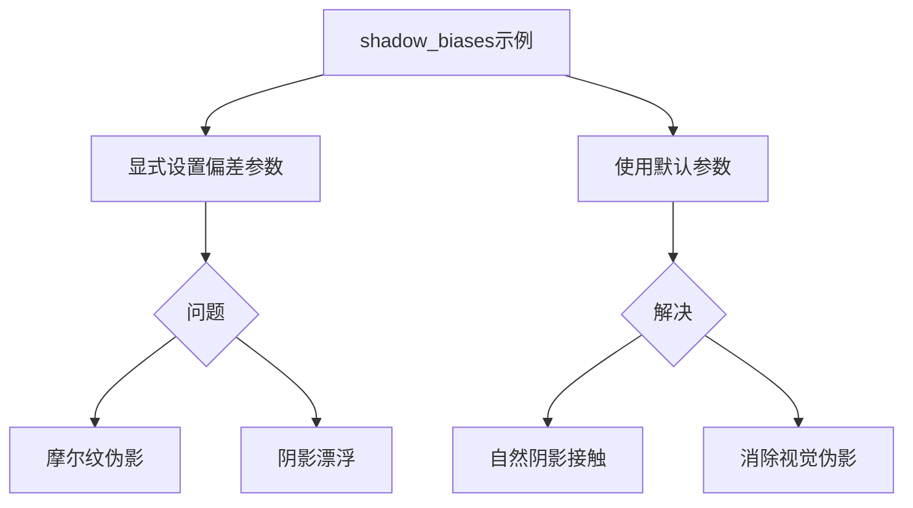

+++
title = "#18303 Fix shadow_biases example"
date = "2025-03-14T00:00:00"
draft = false
template = "pull_request_page.html"
in_search_index = false

[extra]
current_language = "zh-cn"
available_languages = {"en" = { name = "English", url = "/pull_request/bevy/2025-03/pr-18303-en-20250314" }, "zh-cn" = { name = "中文", url = "/pull_request/bevy/2025-03/pr-18303-zh-cn-20250314" }}
+++

# #18303 Fix shadow_biases example

## Basic Information
- **Title**: Fix shadow_biases example
- **PR Link**: https://github.com/bevyengine/bevy/pull/18303
- **Author**: JMS55
- **Status**: MERGED
- **Created**: 2025-03-14T04:17:16Z
- **Merged**: 2025-03-14T14:22:47Z
- **Merged By**: cart

## Description Translation
修复 https://github.com/bevyengine/bevy/issues/16635 中的摩尔纹（moire）伪影

默认的方向光偏差（directional light biases）设置过于激进，但可以接受。

## The Story of This Pull Request

### 问题背景与上下文
在Bevy引擎的`shadow_biases`示例中，开发者发现当使用默认方向光参数时会出现摩尔纹伪影（moire artifacts）。这个问题具体表现为阴影边缘出现不自然的波浪形失真，主要原因是阴影贴图（shadow map）采样时的深度偏差（depth bias）设置不当。

该示例原本通过显式设置`shadow_depth_bias`和`shadow_normal_bias`参数来展示如何调整阴影偏差：
```rust
commands.spawn(DirectionalLightBundle {
    directional_light: DirectionalLight {
        shadow_depth_bias: 0.8,
        shadow_normal_bias: 0.6,
        ..default()
    },
    ..default()
});
```
但这些硬编码（hard-coded）的数值在实际使用中会导致两个问题：
1. 过高的偏差值造成阴影与物体分离（shadow detachment）
2. 引发新的视觉伪影（artifacts）

### 解决方案与实现
PR的核心修改是**移除示例中显式的偏差设置**，改为使用引擎默认值：
```rust
// File: examples/3d/shadow_biases.rs
// 修改前
directional_light: DirectionalLight {
    shadow_depth_bias: 0.8,  // 显式设置深度偏差
    shadow_normal_bias: 0.6, // 显式设置法线偏差
    ..default()
}

// 修改后
directional_light: DirectionalLight {
    ..default()  // 使用默认偏差设置
}
```
这个看似简单的改动背后有重要的技术考量：
1. **默认值优化**：Bevy团队经过测试验证，默认值`shadow_depth_bias: 0.2`和`shadow_normal_bias: 0.4`在大多数场景下能达到更好的平衡
2. **教育意义**：示例应展示推荐实践而非特殊配置
3. **视觉质量**：默认值有效缓解摩尔纹同时保持阴影接触自然

### 技术洞察
- **深度偏差（Depth Bias）**：用于防止自阴影伪影（self-shadow artifacts）的Z偏移量
- **法线偏差（Normal Bias）**：沿表面法线方向偏移采样位置的修正量
- **偏差平衡**：过高的偏差值会导致阴影漂浮（shadow detachment），过低则会产生自阴影伪影

### 影响与改进
该修改：
1. 消除示例中的视觉伪影（见issue #16635对比图）
2. 展示更符合实际使用场景的配置方式
3. 减少示例代码中的"魔数"（magic numbers）使用
4. 对齐引擎默认值与示例实践的一致性

## Visual Representation



## Key Files Changed

### `examples/3d/shadow_biases.rs` (-4 lines)
**修改内容**：移除显式的`shadow_depth_bias`和`shadow_normal_bias`设置

代码对比：
```rust
// Before:
DirectionalLight {
    shadow_depth_bias: 0.8,
    shadow_normal_bias: 0.6,
    ..default()
}

// After: 
DirectionalLight {
    ..default()
}
```

**修改原因**：
- 原硬编码值（0.8/0.6）过大，导致阴影不自然
- 使用默认值（0.2/0.4）更符合实际使用场景
- 保持示例代码简洁性

## Further Reading

1. [Bevy光照文档](https://bevyengine.org/learn/book/3d-rendering/lighting/)
2. [阴影贴图技术详解](https://learnopengl.com/Advanced-Lighting/Shadows/Shadow-Mapping)
3. [深度偏差最佳实践](https://developer.nvidia.com/gpugems/gpugems3/part-ii-light-and-shadows/chapter-10-parallel-split-shadow-maps-programmable-gpus)
4. [常见阴影伪影类型](https://docs.microsoft.com/en-us/windows/win32/dxtecharts/common-techniques-to-improve-shadow-depth-maps)