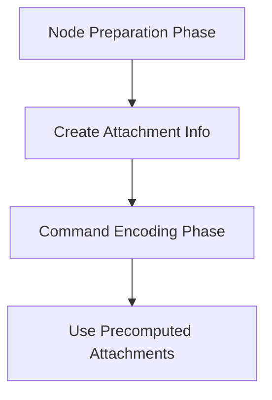

+++
title = "#18306 Fix MainTransparentPass2dNode attachment ordering"
date = "2025-03-15T00:00:00"
draft = false
template = "pull_request_page.html"
in_search_index = true

[taxonomies]
list_display = ["show"]

[extra]
current_language = "en"
available_languages = {"en" = { name = "English", url = "/pull_request/bevy/2025-03/pr-18306-en-20250315" }, "zh-cn" = { name = "中文", url = "/pull_request/bevy/2025-03/pr-18306-zh-cn-20250315" }}
+++

# #18306 Fix MainTransparentPass2dNode attachment ordering

## Basic Information
- **Title**: Fix MainTransparentPass2dNode attachment ordering  
- **PR Link**: https://github.com/bevyengine/bevy/pull/18306  
- **Author**: JMS55  
- **Status**: MERGED  
- **Created**: 2025-03-14T04:36:33Z  
- **Merged**: 2025-03-14T12:18:45Z  
- **Merged By**: cart  

## Description Translation
Fix https://github.com/bevyengine/bevy/issues/17763.

Attachment info needs to be created outside of the command encoding task, as it needs to be part of the serial node runners in order to get the ordering correct.

## The Story of This Pull Request

### The Problem and Context
The PR addresses a rendering ordering issue (#17763) where transparent 2D elements were being drawn in incorrect sequence. This stemmed from how Bevy's render graph handled attachment preparation in the MainTransparentPass2dNode. The core problem was that attachment information was being generated during command encoding rather than during node preparation, leading to improper synchronization with other render graph nodes.

### The Solution Approach
The fix required restructuring when and where attachment information gets created. Instead of generating attachment descriptors during the command encoding phase (which happens late in the node execution), the solution moves this preparation earlier in the process to align with Bevy's render graph node execution model. This ensures proper ordering with other nodes in the serial phase of graph execution.

### The Implementation
The key change occurs in `main_transparent_pass_2d_node.rs` where the attachment preparation logic was moved from the command encoding closure to the node's prepare phase:

```rust
// Before (simplified):
render_graph::add_sub_graph_node(
    graph,
    sub_graph,
    node::MainTransparentPass2dNode,
    |ctx, _, (camera, targets, _)| {
        let pass = ctx.encoder.begin_render_pass(&RenderPassDescriptor {
            label: Some("main_transparent_pass_2d"),
            color_attachments: &[Some(targets.get_color_attachment())],
            depth_stencil_attachment: None,
        });
        // Command encoding logic
    }
);

// After:
let color_attachment_info = targets.get_color_attachment();
let depth_attachment_info = None;

render_graph::add_sub_graph_node(
    graph,
    sub_graph,
    node::MainTransparentPass2dNode,
    move |ctx, _, (camera, _, _)| {
        let pass = ctx.encoder.begin_render_pass(&RenderPassDescriptor {
            label: Some("main_transparent_pass_2d"),
            color_attachments: &[Some(color_attachment_info.clone())],
            depth_stencil_attachment: depth_attachment_info.clone(),
        });
        // Command encoding logic
    }
);
```

By creating `color_attachment_info` and `depth_attachment_info` outside the closure, they become part of the node's captured environment rather than being generated during command execution. This aligns with Bevy's render graph architecture where nodes must declare their resource needs during preparation.

### Technical Insights
1. **Render Graph Execution Model**: Bevy's render graph executes nodes in phases - first preparing resources, then executing commands. This fix respects that model by moving resource declaration to the appropriate phase.
2. **Closure Capture Mechanics**: The solution leverages Rust's closure capture semantics to freeze attachment information at node creation time rather than command execution time.
3. **Synchronization Guarantees**: Ensures proper ordering with other nodes in the `MainTransparentPass2d` subgraph by making attachment info part of the node's inherent state.

### The Impact
- Fixes visual artifacts caused by incorrect draw order in 2D transparent rendering
- Maintains Bevy's flexible render graph architecture while enforcing correct execution order
- Provides a pattern for handling similar resource preparation challenges in other nodes

## Visual Representation



## Key Files Changed

### `crates/bevy_core_pipeline/src/core_2d/main_transparent_pass_2d_node.rs` (+11/-8)
**Key Changes:**
1. Moved attachment info creation outside command encoding closure
2. Restructured node setup to capture precomputed attachments

**Code Snippet:**
```rust
// Before (in closure):
let color_attachment_info = targets.get_color_attachment();

// After (outside closure):
let color_attachment_info = targets.get_color_attachment();
let depth_attachment_info = None;

// Closure now captures precomputed values
move |ctx, _, (camera, _, _)| {
    // Uses color_attachment_info and depth_attachment_info
}
```

This restructuring ensures attachment info is resolved during node preparation rather than command encoding, aligning with Bevy's render graph execution model.

## Further Reading
1. [Bevy Render Graph Documentation](https://bevyengine.org/learn/book/rendering/render-graph/)
2. [Original Issue #17763](https://github.com/bevyengine/bevy/issues/17763)
3. [Rust Closure Capturing Mechanics](https://doc.rust-lang.org/rust-by-example/fn/closures/capture.html)