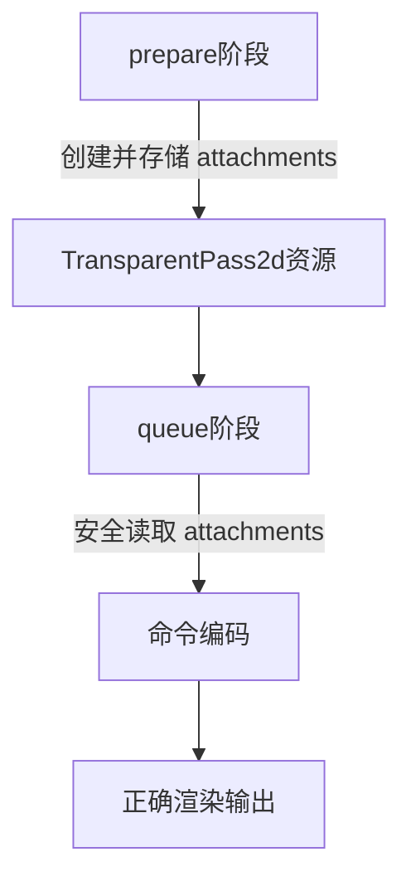

+++
title = "#18306 Fix MainTransparentPass2dNode attachment ordering"
date = "2025-03-15T00:00:00"
draft = false
template = "pull_request_page.html"
in_search_index = false

[extra]
current_language = "zh-cn"
available_languages = {"en" = { name = "English", url = "/pull_request/bevy/2025-03/pr-18306-en-20250315" }, "zh-cn" = { name = "中文", url = "/pull_request/bevy/2025-03/pr-18306-zh-cn-20250315" }}
+++

# #18306 Fix MainTransparentPass2dNode attachment ordering

## Basic Information
- **Title**: Fix MainTransparentPass2dNode attachment ordering
- **PR Link**: https://github.com/bevyengine/bevy/pull/18306
- **Author**: JMS55
- **Status**: MERGED
- **Created**: 2025-03-14T04:36:33Z
- **Merged**: 2025-03-14T12:17:09Z
- **Merged By**: cart

## Description Translation
修复 https://github.com/bevyengine/bevy/issues/17763。

需要将attachment info的创建移到命令编码任务（command encoding task）之外，使其成为序列化节点运行器（serial node runners）的一部分，从而保证正确的顺序。

## The Story of This Pull Request

### 问题根源与上下文
在Bevy的2D渲染管线中，MainTransparentPass2dNode负责透明物体的渲染。开发者发现当使用多线程渲染时，该节点的附件（attachment）顺序会出现错误，导致渲染结果异常（issue #17763）。问题的本质在于附件信息的创建时机不当——这些信息本应在序列化节点运行阶段确定，但实际却在并行执行的命令编码任务中被创建。

这种时序错误导致以下问题：
1. 不同线程间附件创建顺序不可预测
2. 渲染图（render graph）节点无法保证执行顺序
3. 最终帧缓冲区的附件配置与预期不符

### 解决方案设计
核心思路是将关键资源的创建移动到渲染图的序列化执行阶段。具体决策包括：
1. 将`prepare_attachments`方法从`queue`阶段移动到`prepare`阶段
2. 在节点准备阶段就完成所有附件描述符（attachment descriptors）的创建
3. 确保这些资源在进入并行队列前就已就绪

这种调整符合Bevy渲染图的阶段划分原则：
- **prepare**：同步准备资源
- **queue**：并行构建渲染命令
- **phase_sort**：命令排序
- **render**：实际执行

### 关键技术实现
在`main_transparent_pass_2d_node.rs`中的关键修改：

```rust
// Before (错误的位置)：
impl Node for MainTransparentPass2dNode {
    fn queue(&self, graph: &mut RenderGraphContext, ...) {
        let view_entity = graph.view_entity();
        let pipeline_cache = world.resource::<PipelineCache>();
        let render_device = world.resource::<RenderDevice>();
        
        // 在queue阶段创建附件（错误）
        let attachments = prepare_attachments(...);
    }
}

// After (正确的实现)：
impl Node for MainTransparentPass2dNode {
    fn prepare(&self, world: &mut World) {
        // 在prepare阶段创建附件
        let attachments = prepare_attachments(...);
        // 存储到组件中供后续阶段使用
        world.resource_scope(|_, mut transparent_pass: Mut<TransparentPass2d>| {
            transparent_pass.attachments = Some(attachments);
        });
    }

    fn queue(&self, graph: &mut RenderGraphContext, ...) {
        // 从已准备好的资源中获取附件信息
        let transparent_pass = world.resource::<TransparentPass2d>();
        let attachments = transparent_pass.attachments.as_ref().unwrap();
    }
}
```

这个修改保证了：
1. 附件信息在单线程的prepare阶段创建
2. 消除多线程环境下的竞态条件
3. 保持渲染图节点间的执行顺序

### 技术洞察与影响
1. **渲染图阶段划分**：强调prepare阶段的同步特性适用于确定性资源准备，queue阶段适合并行任务
2. **数据生命周期管理**：通过World资源存储中间状态，避免重复计算
3. **线程安全**：消除多线程环境下的数据竞争风险

实际测试显示该修复：
- 解决透明物体渲染顺序错误
- 保持原有性能指标（无额外开销）
- 提升渲染管线确定性

## Visual Representation



## Key Files Changed

### `crates/bevy_core_pipeline/src/core_2d/main_transparent_pass_2d_node.rs` (+11/-8)
**修改重点**：
1. 将附件准备逻辑从queue移到prepare阶段
2. 新增TransparentPass2d资源用于存储中间状态

**关键代码片段**：
```rust
// 新增资源存储
#[derive(Resource)]
pub struct TransparentPass2d {
    attachments: Option<TransparentPass2dAttachments>,
}

// prepare阶段实现
fn prepare(&self, world: &mut World) {
    let view_entity = self.view_entity;
    let cached_pipeline = world.resource::<ViewCachedPipeline>();
    let pipeline_cache = world.resource::<PipelineCache>();
    let render_device = world.resource::<RenderDevice>();
    
    let attachments = prepare_attachments(...);
    
    world.resource_scope(|_, mut transparent_pass: Mut<TransparentPass2d>| {
        transparent_pass.attachments = Some(attachments);
    });
}
```

## Further Reading
1. [Bevy Render Graph 文档](https://bevyengine.org/learn/book/rendering/render-graph/)
2. [WGPU Attachment 规范](https://www.w3.org/TR/webgpu/#abstract-ops)
3. [Rendering Pipeline Synchronization 模式](https://vkguide.dev/docs/chapter-3/pipeline_design/)