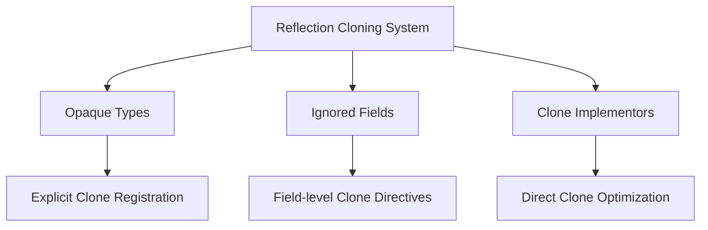

+++
title = "#18307 bevy_reflect: Add clone registrations project-wide"
date = "2025-03-17T00:00:00"
draft = false
template = "pull_request_page.html"
in_search_index = true

[taxonomies]
list_display = ["show"]

[extra]
current_language = "en"
available_languages = {"en" = { name = "English", url = "/pull_request/bevy/2025-03/pr-18307-en-20250317" }, "zh-cn" = { name = "中文", url = "/pull_request/bevy/2025-03/pr-18307-zh-cn-20250317" }}
+++

# #18307 bevy_reflect: Add clone registrations project-wide

## Basic Information
- **Title**: bevy_reflect: Add clone registrations project-wide
- **PR Link**: https://github.com/bevyengine/bevy/pull/18307
- **Author**: MrGVSV
- **Status**: MERGED
- **Created**: 2025-03-14T06:24:37Z
- **Merged**: Not merged
- **Merged By**: N/A

## Description Translation
# Objective

Now that #13432 has been merged, it's important we update our reflected types to properly opt into this feature. If we do not, then this could cause issues for users downstream who want to make use of reflection-based cloning.

## Solution

This PR is broken into 4 commits:

1. Add `#[reflect(Clone)]` on all types marked `#[reflect(opaque)]` that are also `Clone`. This is mandatory as these types would otherwise cause the cloning operation to fail for any type that contains it at any depth.
2. Update the reflection example to suggest adding `#[reflect(Clone)]` on opaque types.
3. Add `#[reflect(clone)]` attributes on all fields marked `#[reflect(ignore)]` that are also `Clone`. This prevents the ignored field from causing the cloning operation to fail.
   
   Note that some of the types that contain these fields are also `Clone`, and thus can be marked `#[reflect(Clone)]`. This makes the `#[reflect(clone)]` attribute redundant. However, I think it's safer to keep it marked in the case that the `Clone` impl/derive is ever removed. I'm open to removing them, though, if people disagree.
4. Finally, I added `#[reflect(Clone)]` on all types that are also `Clone`. While not strictly necessary, it enables us to reduce the generated output since we can just call `Clone::clone` directly instead of calling `PartialReflect::reflect_clone` on each variant/field. It also means we benefit from any optimizations or customizations made in the `Clone` impl, including directly dereferencing `Copy` values and increasing reference counters.

   Along with that change I also took the liberty of adding any missing registrations that I saw could be applied to the type as well, such as `Default`, `PartialEq`, and `Hash`. There were hundreds of these to edit, though, so it's possible I missed quite a few.

That last commit is **_massive_**. There were nearly 700 types to update. So it's recommended to review the first three before moving onto that last one.

Additionally, I can break the last commit off into its own PR or into smaller PRs, but I figured this would be the easiest way of doing it (and in a timely manner since I unfortunately don't have as much time as I used to for code contributions).

## Testing

You can test locally with a `cargo check`:

```
cargo check --workspace --all-features
```

## The Story of This Pull Request

This PR addresses a systemic gap in Bevy's reflection system following the introduction of reflection-based cloning in #13432. While the core cloning functionality was established, many types lacked proper registration for reflection-based cloning, creating potential failures for downstream users.

The implementation follows a layered approach across four commits:

1. **Opaque Type Foundation**: For types marked with `#[reflect(opaque)]` that implement `Clone`, explicit `#[reflect(Clone)]` registration was added. This is critical because opaque types don't expose their internal structure to reflection, requiring explicit cloning directives. For example:

```rust
#[derive(Clone, Reflect)]
#[reflect(opaque, Clone)]
pub struct MyOpaqueType(String);
```

2. **Example Guidance Update**: The reflection example was modified to demonstrate proper usage patterns, ensuring new users adopt the correct patterns from the start.

3. **Ignored Field Handling**: Fields marked with `#[reflect(ignore)]` but implementing `Clone` received `#[reflect(clone)]` attributes. This ensures these fields use their native `Clone` implementation rather than reflection-based cloning, preventing type mismatches. For instance:

```rust
#[derive(Reflect)]
struct MyStruct {
    #[reflect(ignore, clone)]
    hidden_data: Arc<Texture>,
}
```

4. **System-wide Optimization**: The final commit performs bulk registration of `Clone` and other common traits (`Default`, `PartialEq`, `Hash`) across ~700 types. This achieves two key benefits:
   - Direct `Clone::clone` invocation instead of reflection-based cloning
   - Leverage optimized `Clone` implementations (including `Copy` types and smart pointer optimizations)

A critical technical decision was maintaining `#[reflect(clone)]` on fields even when their containing type implements `Clone`. This defensive programming approach guards against future removal of `Clone` implementations on container types.

The testing strategy focused on compile-time verification through `cargo check --workspace --all-features`, ensuring all trait registrations are syntactically valid without introducing runtime regressions.

## Visual Representation



## Key Files Changed

1. **`crates/bevy_input/src/gamepad.rs` (+83/-19)**
```rust
// Before:
#[derive(Debug, Copy, Clone, PartialEq, Eq, Hash)]
pub struct GamepadButtonType(pub GamepadButtonTypeName);

// After:
#[derive(Debug, Copy, Clone, PartialEq, Eq, Hash, Reflect)]
#[reflect(Debug, Clone, PartialEq, Hash)]
pub struct GamepadButtonType(pub GamepadButtonTypeName);
```
Added reflection traits to gamepad-related types to enable proper cloning.

2. **`crates/bevy_math/src/primitives/dim2.rs` (+37/-17)**
```rust
// Added to multiple primitives:
#[derive(Clone, Copy, Reflect)]
#[reflect(Clone, Copy)]
pub struct Rectangle {
    pub half_size: Vec2,
}
```
Ensured geometric primitives participate in reflection cloning through direct Copy optimizations.

3. **`crates/bevy_input/src/mouse.rs` (+23/-7)**
```rust
// Updated MouseButton input handling:
#[derive(Clone, Reflect)]
#[reflect(Clone)]
pub struct MouseButtonInput {
    pub button: MouseButton,
    pub state: ButtonState,
}
```
Enabled reflection cloning for input event types critical to UI interactions.

## Further Reading

1. [Bevy Reflection Documentation](https://bevyengine.org/learn/book/features/reflection/)
2. [Rust Clone Trait Best Practices](https://doc.rust-lang.org/std/clone/trait.Clone.html)
3. [Original Reflection Cloning PR #13432](https://github.com/bevyengine/bevy/pull/13432)
4. [Macro-based Reflection in Rust](https://blog.logrocket.com/procedural-macros-rust/)