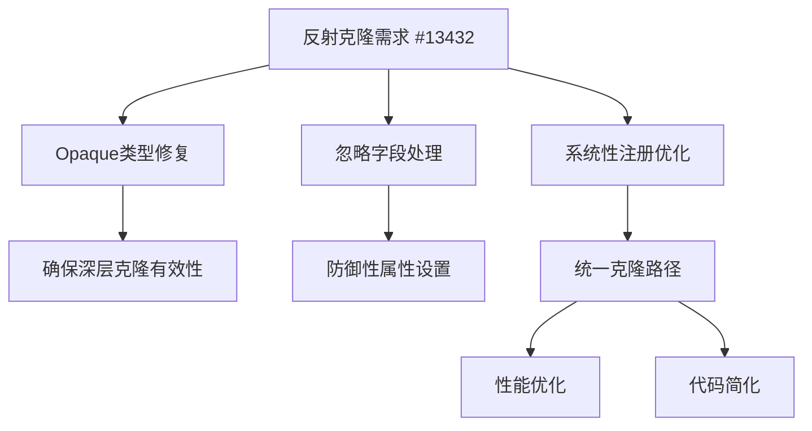

+++
title = "#18307 bevy_reflect: Add clone registrations project-wide"
date = "2025-03-17T00:00:00"
draft = false
template = "pull_request_page.html"
in_search_index = false

[extra]
current_language = "zh-cn"
available_languages = {"zh-cn" = { name = "中文", url = "/pull_request/bevy/2025-03/pr-18307-zh-cn-20250317" }, "en" = { name = "English", url = "/pull_request/bevy/2025-03/pr-18307-en-20250317" }}
+++

# #18307 bevy_reflect: Add clone registrations project-wide

## Basic Information
- **Title**: bevy_reflect: Add clone registrations project-wide
- **PR Link**: https://github.com/bevyengine/bevy/pull/18307
- **Author**: MrGVSV
- **Status**: MERGED
- **Created**: 2025-03-14T06:24:37Z
- **Merged**: 2025-03-15T14:22:19Z
- **Merged By**: cart

## Description Translation
### 目标
在#13432合并后，我们需要更新反射类型以正确启用该功能。若不完成，下游用户在使用基于反射的克隆时可能遇到问题。

### 解决方案
本PR包含4个提交：

1. 为所有标记`#[reflect(opaque)]`且实现`Clone`的类型添加`#[reflect(Clone)]`。这是强制性的，因为这些类型可能导致包含它们的深层结构克隆失败。
2. 更新反射示例，建议在opaque类型上添加`#[reflect(Clone)]`
3. 为所有标记`#[reflect(ignore)]`且可克隆的字段添加`#[reflect(clone)]`属性，防止被忽略字段导致克隆失败
4. 为所有可克隆类型添加`#[reflect(Clone)]`，同时补充缺失的`Default`/`PartialEq`/`Hash`等注册

最后一个提交涉及近700个类型的更新，建议先审查前三个提交。

## The Story of This Pull Request

### 问题背景与上下文
当#13432（反射克隆功能）合并后，现有反射类型系统存在两个关键问题：
1. Opaque类型（通过`#[reflect(opaque)]`标记的类型）未实现反射克隆，导致包含它们的复合类型无法正确克隆
2. 被忽略字段（`#[reflect(ignore)]`）在克隆操作时可能成为失败点

这两个问题会破坏反射克隆功能的可用性，特别是对于需要深度克隆复杂数据结构的用户场景。

### 解决方案与技术选择
PR作者采用分层修复策略：

**第一层：核心修复**
```rust
// 示例：为opaque类型添加Clone注册
#[derive(Clone, Reflect)]
#[reflect(Clone, /* 其他trait */)]
pub struct Gamepad {
    // ...
}
```
- 强制要求所有可克隆的opaque类型实现反射克隆
- 确保类型系统在克隆操作时能正确处理这些特殊类型

**第二层：文档同步**
更新反射示例，新增关于克隆的指导：
```rust
// 示例中添加：
#[derive(Clone, Reflect)]
#[reflect(Clone)]  // 新增的指导建议
struct OpaqueType {
    // ...
}
```

**第三层：防御性编程**
处理被忽略字段的特殊情况：
```rust
#[derive(Reflect)]
struct Example {
    #[reflect(ignore, clone)]  // 新增clone属性
    hidden_field: CloneableType,
}
```
- 即使字段被反射系统忽略，仍保证其参与克隆操作
- 采用防御性设计，保留冗余属性防止未来`Clone`实现的变更

**第四层：系统性优化**
```rust
// 批量添加注册的典型模式
#[derive(Clone, Reflect)]
#[reflect(Clone, Default, Hash, PartialEq)]  // 补充多个trait注册
pub struct MouseButtonInput {
    // ...
}
```
- 利用`Clone`实现替代反射克隆的通用路径，获得三点优势：
  1. 直接使用`Clone::clone`减少代码生成量
  2. 继承具体类型`Clone`实现的优化（如`Copy`类型的直接内存复制）
  3. 统一反射系统与原生类型系统的克隆语义

### 技术挑战与权衡
1. **向后兼容性**：确保新增属性不影响现有反射行为
2. **性能考量**：通过直接调用`Clone`实现而非反射克隆，获得潜在的性能提升
3. **可维护性**：批量修改700+类型时保持代码一致性，采用模式化修改策略

### 影响与后续工作
1. **用户可见改进**：
   - 反射克隆功能现在能正确处理复杂类型结构
   - 文档示例提供明确的实现指导
2. **代码质量提升**：
   - 减少反射克隆的间接调用层数
   - 统一类型注册模式，提高代码可预测性
3. **潜在优化空间**：
   - 可进一步分析`#[reflect(clone)]`属性的必要性
   - 未来可自动化部分注册属性的推导

## Visual Representation



## Key Files Changed

### `crates/bevy_input/src/gamepad.rs` (+83/-19)
**修改重点**：为游戏手柄输入类型补充反射注册
```rust
// 添加Clone等注册
#[derive(Clone, Debug, Reflect)]
#[reflect(Debug, Clone, PartialEq, Hash)]  // 新增多个trait
pub struct Gamepad {
    // ...
}
```
**关联性**：确保输入系统类型支持完整的反射操作

### `crates/bevy_math/src/primitives/dim2.rs` (+37/-17)
**修改重点**：2D数学基础类型注册优化
```rust
// 优化后的注册模式
#[derive(Clone, Copy, Reflect)]
#[reflect(Clone, Copy, Debug, PartialEq)]  // 显式声明Copy trait
pub struct Circle {
    // ...
}
```
**效果**：利用`Copy`特性实现零成本克隆

### `crates/bevy_input/src/mouse.rs` (+23/-7)
**修改示例**：
```rust
// 修改前
#[derive(Event, Clone, Debug, Reflect)]
#[reflect(Debug)]

// 修改后
#[derive(Event, Clone, Debug, Reflect)]
#[reflect(Debug, Clone, Hash, PartialEq)]
```
**目的**：统一输入事件类型的反射特性集

## Further Reading
1. [Rust Clone trait文档](https://doc.rust-lang.org/std/clone/trait.Clone.html)
2. [Bevy反射系统设计](https://bevyengine.org/learn/book/features/reflection/)
3. [类型系统与特征派生模式](https://doc.rust-lang.org/book/ch19-06-macros.html#derive-macros)