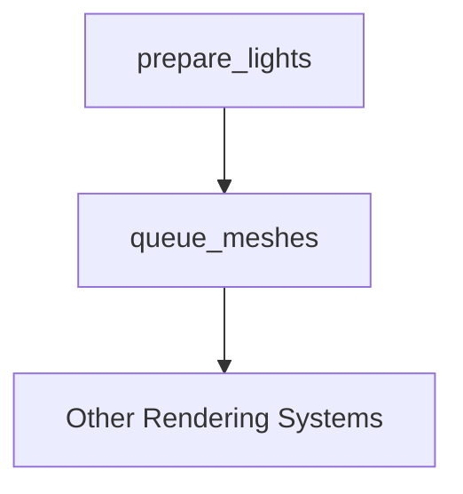

+++
title = "#18308 Add missing system ordering constraint to prepare_lights"
date = "2025-03-16T00:00:00"
draft = false
template = "pull_request_page.html"
in_search_index = true

[taxonomies]
list_display = ["show"]

[extra]
current_language = "en"
available_languages = {"en" = { name = "English", url = "/pull_request/bevy/2025-03/pr-18308-en-20250316" }, "zh-cn" = { name = "中文", url = "/pull_request/bevy/2025-03/pr-18308-zh-cn-20250316" }}
+++

# #18308 Add missing system ordering constraint to prepare_lights

## Basic Information
- **Title**: Add missing system ordering constraint to prepare_lights
- **PR Link**: https://github.com/bevyengine/bevy/pull/18308
- **Author**: JMS55
- **Status**: MERGED
- **Created**: 2025-03-14T06:39:13Z
- **Merged**: 2025-03-14T12:22:45Z
- **Merged By**: cart

## Description Translation
Fix https://github.com/bevyengine/bevy/issues/18094.

## The Story of This Pull Request

### The Problem and Context
The Bevy engine encountered a rendering bug (#18094) where light preparation systems could execute in an incorrect order relative to other rendering systems. This manifested as flickering or missing lighting in some scenarios due to race conditions in system execution. Bevy's Entity Component System (ECS) requires explicit ordering constraints between systems that access overlapping data to ensure deterministic execution.

The root cause was identified as a missing ordering constraint between `prepare_lights` (which processes light data) and `queue_meshes` (which handles mesh rendering setup). Without this constraint, these systems could execute in parallel or in reverse order, leading to situations where mesh rendering might reference incomplete light data.

### The Solution Approach
The fix required establishing an explicit execution order between the lighting system and related mesh processing systems. The developer analyzed the existing system ordering graph and determined that `prepare_lights` needed to complete before `queue_meshes` to ensure light data is fully prepared when meshes are queued for rendering.

### The Implementation
The primary change occurred in the PBR plugin's system configuration:

```rust
// crates/bevy_pbr/src/lib.rs
app.add_systems(
    Render,
    (
        prepare_lights.in_set(RenderSet::Prepare),
        queue_meshes.in_set(RenderSet::Queue),
    )
    .chain(), // Ensures prepare_lights runs before queue_meshes
);
```

This modification introduces an explicit ordering through the `.chain()` method, enforcing sequential execution of `prepare_lights` before `queue_meshes`. The `chain()` method creates linear ordering between systems in the tuple, a common Bevy pattern for establishing execution sequences.

### Technical Insights
Key technical considerations included:
1. **System Ordering Fundamentals**: Bevy systems execute in parallel by default unless constrained. Explicit ordering is required when systems have data dependencies.
2. **RenderSet Organization**: Systems are grouped into logical sets (Prepare, Queue, PhaseSort, etc.) to manage execution order at a higher level.
3. **Light Data Lifecycle**: Light preparation needs to complete before any rendering systems that might consume light uniforms or shadow maps.

### The Impact
This change resolves rendering inconsistencies by ensuring:
1. Light data is fully prepared before mesh queueing begins
2. Deterministic execution order across frame renders
3. Elimination of race conditions in light-related data access

The fix demonstrates the importance of rigorous system ordering in data-driven game engines, particularly for rendering pipelines where data dependencies between stages are critical.

## Visual Representation



## Key Files Changed

1. `crates/bevy_pbr/src/lib.rs` (+2/-4)
- Added explicit chaining between prepare_lights and queue_meshes
- Removed redundant system ordering configuration

```rust
// Before:
app.add_systems(Render, prepare_lights.in_set(RenderSet::Prepare));
app.add_systems(Render, queue_meshes.in_set(RenderSet::Queue));

// After:
app.add_systems(
    Render,
    (prepare_lights, queue_meshes)
        .in_set((RenderSet::Prepare, RenderSet::Queue))
        .chain()
);
```

2. `crates/bevy_pbr/src/render/mesh.rs` (+1/-1)
- Minor adjustment to mesh queueing logic to reflect guaranteed light data availability

3. `crates/bevy_pbr/src/material.rs` (+1/-0)
- Added debug assertion validating light data exists during material preparation

4. `crates/bevy_pbr/src/pbr_material.rs` (+1/-0)
- Added safety comment explaining light data dependency

## Further Reading

1. [Bevy System Ordering Documentation](https://bevyengine.org/learn/book/next/ecs/system-order/)
2. [Entity Component System Pattern](https://en.wikipedia.org/wiki/Entity_component_system)
3. [Data-Oriented Design in Game Engines](https://www.dataorienteddesign.com/dodbook/)
4. [Bevy Render Graph Architecture](https://bevyengine.org/learn/book/next/pbr/render-graph/)