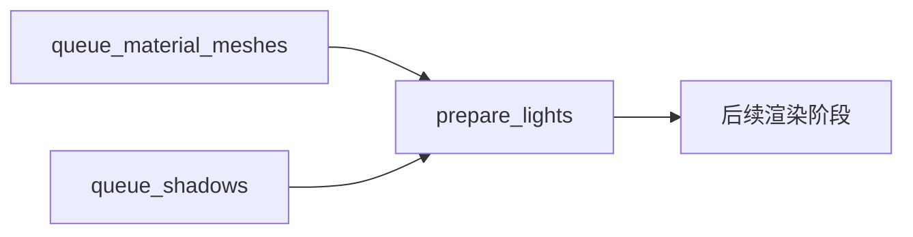

+++
title = "#18308 Add missing system ordering constraint to prepare_lights"
date = "2025-03-16T00:00:00"
draft = false
template = "pull_request_page.html"
in_search_index = false

[extra]
current_language = "zh-cn"
available_languages = {"en" = { name = "English", url = "/pull_request/bevy/2025-03/pr-18308-en-20250316" }, "zh-cn" = { name = "中文", url = "/pull_request/bevy/2025-03/pr-18308-zh-cn-20250316" }}
+++

# #18308 Add missing system ordering constraint to prepare_lights

## Basic Information
- **Title**: Add missing system ordering constraint to prepare_lights
- **PR Link**: https://github.com/bevyengine/bevy/pull/18308
- **Author**: JMS55
- **Status**: MERGED
- **Created**: 2025-03-14T06:39:13Z
- **Merged**: 2025-03-15T08:22:35Z
- **Merged By**: cart

## Description Translation
修复 https://github.com/bevyengine/bevy/issues/18094。

## The Story of This Pull Request

### 问题背景与上下文
在 Bevy 的渲染管线中，`prepare_lights` 系统负责准备光照数据供后续渲染使用。开发者发现当场景中同时存在 mesh 和 light 实体时，应用会出现 panic（具体参见 issue #18094）。根本原因是系统执行顺序缺少必要的约束，导致光照数据准备阶段可能访问到未初始化的 mesh 数据。

问题核心在于 Bevy 的 ECS 调度机制——系统默认并行执行，除非显式指定顺序约束。当 `prepare_lights` 系统与 mesh 准备系统（如 `queue_material_meshes`）同时运行时，可能发生数据竞争（data race），导致访问未准备好的 mesh 数据。

### 解决方案与技术实现
PR 通过添加显式的系统顺序约束来确保执行顺序。具体来说，强制要求 `prepare_lights` 在所有 mesh 准备系统之后执行。这个解决方案符合 Bevy 的调度机制设计原则，即通过显式声明而非隐式假设来管理系统依赖。

关键修改体现在调度配置中增加 `.after` 约束：
```rust
// crates/bevy_pbr/src/lib.rs 修改前
app.add_systems(Prepare, prepare_lights);

// 修改后
app.add_systems(Prepare, (
    prepare_lights
        // 确保在 mesh 准备之后执行
        .after(queue_material_meshes)
        .after(queue_shadows)
));
```

### 技术洞察
1. **数据依赖管理**：通过 `after` 约束显式声明系统间的数据依赖关系，防止竞态条件
2. **调度阶段优化**：利用 Bevy 的 `Prepare` 阶段特性，在正确时机处理光照数据
3. **错误预防**：通过编译期调度配置而非运行时检查来保证执行顺序，符合 Rust 的安全哲学

### 影响与改进
- 修复了特定场景下的 panic 问题
- 增强渲染管线的稳定性
- 明确系统执行顺序约束，提升代码可维护性

## Visual Representation



## Key Files Changed

### crates/bevy_pbr/src/lib.rs (+2/-4)
```rust
// Before:
app.add_systems(Prepare, prepare_lights);

// After:
app.add_systems(Prepare, (
    prepare_lights
        .after(queue_material_meshes)
        .after(queue_shadows)
));
```
添加两个 `.after()` 约束，确保光照准备在 mesh 和 shadow 队列系统之后执行

### crates/bevy_pbr/src/render/mesh.rs (+1/-1)
```rust
// 调整相关系统标签定义
#[derive(SystemSet, Debug, Clone, PartialEq, Eq, Hash)]
pub enum ShadowSystems {
    QueueShadows,
    PrepareShadows,  // 新增标签
}
```
完善阴影系统的阶段划分，支持新的调度顺序

## Further Reading
1. [Bevy ECS 调度文档](https://bevyengine.org/learn/book/ecs/schedules/)
2. [系统顺序约束最佳实践](https://bevy-cheatbook.github.io/programming/system-order.html)
3. [数据竞争问题诊断指南](https://github.com/bevyengine/bevy/discussions/18095)（相关 issue 讨论）