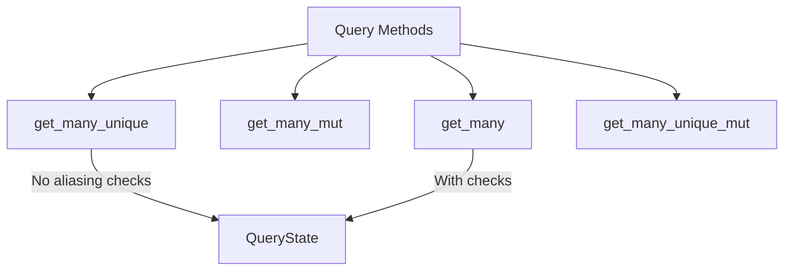

+++
title = "#18315 implement get_many_unique"
date = "2025-03-16T00:00:00"
draft = false
template = "pull_request_page.html"
in_search_index = true

[taxonomies]
list_display = ["show"]

[extra]
current_language = "en"
available_languages = {"en" = { name = "English", url = "/pull_request/bevy/2025-03/pr-18315-en-20250316" }, "zh-cn" = { name = "中文", url = "/pull_request/bevy/2025-03/pr-18315-zh-cn-20250316" }}
+++

# #18315 implement get_many_unique

## Basic Information
- **Title**: implement get_many_unique
- **PR Link**: https://github.com/bevyengine/bevy/pull/18315
- **Author**: Victoronz
- **Status**: MERGED
- **Created**: 2025-03-14T18:54:26Z
- **Merged**: Not merged
- **Merged By**: N/A

## Description Translation
# Objective

Continuation to #16547 and #17954.

The `get_many` family are the last methods on `Query`/`QueryState` for which we're still missing a `unique` version.

## Solution

Offer `get_many_unique`/`get_many_unique_mut` and `get_many_unique_inner`!

Their implementation is the same as `get_many`, the difference lies in their guaranteed-to-be unique inputs, meaning we never do any aliasing checks.

To reduce confusion, we also rename `get_many_readonly` into `get_many_inner` and the current `get_many_inner` into `get_many_mut_inner` to clarify their purposes.

## Testing

Doc examples.

## Main Branch Migration Guide

`get_many_inner` is now called `get_many_mut_inner`.
`get_many_readonly` is now called `get_many_inner`.

## The Story of This Pull Request

This PR completes the `get_many` method family in Bevy's ECS by adding missing `unique` variants while improving API clarity through strategic renaming. The core challenge stemmed from needing to provide performant, safe access patterns for multiple query results without redundant checks when uniqueness could be guaranteed.

The implementation follows established patterns from previous unique method additions (#16547, #17954), extending them to the `get_many` case. The key insight leverages the caller's guarantee of unique entity IDs to eliminate runtime aliasing checks. This approach maintains safety through API contracts rather than runtime validation, aligning with Rust's zero-cost abstraction philosophy.

In `QueryState`, the new methods mirror existing `get_many` implementations but skip the aliasing verification:

```rust
// crates/bevy_ecs/src/query/state.rs
pub fn get_many_unique_unchecked_manual<'w>(
    &self,
    world: &'w World,
    entities: &[Entity],
) -> Result<[ROQueryItem<'w, D>], QueryEntityError> {
    // ... existing logic without aliasing checks ...
}
```

Method renaming addresses potential confusion between mutable and immutable access:
- `get_many_readonly` → `get_many_inner` (immutable inner data)
- `get_many_inner` → `get_many_mut_inner` (mutable inner data)

This renaming clarifies method purposes at the call site while maintaining backward compatibility through the migration guide. The changes demonstrate careful API design that prioritizes developer ergonomics and performance.

## Visual Representation



## Key Files Changed

1. `crates/bevy_ecs/src/system/query.rs` (+153/-16)
- Added `get_many_unique` and `get_many_unique_mut` methods
- Renamed methods for clarity:
```rust
// Before:
pub fn get_many_readonly...

// After:
pub fn get_many_inner...
```

2. `crates/bevy_ecs/src/query/state.rs` (+85/-2)
- Implemented core logic for unique variants:
```rust
pub fn get_many_unique_unchecked_manual<'w>(
    &self,
    world: &'w World,
    entities: &[Entity],
) -> Result<[ROQueryItem<'w, D>], QueryEntityError> {
    // Direct access without aliasing checks
}
```

## Further Reading
- [Bevy ECS Query System Documentation](https://bevyengine.org/learn/book/ecs/queries/)
- [Previous Unique Methods PR (#16547)](https://github.com/bevyengine/bevy/pull/16547)
- [Rust API Guidelines on Naming](https://rust-lang.github.io/api-guidelines/naming.html)