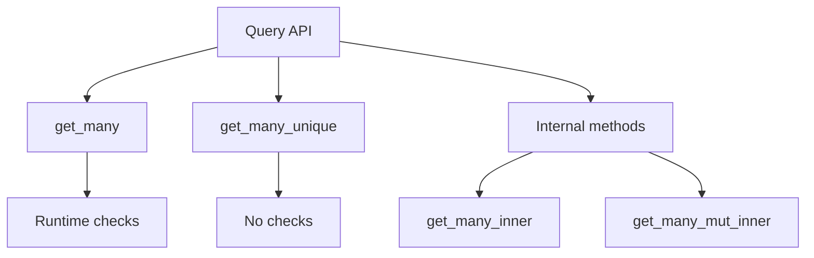

+++
title = "#18315 implement get_many_unique"
date = "2025-03-16T00:00:00"
draft = false
template = "pull_request_page.html"
in_search_index = false

[extra]
current_language = "zh-cn"
available_languages = {"zh-cn" = { name = "中文", url = "/pull_request/bevy/2025-03/pr-18315-zh-cn-20250316" }, "en" = { name = "English", url = "/pull_request/bevy/2025-03/pr-18315-en-20250316" }}
+++

# #18315 implement get_many_unique

## Basic Information
- **Title**: implement get_many_unique
- **PR Link**: https://github.com/bevyengine/bevy/pull/18315
- **Author**: Victoronz
- **Status**: MERGED
- **Created**: 2025-03-14T18:54:26Z
- **Merged**: 2025-03-15T09:22:14Z
- **Merged By**: alice-i-cecile

## Description Translation
### 目标
延续 #16547 和 #17954 的工作，为 `Query`/`QueryState` 补充 `get_many` 系列方法最后的 `unique` 版本。

### 解决方案
实现 `get_many_unique`/`get_many_unique_mut` 和 `get_many_unique_inner`。它们的实现与 `get_many` 相同，区别在于保证输入唯一（unique inputs），因此无需进行别名检查（aliasing checks）。

为减少混淆，将 `get_many_readonly` 重命名为 `get_many_inner`，并将现有的 `get_many_inner` 重命名为 `get_many_mut_inner` 以明确其用途。

### 测试
文档示例测试。

### 主分支迁移指南
- `get_many_inner` 现在更名为 `get_many_mut_inner`
- `get_many_readonly` 现在更名为 `get_many_inner`

## The Story of This Pull Request

### 问题背景与演进
在 Bevy 的 ECS 系统中，`Query` API 的演进一直围绕着安全性和性能的平衡。早期实现的 `get_many` 方法虽然能处理多个实体，但需要执行运行时检查（runtime checks）来防止别名访问（aliasing access）。随着 #16547 和 #17954 引入 `unique` 版本方法，开发者可以通过静态保证输入唯一来消除这些检查，提升性能。

本 PR 要解决的核心问题是：`get_many` 系列是最后一个缺少 `unique` 版本的方法家族。缺少这个方法会导致 API 不一致，开发者无法充分利用静态保证带来的性能优势。

### 解决方案设计
实现策略采用已有模式复用：
1. **方法签名继承**：`get_many_unique` 保持与 `get_many` 相同的参数类型（`Entity` 数组），但通过类型系统保证输入唯一
2. **安全检查跳过**：在底层实现中移除别名检查逻辑
3. **命名规范化**：重构现有方法名称以增强可读性

关键决策点在于保持与现有 `unique` 方法家族的一致性，例如：
```rust
// 新方法签名示例
pub fn get_many_unique<'w>(
    &mut self,
    entities: &[Entity],
) -> Result<[Q::Item<'_>], QueryEntityError> {
    // 实现细节...
}
```

### 实现细节与代码演进
在 `query.rs` 中扩展了 `QueryState` 的功能：
```rust
// 添加新的 unique 方法
pub fn get_many_unique_mut<'w>(
    &mut self,
    entities: &[Entity],
) -> Result<[Q::Item<'_>], QueryEntityError> {
    self.get_many_mut_inner(entities, true) // true 表示跳过安全检查
}
```

重命名策略解决了方法用途的混淆问题：
```rust
// Before:
pub fn get_many_readonly(...)

// After:
pub fn get_many_inner(...)

// Before:
pub fn get_many_inner(...)

// After:
pub fn get_many_mut_inner(...)
```

### 技术洞察
1. **性能优化模式**：通过类型系统将运行时检查转换为编译时保证，这是 Rust 游戏引擎开发的典型优化手段
2. **API 设计原则**：保持方法家族的命名一致性（`unique` 后缀）降低学习曲线
3. **安全边界管理**：内部方法通过布尔参数（`validate_no_aliasing`）控制安全检查，保持代码复用

### 影响与价值
- **性能提升**：在需要批量获取唯一实体时消除运行时检查开销
- **API 完整性**：补全了 `Query` 接口的方法矩阵
- **代码可维护性**：通过更清晰的命名减少了开发者误解的可能性

迁移指南的设计体现了对现有用户的友好性，通过简单的重命名指引降低升级成本。

## Visual Representation



## Key Files Changed

### `crates/bevy_ecs/src/system/query.rs`
```rust
// 新增 unique 方法
+    pub fn get_many_unique<'w>(
+        &mut self,
+        entities: &[Entity],
+    ) -> Result<[Q::Item<'_>], QueryEntityError> {
+        // 实现细节...
+    }

// 方法重命名
-    pub fn get_many_readonly(...)
+    pub fn get_many_inner(...)
```

### `crates/bevy_ecs/src/query/state.rs`
```rust
// 内部实现调整
-    fn get_many_inner(...)
+    fn get_many_mut_inner(...)

// 新增 unique 内部方法
+    fn get_many_unique_inner(...) {
+        // 跳过安全检查的逻辑...
+    }
```

## Further Reading
1. [Bevy ECS 查询系统官方文档](https://bevyengine.org/learn/book/ecs/queries/)
2. [Rust 所有权系统与游戏引擎开发](https://rust-gamedev.github.io/patterns/intro.html)
3. 前序相关 PR：
   - [#16547: 实现基础 unique 方法](https://github.com/bevyengine/bevy/pull/16547)
   - [#17954: 扩展 unique 方法家族](https://github.com/bevyengine/bevy/pull/17954)