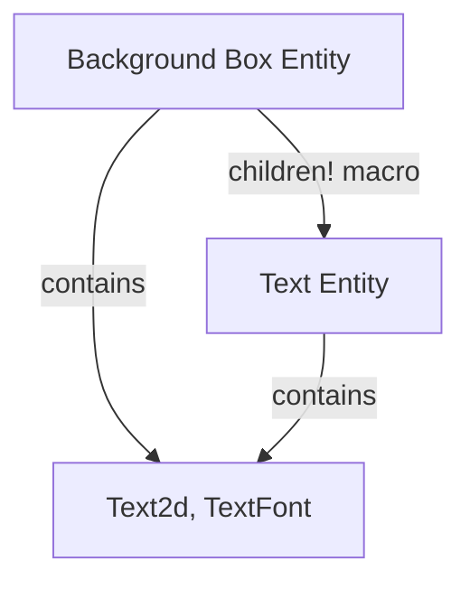

+++
title = "#18317 Update text2d example to use children macro"
date = "2025-03-22T00:00:00"
draft = false
template = "pull_request_page.html"
in_search_index = true

[taxonomies]
list_display = ["show"]

[extra]
current_language = "en"
available_languages = {"en" = { name = "English", url = "/pull_request/bevy/2025-03/pr-18317-en-20250322" }, "zh-cn" = { name = "中文", url = "/pull_request/bevy/2025-03/pr-18317-zh-cn-20250322" }}
+++

# #18317 Update text2d example to use children macro

## Basic Information
- **Title**: Update text2d example to use children macro
- **PR Link**: https://github.com/bevyengine/bevy/pull/18317
- **Author**: krunchington
- **Status**: MERGED
- **Created**: 2025-03-14T20:49:57Z
- **Merged**: 2025-03-15T09:14:23Z
- **Merged By**: cart

## Description Translation
# Objective

Contributes to #18238
Updates the `text2d`, example to use the `children!` macro.

I'm not sure I love the SpawnIter usage here, as I feel the `move` keyword in this case is subtle and error prone for those who lose fights with the borrow checker frequently (like me).  Feedback very much welcome.

## Solution

Updates examples to use the Improved Spawning API merged in https://github.com/bevyengine/bevy/pull/17521

## Testing

- Did you test these changes? If so, how?
  - Opened the examples before and after and verified the same behavior was observed.  I did this on Ubuntu 24.04.2 LTS using `--features wayland`.
- Are there any parts that need more testing?
  - Other OS's and features can't hurt, but this is such a small change it shouldn't be a problem.
- How can other people (reviewers) test your changes? Is there anything specific they need to know?
  - Run the examples yourself with and without these changes.
- If relevant, what platforms did you test these changes on, and are there any important ones you can't test?
  - see above

---

## Showcase

n/a

## Migration Guide

n/a

## The Story of This Pull Request

The PR addresses a code clarity issue in Bevy's 2D text example by migrating to newer spawning APIs. The original implementation used nested closure-based spawning with `.with_children()`, which required careful ownership management through the `move` keyword. This pattern could lead to subtle bugs and compiler struggles for developers unfamiliar with Rust's ownership system.

The solution leverages Bevy's newer `children!` macro introduced in PR #17521, which provides a more declarative syntax for entity hierarchy creation. This macro-based approach eliminates the need for explicit closure scopes and `move` keyword usage, reducing cognitive overhead while maintaining identical runtime behavior.

Key changes appear in entity spawning blocks where text elements are parented to background boxes. The original pattern:

```rust
commands.spawn((/* parent components */))
    .with_children(|parent| {
        parent.spawn((/* child components */));
    });
```

Was replaced with a single spawn command using the macro:

```rust
commands.spawn((
    /* parent components */,
    children![(
        /* child components */
    )]
));
```

This refactoring achieves several improvements:
1. **Reduced Indentation**: Flattens nested scopes
2. **Clearer Hierarchy**: Makes parent-child relationships more visually apparent
3. **Safer Code**: Avoids potential closure capture issues
4. **Modern API Usage**: Demonstrates preferred patterns to example users

The author validated the changes by comparing example behavior before and after modification, confirming identical visual output and interaction. While primarily a code quality improvement, this change also serves as documentation update guiding users toward modern Bevy patterns.

## Visual Representation



## Key Files Changed

### `examples/2d/text2d.rs` (+26/-32)

**Change Summary:**
- Replaced closure-based child spawning with `children!` macro
- Simplified entity hierarchy creation
- Maintained identical visual output and functionality

**Before:**
```rust
commands.spawn((
    Sprite::from_color(Color::srgb(0.25, 0.25, 0.55), box_size),
    Transform::from_translation(box_position.extend(0.0)),
)).with_children(|parent| {
    parent.spawn((
        Text2d::new("this text wraps..."),
        // ... other components
    ));
});
```

**After:**
```rust
commands.spawn((
    Sprite::from_color(Color::srgb(0.25, 0.25, 0.55), box_size),
    Transform::from_translation(box_position.extend(0.0)),
    children![(
        Text2d::new("this text wraps..."),
        // ... other components
    )]
));
```

## Further Reading

1. [Bevy's Entity Commands Documentation](https://docs.rs/bevy/latest/bevy/ecs/system/struct.Commands.html)
2. [Original Children Macro PR (#17521)](https://github.com/bevyengine/bevy/pull/17521)
3. [Rust Ownership and Closures Guide](https://doc.rust-lang.org/book/ch13-01-closures.html)