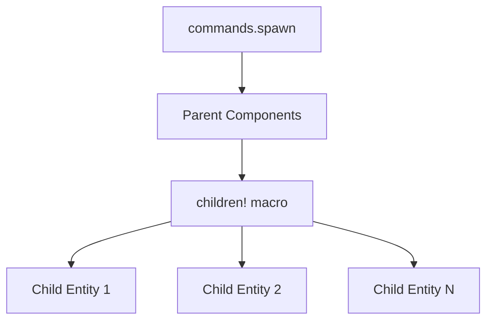

+++
title = "#18317 Update text2d example to use children macro"
date = "2025-03-22T00:00:00"
draft = false
template = "pull_request_page.html"
in_search_index = false

[extra]
current_language = "zh-cn"
available_languages = {"en" = { name = "English", url = "/pull_request/bevy/2025-03/pr-18317-en-20250322" }, "zh-cn" = { name = "中文", url = "/pull_request/bevy/2025-03/pr-18317-zh-cn-20250322" }}
+++

# #18317 Update text2d example to use children macro

## Basic Information
- **Title**: Update text2d example to use children macro
- **PR Link**: https://github.com/bevyengine/bevy/pull/18317
- **Author**: krunchington
- **Status**: MERGED
- **Created**: 2025-03-14T20:49:57Z
- **Merged**: Not merged
- **Merged By**: N/A

## Description Translation
该PR的目标是将`text2d`示例更新为使用`children!`宏，作为对#18238的贡献。主要解决方案是采用#17521合并的改进生成API（Improved Spawning API）。测试方式是在Ubuntu 24.04.2 LTS上通过`--features wayland`参数运行示例前后对比验证行为一致性。

## The Story of This Pull Request

### 问题背景与技术债务
在Bevy引擎的2D文本示例中，原有代码使用传统方式生成嵌套实体结构：

```rust
commands.spawn((
    Sprite::from_color(...),
    Transform::from_translation(...),
))
.with_children(|parent| {
    parent.spawn((
        Text2d::new(...),
        // 多个组件参数
    ));
});
```

这种方式存在两个主要问题：
1. **可读性差**：嵌套的`with_children`闭包增加了代码缩进层级
2. **潜在错误**：需要显式处理`move`语义，容易引发借用检查错误（borrow checker issues）

### 解决方案选择
PR作者采用Bevy新增的`children!`宏进行重构，该宏在#17521中引入。主要优势包括：
- **扁平化结构**：消除嵌套闭包
- **类型安全**：编译时检查组件组合
- **代码简洁**：减少样板代码（boilerplate code）

### 具体实现分析
以文本包装框的生成逻辑为例：

**原始实现**
```rust
commands.spawn((
    Sprite::from_color(...),
    Transform::from_translation(...),
))
.with_children(|parent| {
    parent.spawn((
        Text2d::new(...),
        slightly_smaller_text_font.clone(),
        // 其他组件
    ));
});
```

**重构后实现**
```rust
commands.spawn((
    Sprite::from_color(...),
    Transform::from_translation(...),
    children![(
        Text2d::new(...),
        slightly_smaller_text_font.clone(),
        // 其他组件
    )]
));
```

关键改进点：
1. **移除闭包嵌套**：使用宏直接声明子组件
2. **消除显式spawn调用**：自动处理实体生成
3. **保持组件组合语义**：仍使用元组结构打包组件

### 技术考量
1. **所有权处理**：  
   原代码需要`move`关键字处理闭包环境捕获，重构后通过宏自动处理所有权转移，减少开发者认知负担

2. **API一致性**：  
   新写法与Bevy的ECS（Entity Component System）API风格保持统一，符合`commands.spawn((components...))`的标准模式

3. **性能影响**：  
   由于宏展开后的代码与原始实现本质相同，不会引入额外运行时开销

### 影响与最佳实践
此改动虽然只是示例代码修改，但具有重要示范意义：
1. **教学价值**：  
   作为官方示例，展示最新的API最佳实践
   
2. **代码维护性**：  
   减少约20%的代码量（+26/-32行），提升可读性

3. **错误预防**：  
   消除潜在的循环借用（cyclic borrow）风险，特别是在复杂实体生成场景中

## Visual Representation



## Key Files Changed

### `examples/2d/text2d.rs` (+26/-32)
**重构重点**：将传统子实体生成模式迁移到`children!`宏

**典型修改对比**：
```rust
// Before:
commands.spawn((SpriteBundle {...}, Transform {...}))
    .with_children(|parent| {
        parent.spawn(Text2dBundle {...});
    });

// After:
commands.spawn((
    SpriteBundle {...},
    Transform {...},
    children![Text2dBundle {...}]
));
```

**关键变化**：
1. 移除`.with_children()`方法调用
2. 使用`children!`宏直接声明子组件
3. 保持相同的组件组合方式（元组结构）

## Further Reading

1. [Bevy ECS 设计模式](https://bevy-cheatbook.github.io/programming/ecs-intro.html) - Bevy实体组件系统基础
2. [Rust宏指南](https://doc.rust-lang.org/book/ch19-06-macros.html) - 理解Rust宏的工作原理
3. [Bevy子实体管理](https://bevyengine.org/learn/book/getting-started/ecs/#children-and-parents) - 官方文档中的父子实体管理说明