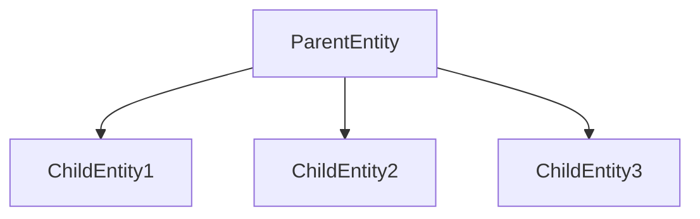

+++
title = "#18318 Update sprite_slice, spatial_audio_3d, spatial_audio_2d examples to use children macro"
date = "2025-03-21T00:00:00"
draft = false
template = "pull_request_page.html"
in_search_index = true

[taxonomies]
list_display = ["show"]

[extra]
current_language = "en"
available_languages = {"en" = { name = "English", url = "/pull_request/bevy/2025-03/pr-18318-en-20250321" }, "zh-cn" = { name = "中文", url = "/pull_request/bevy/2025-03/pr-18318-zh-cn-20250321" }}
+++

# #18318 Update sprite_slice, spatial_audio_3d, spatial_audio_2d examples to use children macro

## Basic Information
- **Title**: Update sprite_slice, spatial_audio_3d, spatial_audio_2d examples to use children macro
- **PR Link**: https://github.com/bevyengine/bevy/pull/18318
- **Author**: krunchington
- **Status**: MERGED
- **Created**: 2025-03-14T21:00:50Z
- **Merged**: 2025-03-15T08:12:31Z
- **Merged By**: alice-i-cecile

## Description Translation
# Objective

Contributes to #18238 
Updates the `sprite_slice`, `spatial_audio_3d` and `spatial_audio_2d` examples to use the `children!` macro.

## Solution

Updates examples to use the Improved Spawning API merged in https://github.com/bevyengine/bevy/pull/17521

## Testing

- Did you test these changes? If so, how?
  - Opened the examples before and after and verified the same behavior was observed.  I did this on Ubuntu 24.04.2 LTS using `--features wayland`.
- Are there any parts that need more testing?
  - Other OS's and features can't hurt, but this is such a small change it shouldn't be a problem.
- How can other people (reviewers) test your changes? Is there anything specific they need to know?
  - Run the examples yourself with and without these changes.
- If relevant, what platforms did you test these changes on, and are any important ones you can't test?
  - see above

---

## Showcase

n/a

## Migration Guide

n/a

## The Story of This Pull Request

The PR addresses technical debt in Bevy's example code by modernizing three examples to use the new `children!` macro introduced in Bevy's Improved Spawning API. This change follows up on PR #17521 which established the new spawning patterns, making entity hierarchy creation more concise and readable.

The core problem was that several examples still used legacy child spawning methods involving separate `spawn` commands and `with_children` closures. These patterns required more boilerplate and were less visually clear about parent-child relationships in entity hierarchies. The `children!` macro solves this by allowing inline declaration of child entities directly within a parent's spawn command.

In each affected example, the implementation changes follow a consistent pattern:
1. Replace nested `spawn` commands with `children!` macro invocations
2. Remove explicit `with_children` method calls
3. Maintain existing entity component structures while simplifying hierarchy creation

For instance, in the spatial audio examples, the listener entity's ear indicators were previously created through separate spawn commands inside a closure. The new approach nests them directly using the macro:

```rust
// Before:
commands.spawn((
    Transform::default(),
    Visibility::default(),
    listener.clone(),
)).with_children(|parent| {
    parent.spawn((
        Sprite::from_color(RED, Vec2::splat(20.0)),
        Transform::from_xyz(-gap / 2.0, 0.0, 0.0),
    ));
    parent.spawn((
        Sprite::from_color(LIME, Vec2::splat(20.0)),
        Transform::from_xyz(gap / 2.0, 0.0, 0.0),
    ));
});

// After:
commands.spawn((
    Transform::default(),
    Visibility::default(),
    listener.clone(),
    children![
        (
            Sprite::from_color(RED, Vec2::splat(20.0)),
            Transform::from_xyz(-gap / 2.0, 0.0, 0.0),
        ),
        (
            Sprite::from_color(LIME, Vec2::splat(20.0)),
            Transform::from_xyz(gap / 2.0, 0.0, 0.0),
        )
    ],
));
```

This change reduces indentation levels and makes the parent-child relationships immediately visible. The technical insight here is leveraging Rust's macro system to create domain-specific language features for entity composition, a common pattern in Bevy's API design.

The impact is threefold:
1. Improved example code quality demonstrating modern Bevy patterns
2. Reduced cognitive load when reading example implementations
3. Consistent API usage across the codebase

No functional changes were made - the PR focuses solely on code structure improvements. Testing involved visual verification of example behavior and ensuring compilation success, appropriate for this type of refactoring.

## Visual Representation



## Key Files Changed

### `examples/audio/spatial_audio_2d.rs` (+11/-13)
- Updated listener entity creation to use `children!` macro for ear indicators
- Before:
```rust
commands.spawn((
    Transform::default(),
    Visibility::default(),
    listener.clone(),
)).with_children(|parent| {
    parent.spawn((
        Sprite::from_color(RED, Vec2::splat(20.0)),
        Transform::from_xyz(-gap / 2.0, 0.0, 0.0),
    ));
    parent.spawn((
        Sprite::from_color(LIME, Vec2::splat(20.0)),
        Transform::from_xyz(gap / 2.0, 0.0, 0.0),
    ));
});
```
- After:
```rust
commands.spawn((
    Transform::default(),
    Visibility::default(),
    listener.clone(),
    children![
        (
            Sprite::from_color(RED, Vec2::splat(20.0)),
            Transform::from_xyz(-gap / 2.0, 0.0, 0.0),
        ),
        (
            Sprite::from_color(LIME, Vec2::splat(20.0)),
            Transform::from_xyz(gap / 2.0, 0.0, 0.0),
        )
    ],
));
```

### `examples/2d/sprite_slice.rs` (+4/-6)
- Simplified sprite hierarchy creation in example setup
- Removed separate child spawning in favor of macro-based approach

### `examples/audio/spatial_audio_3d.rs` (+11/-13)
- Mirror changes from 2D audio example applied to 3D version
- Updated 3D listener entity to use macro for ear indicators

## Further Reading
- [Bevy's Entity Commands Documentation](https://bevyengine.org/learn/book/next/ecs/commands/)
- [Original Children Macro PR (#17521)](https://github.com/bevyengine/bevy/pull/17521)
- [Rust Macro System Guide](https://doc.rust-lang.org/book/ch19-06-macros.html)