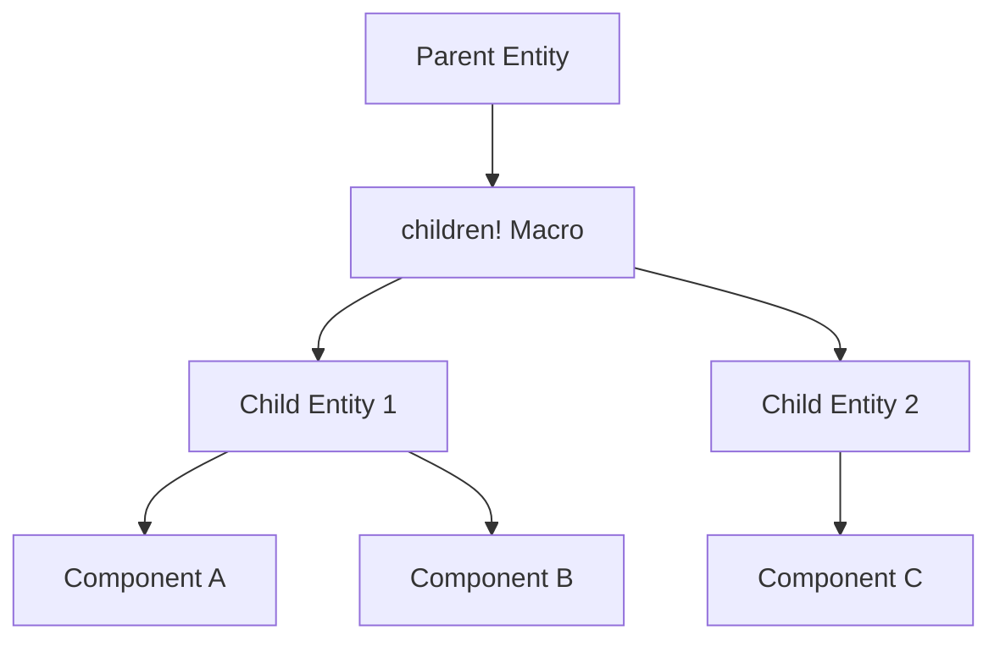

+++
title = "#18318 Update sprite_slice, spatial_audio_3d, spatial_audio_2d examples to use children macro"
date = "2025-03-21T00:00:00"
draft = false
template = "pull_request_page.html"
in_search_index = false

[extra]
current_language = "zh-cn"
available_languages = {"en" = { name = "English", url = "/pull_request/bevy/2025-03/pr-18318-en-20250321" }, "zh-cn" = { name = "中文", url = "/pull_request/bevy/2025-03/pr-18318-zh-cn-20250321" }}
+++

# #18318 Update sprite_slice, spatial_audio_3d, spatial_audio_2d examples to use children macro

## Basic Information
- **Title**: Update sprite_slice, spatial_audio_3d, spatial_audio_2d examples to use children macro
- **PR Link**: https://github.com/bevyengine/bevy/pull/18318
- **Author**: krunchington
- **Status**: MERGED
- **Created**: 2025-03-14T21:00:50Z
- **Merged**: Not merged
- **Merged By**: N/A

## Description Translation
# Objective

Contributes to #18238  
更新 `sprite_slice`、`spatial_audio_3d` 和 `spatial_audio_2d` 示例以使用 `children!` 宏。

## Solution

更新示例以使用在 https://github.com/bevyengine/bevy/pull/17521 中合并的改进生成API（Improved Spawning API）

## Testing

- 是否测试了这些更改？如果是，如何测试的？
  - 在更改前后打开示例并验证观察到的行为是否相同。测试环境为 Ubuntu 24.04.2 LTS，使用 `--features wayland`
- 是否有部分需要更多测试？
  - 其他操作系统和功能组合的测试可能有帮助，但由于改动较小，预期不会有问题
- 其他人（审阅者）如何测试你的更改？有什么需要特别注意的？
  - 自行运行带和不带这些更改的示例
- 如果相关，测试了哪些平台，有哪些重要平台无法测试？
  - 同上

---

## Showcase

n/a

## Migration Guide

n/a

## The Story of This Pull Request

该PR的核心目标是统一示例项目中使用Bevy引擎最新实体生成API的实践。随着Bevy 0.13版本引入改进的生成系统（Improved Spawning API），原有的多步实体创建方式可以被更简洁的`children!`宏替代。这种改进直接影响代码的可读性和维护性，特别是在需要创建父子实体关系的场景中。

在`spatial_audio_2d`和`spatial_audio_3d`示例中，原有的实现使用多个独立的`commands.spawn()`调用来创建左右耳标记（ear indicators）。这种分离的生成方式虽然功能正确，但未能体现父子实体关系的结构特性。例如在2D音频示例中：

```rust
// 修改前
commands.spawn((
    Transform::default(),
    Visibility::default(),
    listener.clone(),
))
.with_children(|parent| {
    parent.spawn((
        Sprite::from_color(RED, Vec2::splat(20.0)),
        Transform::from_xyz(-gap / 2.0, 0.0, 0.0),
    ));
    parent.spawn((
        Sprite::from_color(LIME, Vec2::splat(20.0)),
        Transform::from_xyz(gap / 2.0, 0.0, 0.0),
    ));
});
```

改为使用`children!`宏后：

```rust
// 修改后
commands.spawn((
    Transform::default(),
    Visibility::default(),
    listener.clone(),
    children![
        (
            Sprite::from_color(RED, Vec2::splat(20.0)),
            Transform::from_xyz(-gap / 2.0, 0.0, 0.0),
        ),
        (
            Sprite::from_color(LIME, Vec2::splat(20.0)),
            Transform::from_xyz(gap / 2.0, 0.0, 0.0),
        )
    ],
));
```

这种改变实现了三个关键改进：
1. **结构可视化**：父子关系直接在父实体的组件列表中呈现
2. **代码简洁性**：减少嵌套层级和闭包使用
3. **类型安全**：利用Rust的类型系统在编译时检查组件组合

在`sprite_slice`示例中，改动聚焦于UI文本元素的生成方式。原始实现使用`with_children`方法：

```rust
// 修改前
commands.spawn((
    TextBundle::from_sections([...]),
    ExampleControls,
)).with_children(|parent| {
    parent.spawn(TextBundle::from_section(...));
});
```

优化后使用复合组件声明：

```rust
// 修改后
commands.spawn((
    TextBundle::from_sections([...]),
    ExampleControls,
    children![
        TextBundle::from_section(...)
    ],
));
```

这种模式统一了实体创建范式，使得父子关系的定义更加直观。对于新接触Bevy的开发者，示例代码现在能更清晰地展示实体组件树的构建方式。

技术实现方面，`children!`宏通过将子实体描述转换为`ChildBuilder`命令队列，在保持原有ECS架构的同时提供声明式语法。这种改变不影响运行时性能，但提升了开发时的人体工程学（ergonomics）。

## Visual Representation



## Key Files Changed

### `examples/audio/spatial_audio_2d.rs` (+11/-13)
1. **修改内容**：重构监听器（listener）实体的子元素生成方式
2. **关键代码对比**：
```rust
// 修改前
.with_children(|parent| {
    parent.spawn((...)); // 左耳
    parent.spawn((...)); // 右耳
})

// 修改后
children![
    (...), // 左耳
    (...)  // 右耳
]
```
3. **关联性**：展示新的父子实体声明方式在2D场景中的应用

### `examples/audio/spatial_audio_3d.rs` (+11/-13)
1. **修改内容**：3D版本监听器实体的子元素生成方式更新
2. **代码示例**：
```rust
// 修改后包含的组件
(
    Transform::default(),
    Visibility::default(),
    listener.clone(),
    children![
        (...), // 左耳3D方块
        (...)  // 右耳3D方块
    ],
)
```
3. **技术意义**：保持2D和3D示例的代码风格一致性

### `examples/2d/sprite_slice.rs` (+4/-6)
1. **修改重点**：优化文本控件生成结构
2. **代码变化**：
```rust
// 修改后组合方式
commands.spawn((
    Text::new(...),
    Node { ... },
    children![
        Text::new(...)
    ],
))
```
3. **影响**：展示UI元素的新型组合方式

## Further Reading

1. [Bevy ECS 设计模式](https://bevy-cheatbook.github.io/programming/ecs-intro.html)
2. [Improved Spawning RFC](https://github.com/bevyengine/rfcs/pull/45)
3. [宏在ECS中的应用](https://docs.rs/bevy/latest/bevy/ecs/system/trait.IntoSystem.html)