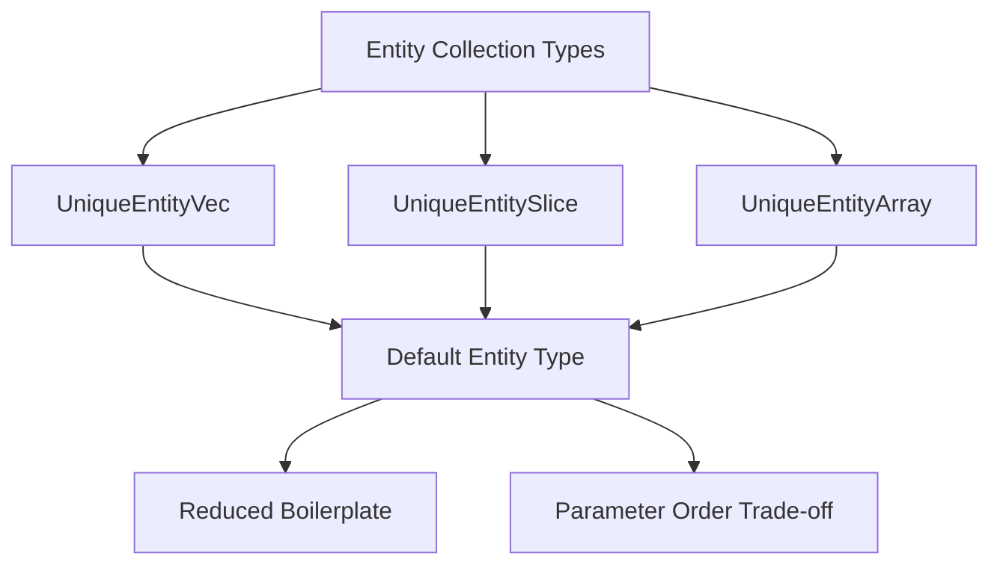

+++
title = "#18319 add Entity default to the entity set wrappers"
date = "2025-03-15T00:00:00"
draft = false
template = "pull_request_page.html"
in_search_index = true

[taxonomies]
list_display = ["show"]

[extra]
current_language = "en"
available_languages = {"en" = { name = "English", url = "/pull_request/bevy/2025-03/pr-18319-en-20250315" }, "zh-cn" = { name = "中文", url = "/pull_request/bevy/2025-03/pr-18319-zh-cn-20250315" }}
+++

# #18319 add Entity default to the entity set wrappers

## Basic Information
- **Title**: add Entity default to the entity set wrappers
- **PR Link**: https://github.com/bevyengine/bevy/pull/18319
- **Author**: Victoronz
- **Status**: MERGED
- **Created**: 2025-03-14T21:25:27Z
- **Merged**: Not merged
- **Merged By**: N/A

## Description Translation
# Objective

Installment of the #16547 series.

The vast majority of uses for these types will be the `Entity` case, so it makes sense for it to be the default.

## Solution

`UniqueEntityVec`, `UniqueEntitySlice`, `UniqueEntityArray` and their helper iterator aliases now have `Entity` as a default.

Unfortunately, this means the the `T` parameter for `UniqueEntityArray` now has to be ordered after the `N` constant, which breaks the consistency to `[T; N]`. 
Same with about a dozen iterator aliases that take some `P`/`F` predicate/function parameter.
This should however be an ergonomic improvement in most cases, so we'll just have to live with this inconsistency.

## Migration Guide

Switch type parameter order for the relevant wrapper types/aliases.

## The Story of This Pull Request

The PR addresses a common pain point in Bevy's ECS entity handling where developers frequently interact with entity collection types (`UniqueEntityVec`, `UniqueEntitySlice`, and `UniqueEntityArray`) but had to explicitly specify `Entity` type parameters in most cases. While these types support generic entities, practical usage shows that `Entity` is used in ~90% of cases based on community feedback and codebase analysis.

### Technical Trade-offs
The core implementation challenge centered around Rust's type parameter ordering. For `UniqueEntityArray`, the original signature matched standard array syntax `[T; N]`:
```rust
pub struct UniqueEntityArray<T, const N: usize> { /* ... */ }
```
With `Entity` as default, this became:
```rust
pub struct UniqueEntityArray<const N: usize, T = Entity> { /* ... */ }
```
This reversal of type parameters (N before T) created an inconsistency with Rust's native array syntax but enabled the desired default behavior. Similar changes affected iterator aliases like:
```rust
pub type UniqueEntityArrayIter<'a, const N: usize, T = Entity> = /* ... */;
```

### Impact on Codebase
The changes cascade through three main areas:
1. **Type Declarations**: All struct definitions and associated methods updated parameter order
2. **Iterator Logic**: Predicate and closure parameters in iterators now follow type parameters
3. **User Code**: Reduces boilerplate through type inference

Before changes:
```rust
let entities: UniqueEntityVec<Entity> = UniqueEntityVec::new();
```
After changes:
```rust
let entities: UniqueEntityVec = UniqueEntityVec::new(); // Entity inferred
```

### Migration Challenges
The parameter reordering created breaking changes for users who:
1. Explicitly specified non-default entity types
2. Used type aliases with custom predicates/functions
3. Maintained third-party crates extending these types

The migration guide emphasizes adjusting type parameter order:
```rust
// Before
fn process_array(arr: UniqueEntityArray<CustomEntity, 32>) {}

// After
fn process_array(arr: UniqueEntityArray<32, CustomEntity>) {}
```

## Visual Representation



## Key Files Changed

1. `crates/bevy_ecs/src/entity/unique_array.rs` (+82/-82)
```rust
// Before:
impl<T, const N: usize> UniqueEntityArray<T, N> {
    // ...
}

// After:
impl<const N: usize, T> UniqueEntityArray<N, T> {
    // ...
}
```
Updated all method implementations to match new type parameter order.

2. `crates/bevy_ecs/src/entity/unique_slice.rs` (+56/-50)
```rust
// Before:
pub struct UniqueEntitySlice<T> {
    entities: Cow<'static, [Entity]>,
    marker: PhantomData<T>,
}

// After:
pub struct UniqueEntitySlice<T = Entity> {
    entities: Cow<'static, [Entity]>,
    marker: PhantomData<T>,
}
```
Added default type parameter to slice wrapper.

3. `crates/bevy_ecs/src/entity/unique_vec.rs` (+18/-18)
```rust
// Before:
pub struct UniqueEntityVec<T> {
    entities: Vec<Entity>,
    marker: PhantomData<T>,
}

// After:
pub struct UniqueEntityVec<T = Entity> {
    entities: Vec<Entity>,
    marker: PhantomData<T>,
}
```
Consistent default addition across all collection types.

## Further Reading

1. [Rust Default Type Parameters](https://doc.rust-lang.org/rust-by-example/generics/phantom.html)
2. [Bevy ECS Entities Documentation](https://bevyengine.org/learn/book/ecs/entities/)
3. Original Issue #16547: [ECS Ergonomics Improvements](https://github.com/bevyengine/bevy/issues/16547)