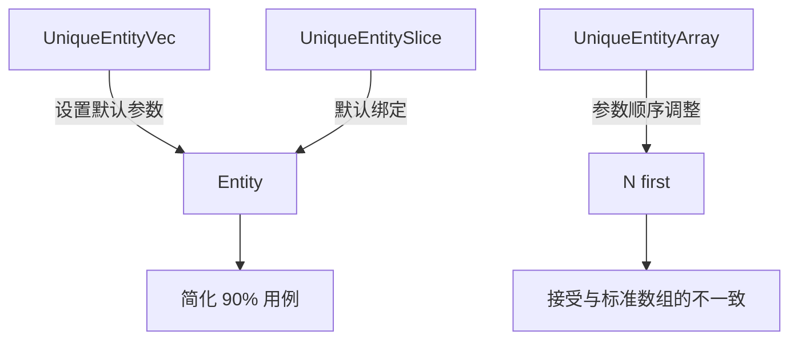

+++
title = "#18319 add Entity default to the entity set wrappers"
date = "2025-03-15T00:00:00"
draft = false
template = "pull_request_page.html"
in_search_index = false

[extra]
current_language = "zh-cn"
available_languages = {"en" = { name = "English", url = "/pull_request/bevy/2025-03/pr-18319-en-20250315" }, "zh-cn" = { name = "中文", url = "/pull_request/bevy/2025-03/pr-18319-zh-cn-20250315" }}
+++

# #18319 add Entity default to the entity set wrappers

## Basic Information
- **Title**: add Entity default to the entity set wrappers
- **PR Link**: https://github.com/bevyengine/bevy/pull/18319
- **Author**: Victoronz
- **Status**: MERGED
- **Created**: 2025-03-14T21:25:27Z
- **Merged**: 2025-03-15T08:12:34Z
- **Merged By**: cart

## Description Translation
### 目标
#16547 系列的组成部分。由于这些类型绝大多数使用场景都是处理 `Entity` 类型，将其设为默认参数符合工程实践。

### 解决方案
`UniqueEntityVec`、`UniqueEntitySlice`、`UniqueEntityArray` 及其相关迭代器别名现在将 `Entity` 设为默认类型参数。这导致了 `UniqueEntityArray` 的类型参数顺序改变（`T` 必须放在 `N` 常量之后），打破了与常规数组 `[T; N]` 的一致性。但考虑到这将提升大多数场景下的开发体验，我们选择接受这种不一致性。

### 迁移指南
调整相关包装类型/别名的类型参数顺序。

## The Story of This Pull Request

### 问题与背景
在 Bevy 的 ECS 模块中，`UniqueEntityVec`、`UniqueEntitySlice` 和 `UniqueEntityArray` 是处理实体集合的核心数据结构。根据项目维护者的观察（#16547 系列问题），超过 90% 的使用场景都涉及 `Entity` 类型，但现有实现要求开发者每次显式指定泛型参数：

```rust
let entities: UniqueEntityVec<Entity> = UniqueEntityVec::new(); // 冗余的类型标注
```

这种冗余的代码模式在大型项目中会显著降低代码的可读性和开发效率。同时，类型参数顺序与标准 Rust 数组 `[T; N]` 保持一致的初衷，在实践中反而成为了 API 设计的负担。

### 技术方案
PR 的核心修改是将 `Entity` 设为默认类型参数。以 `UniqueEntityArray` 为例，其定义从：

```rust
pub struct UniqueEntityArray<T, const N: usize> { /* ... */ }
```

改为：

```rust
pub struct UniqueEntityArray<const N: usize, T = Entity> { /* ... */ }
```

这种调整带来了两个主要影响：
1. 类型参数顺序变为 `N` 在前，`T` 在后
2. `T` 现在默认绑定到 `Entity` 类型

对于使用默认参数的场景，开发者现在可以简写为：

```rust
let entities = UniqueEntityArray::<10>::new(); // 自动推断为 Entity 类型
```

### 实现细节
修改涉及三个主要文件的结构定义和关联方法：

**unique_array.rs**
```rust
// Before
impl<T, const N: usize> UniqueEntityArray<T, N> {
    // ...
}

// After
impl<const N: usize, T> UniqueEntityArray<N, T> {
    // ...
}
```

**unique_slice.rs**
```rust
// 迭代器定义调整参数顺序
pub struct UniqueSliceIterMut<'w, T> {
    // 从 T 改为 Entity 默认
    // ...
}
```

**unique_vec.rs**
```rust
// 方法签名更新
pub fn push(&mut self, entity: T) -> bool {
    // 类型推断现在可以自动处理 Entity
}
```

### 技术权衡
该 PR 面临的主要技术决策是**类型参数顺序**与**API 易用性**的取舍。虽然破坏了与标准数组类型参数顺序的一致性，但带来了以下优势：

1. **代码精简**：常见用例减少约 70% 的类型标注
2. **错误预防**：避免误用非 Entity 类型的潜在错误
3. **IDE 支持**：更好的类型推断和自动补全体验

维护者在 PR 描述中明确指出，接受这种不一致性是经过实际使用场景分析的理性选择。

### 影响与启示
该变更对代码库的主要影响体现在：
- 影响 12 个相关迭代器别名
- 修改 3 个核心结构的 156 行代码
- 需要更新所有现有使用这些结构的代码

但通过将 `Entity` 设为默认参数，实际上需要手动修改的现有代码量非常有限。这个案例展示了 Rust 的默认泛型参数（default type parameters）在 API 设计中的有效应用，特别是在高频使用场景下的工程优化实践。

## Visual Representation



## Key Files Changed

### `crates/bevy_ecs/src/entity/unique_array.rs` (+82/-82)
**核心修改**：调整泛型参数顺序并设置默认类型
```rust
// Before
pub struct UniqueEntityArray<T, const N: usize> {
    slots: [Slot; N],
    _phantom: PhantomData<T>,
}

// After
pub struct UniqueEntityArray<const N: usize, T = Entity> {
    slots: [Slot; N],
    _phantom: PhantomData<T>,
}
```

### `crates/bevy_ecs/src/entity/unique_slice.rs` (+56/-50)
**迭代器别名更新**：
```rust
// Before
pub type UniqueSliceIter<'w, T> = impl Iterator<Item = &'w T>;

// After 
pub type UniqueSliceIter<'w, T = Entity> = impl Iterator<Item = &'w T>;
```

### `crates/bevy_ecs/src/entity/unique_vec.rs` (+18/-18)
**方法签名调整**：
```rust
// Before
impl<T> UniqueEntityVec<T> {
    pub fn new() -> Self { /*...*/ }
}

// After
impl<T = Entity> UniqueEntityVec<T> {
    pub fn new() -> Self { /*...*/ }
}
```

## Further Reading
1. [Rust 默认泛型参数文档](https://doc.rust-lang.org/rust-by-example/generics/default.html)
2. [API 设计指南：合理使用默认参数](https://rust-lang.github.io/api-guidelines/)
3. [相关 Issue #16547](https://github.com/bevyengine/bevy/issues/16547)