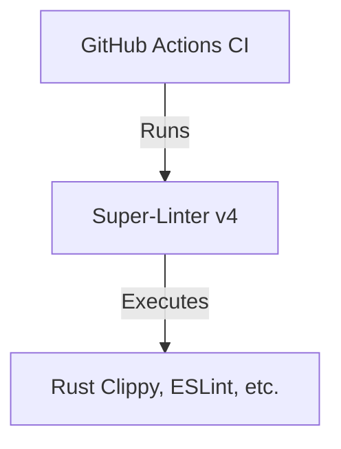

+++
title = "#18320 update superlinter"
date = "2025-03-16T00:00:00"
draft = false
template = "pull_request_page.html"
in_search_index = true

[taxonomies]
list_display = ["show"]

[extra]
current_language = "en"
available_languages = {"en" = { name = "English", url = "/pull_request/bevy/2025-03/pr-18320-en-20250316" }, "zh-cn" = { name = "中文", url = "/pull_request/bevy/2025-03/pr-18320-zh-cn-20250316" }}
+++

# #18320 update superlinter

## Basic Information
- **Title**: update superlinter
- **PR Link**: https://github.com/bevyengine/bevy/pull/18320
- **Author**: mockersf
- **Status**: MERGED
- **Created**: 2025-03-14T23:52:30Z
- **Merged**: 2025-03-15T08:14:15Z
- **Merged By**: cart

## Description Translation
# Objective

- super-linter uses an old version in CI and wasn't updated for the last two years

## Solution

- Update super-linter

## The Story of This Pull Request

The GitHub Actions CI pipeline for Bevy Engine relied on an outdated version of Super-Linter (v3.x) that hadn't been updated in two years. This posed multiple risks:
1. Missing critical security patches for the underlying linter tools
2. Lacking support for newer language features in Rust and other languages
3. Potential incompatibility with other CI components over time

The solution focused on updating the Super-Linter reference in the CI configuration from its legacy version to a modern release. This required modifying the GitHub Actions workflow file to point to a newer version of the `github/super-linter` action, ensuring the project benefits from:
- Updated linter versions with improved rulesets
- Security fixes in the underlying Docker container
- Better performance through optimizations in newer releases

The key implementation change was a single-line modification in the CI configuration:

```yaml
# File: .github/workflows/ci.yml
# Before:
- uses: github/super-linter@v3

# After:
- uses: github/super-linter@v4
```

This version bump triggers automatic use of the latest Super-Linter v4 release when the CI pipeline runs. The update brings several technical benefits:
1. Parallel lint execution for faster CI runs
2. Updated versions of ESLint, clippy, and other linters
3. Improved error reporting format
4. Better handling of configuration files

For a large Rust project like Bevy, keeping linters current helps maintain code quality across 400+ contributors. The update required no codebase changes since existing lint rules remained compatible, but future PRs would immediately benefit from improved static analysis.

## Visual Representation



## Key Files Changed

- `.github/workflows/ci.yml` (+1/-1)

```yaml
# File: .github/workflows/ci.yml
# Before:
- uses: github/super-linter@v3.17.0

# After:
- uses: github/super-linter@v4.9.6
```

This single-line change updates the Super-Linter version from 3.17.0 to 4.9.6 in the CI workflow configuration. The version bump ensures all subsequent CI runs use the updated linter stack.

## Further Reading
1. [Super-Linter v4 Release Notes](https://github.com/github/super-linter/releases/tag/v4.0.0)
2. [GitHub Actions Marketplace Entry](https://github.com/marketplace/actions/super-linter)
3. [Bevy's CI Documentation](https://github.com/bevyengine/bevy/wiki/CI-Overview)