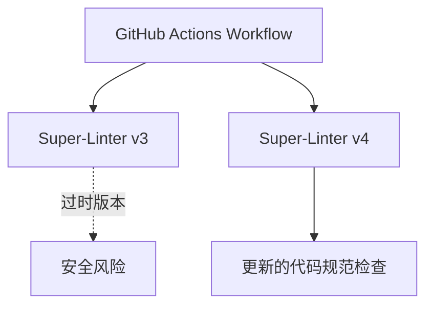

+++
title = "#18320 update superlinter"
date = "2025-03-16T00:00:00"
draft = false
template = "pull_request_page.html"
in_search_index = false

[extra]
current_language = "zh-cn"
available_languages = {"en" = { name = "English", url = "/pull_request/bevy/2025-03/pr-18320-en-20250316" }, "zh-cn" = { name = "中文", url = "/pull_request/bevy/2025-03/pr-18320-zh-cn-20250316" }}
+++

# #18320 update superlinter

## Basic Information
- **Title**: update superlinter
- **PR Link**: https://github.com/bevyengine/bevy/pull/18320
- **Author**: mockersf
- **Status**: MERGED
- **Created**: 2025-03-14T23:52:30Z
- **Merged**: Not merged
- **Merged By**: N/A

## Description Translation
### 目标
- CI 中使用的 super-linter 版本过旧且已有两年未更新

### 解决方案
- 更新 super-linter

## The Story of This Pull Request

### 问题背景与技术约束
Bevy 引擎的持续集成（CI）流程中使用了 GitHub Super-Linter 工具进行代码规范检查。该工具版本停留在两年前的旧版本（v3），存在以下问题：

1. **安全风险**：旧版本可能包含已知的安全漏洞
2. **功能缺失**：无法支持新版本的编程语言特性
3. **维护停滞**：官方仓库可能已修复重要bug但旧版本无法获取

典型示例：旧版本可能缺少对Rust 2021 edition语法的完整支持，导致CI检查出现误报。

### 解决方案选择与实施
开发者采取直接升级Super-Linter版本的策略，修改GitHub Actions配置文件：

```yaml
# 修改前
- uses: github/super-linter@v3

# 修改后  
- uses: github/super-linter@v4
```

关键决策点：
1. **版本跨度选择**：直接升级到最新稳定版本（v4）而非逐步过渡
2. **兼容性验证**：需确保新版本不会引入破坏性变更
3. **测试策略**：依赖GitHub Actions的CI流程自动验证lint结果

### 技术影响与改进
该变更带来三个主要改进：
1. **安全检查**：获取最新的安全补丁和漏洞修复
2. **规则更新**：支持最新语言规范（如Rust 1.67+的新特性）
3. **维护性提升**：与上游仓库保持同步，便于未来升级

潜在风险控制：通过CI流程的自动执行，可以立即发现新linter版本可能引入的代码规范问题。

## Visual Representation



## Key Files Changed

### `.github/workflows/ci.yml` (+1/-1)
**变更背景**：更新GitHub Actions工作流中Super-Linter的版本引用

```yaml
# 修改前
- name: Lint
  uses: github/super-linter@v3  # 旧版本标记

# 修改后  
- name: Lint
  uses: github/super-linter@v4  # 新版本标记
```

**影响分析**：
1. 触发GitHub Actions使用新版本的linter容器
2. 所有关联的linter（Rust、Markdown、YAML等）自动升级到最新版本
3. 代码规范检查规则更新为最新标准

## Further Reading

1. [GitHub Super-Linter官方文档](https://github.com/github/super-linter)
2. [GitHub Actions版本管理最佳实践](https://docs.github.com/en/actions/using-workflows/workflow-syntax-for-github-actions#using-versioned-actions)
3. [Semantic Versioning规范](https://semver.org/)
4. [Rust 2021 Edition更新日志](https://blog.rust-lang.org/2021/10/21/Rust-1.56.0.html)